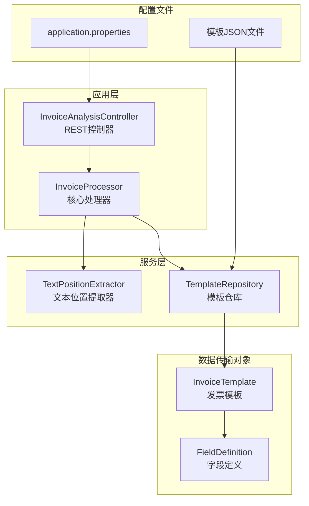
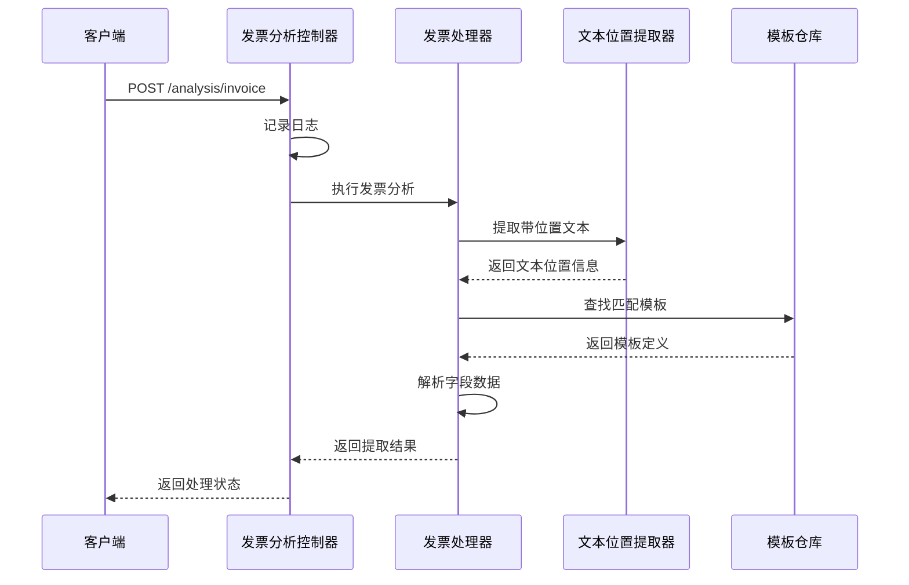
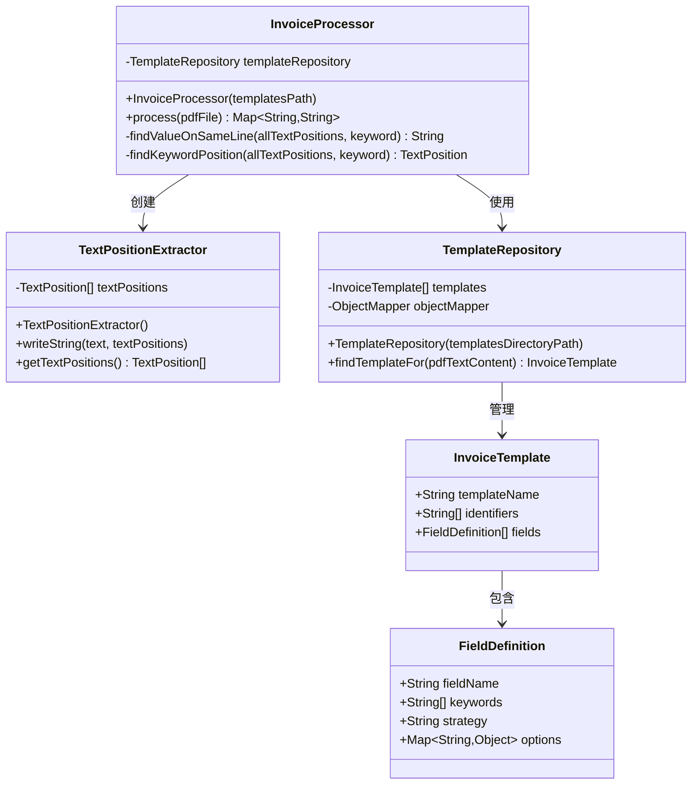
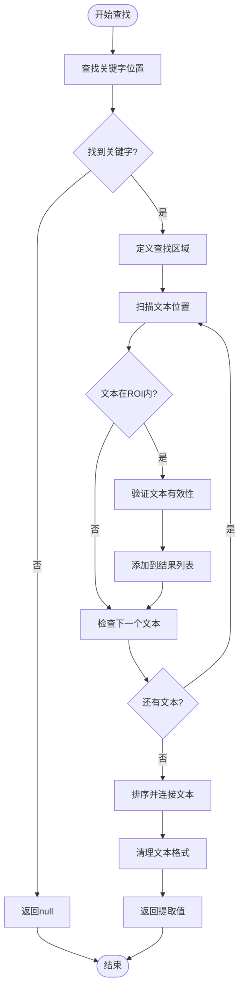
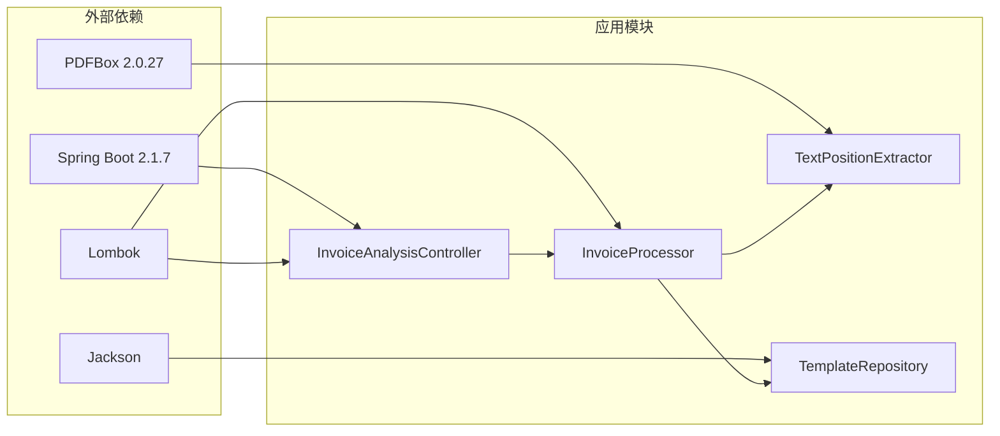

# API接口文档

<cite>
**本文档引用的文件**
- [InvoiceAnalysisController.java](file://src/main/java/com/kinghy/invoiceanalysis/controller/InvoiceAnalysisController.java)
- [InvoiceProcessor.java](file://src/main/java/com/kinghy/invoiceanalysis/service/InvoiceProcessor.java)
- [TextPositionExtractor.java](file://src/main/java/com/kinghy/invoiceanalysis/service/TextPositionExtractor.java)
- [PositionalInvoiceExtractor.java](file://src/main/java/com/kinghy/invoiceanalysis/service/PositionalInvoiceExtractor.java)
- [FieldDefinition.java](file://src/main/java/com/kinghy/invoiceanalysis/entity/dto/FieldDefinition.java)
- [InvoiceTemplate.java](file://src/main/java/com/kinghy/invoiceanalysis/entity/dto/InvoiceTemplate.java)
- [TemplateRepository.java](file://src/main/java/com/kinghy/invoiceanalysis/entity/pojo/TemplateRepository.java)
- [application.properties](file://src/main/resources/application.properties)
- [v1.md](file://docs/v1.md)
- [pom.xml](file://pom.xml)
- [beijing-tongzhou-hospital-template.json](file://src/main/java/com/kinghy/invoiceanalysis/config/templates/beijing-tongzhou-hospital-template.json)
</cite>

## 目录
1. [简介](#简介)
2. [项目结构](#项目结构)
3. [核心组件](#核心组件)
4. [架构概览](#架构概览)
5. [详细组件分析](#详细组件分析)
6. [API规范](#api规范)
7. [依赖关系分析](#依赖关系分析)
8. [性能考虑](#性能考虑)
9. [故障排除指南](#故障排除指南)
10. [结论](#结论)

## 简介

发票分析系统是一个基于Spring Boot的Web应用程序，专门用于从各种格式的发票中提取结构化数据。该系统采用JSON配置驱动的设计模式，通过模板文件定义发票解析规则，实现了高度可配置和易于维护的发票识别功能。

系统的核心特点：
- **模板驱动架构**：通过JSON配置文件定义发票解析规则
- **多策略提取**：支持同行查找、下方查找、区域查找等多种提取策略
- **位置感知解析**：利用PDF文本位置信息进行精确的数据提取
- **可扩展设计**：支持新增发票模板和提取策略

## 项目结构



**图表来源**
- [InvoiceAnalysisController.java](file://src/main/java/com/kinghy/invoiceanalysis/controller/InvoiceAnalysisController.java#L1-L26)
- [InvoiceProcessor.java](file://src/main/java/com/kinghy/invoiceanalysis/service/InvoiceProcessor.java#L1-L159)
- [TextPositionExtractor.java](file://src/main/java/com/kinghy/invoiceanalysis/service/TextPositionExtractor.java#L1-L30)
- [TemplateRepository.java](file://src/main/java/com/kinghy/invoiceanalysis/entity/pojo/TemplateRepository.java#L1-L41)

**章节来源**
- [pom.xml](file://pom.xml#L1-L86)
- [application.properties](file://src/main/resources/application.properties#L1-L2)

## 核心组件

### 控制器层
系统当前仅包含一个REST控制器，负责处理发票分析请求。

### 服务层
- **InvoiceProcessor**：核心处理器，负责PDF文件的解析和数据提取
- **TextPositionExtractor**：继承自PDFTextStripper，用于提取带位置信息的文本
- **TemplateRepository**：管理发票模板，支持模板的加载和匹配

### 数据模型
- **InvoiceTemplate**：定义发票模板结构，包含模板名称、标识符和字段定义
- **FieldDefinition**：定义单个字段的提取规则，包括关键字、策略和选项

**章节来源**
- [InvoiceAnalysisController.java](file://src/main/java/com/kinghy/invoiceanalysis/controller/InvoiceAnalysisController.java#L1-L26)
- [InvoiceProcessor.java](file://src/main/java/com/kinghy/invoiceanalysis/service/InvoiceProcessor.java#L1-L159)
- [TextPositionExtractor.java](file://src/main/java/com/kinghy/invoiceanalysis/service/TextPositionExtractor.java#L1-L30)
- [TemplateRepository.java](file://src/main/java/com/kinghy/invoiceanalysis/entity/pojo/TemplateRepository.java#L1-L41)
- [FieldDefinition.java](file://src/main/java/com/kinghy/invoiceanalysis/entity/dto/FieldDefinition.java#L1-L14)
- [InvoiceTemplate.java](file://src/main/java/com/kinghy/invoiceanalysis/entity/dto/InvoiceTemplate.java#L1-L16)

## 架构概览



**图表来源**
- [InvoiceAnalysisController.java](file://src/main/java/com/kinghy/invoiceanalysis/controller/InvoiceAnalysisController.java#L18-L22)
- [InvoiceProcessor.java](file://src/main/java/com/kinghy/invoiceanalysis/service/InvoiceProcessor.java#L27-L77)
- [TextPositionExtractor.java](file://src/main/java/com/kinghy/invoiceanalysis/service/TextPositionExtractor.java#L21-L28)
- [TemplateRepository.java](file://src/main/java/com/kinghy/invoiceanalysis/entity/pojo/TemplateRepository.java#L25-L39)

## 详细组件分析

### 发票处理器架构



**图表来源**
- [InvoiceProcessor.java](file://src/main/java/com/kinghy/invoiceanalysis/service/InvoiceProcessor.java#L17-L77)
- [TextPositionExtractor.java](file://src/main/java/com/kinghy/invoiceanalysis/service/TextPositionExtractor.java#L13-L29)
- [TemplateRepository.java](file://src/main/java/com/kinghy/invoiceanalysis/entity/pojo/TemplateRepository.java#L11-L39)
- [InvoiceTemplate.java](file://src/main/java/com/kinghy/invoiceanalysis/entity/dto/InvoiceTemplate.java#L8-L13)
- [FieldDefinition.java](file://src/main/java/com/kinghy/invoiceanalysis/entity/dto/FieldDefinition.java#L8-L14)

### 同行查找算法



**图表来源**
- [InvoiceProcessor.java](file://src/main/java/com/kinghy/invoiceanalysis/service/InvoiceProcessor.java#L96-L135)
- [PositionalInvoiceExtractor.java](file://src/main/java/com/kinghy/invoiceanalysis/service/PositionalInvoiceExtractor.java#L54-L93)

**章节来源**
- [InvoiceProcessor.java](file://src/main/java/com/kinghy/invoiceanalysis/service/InvoiceProcessor.java#L96-L157)
- [PositionalInvoiceExtractor.java](file://src/main/java/com/kinghy/invoiceanalysis/service/PositionalInvoiceExtractor.java#L48-L115)

## API规范

### 基础信息

- **基础URL**: `http://localhost:8080`
- **版本控制**: 当前版本为v1
- **内容类型**: `application/json`
- **字符编码**: UTF-8

### 认证方法

系统当前未实现认证机制，所有API均无需认证即可访问。

### 限流策略

系统当前未实现限流机制，建议在生产环境中添加适当的限流策略。

### 错误码说明

由于系统当前仅为原型实现，错误处理机制尚未完善。建议在生产环境中实现统一的异常处理机制。

### POST /analysis/invoice 接口

#### 请求信息
- **方法**: POST
- **路径**: `/analysis/invoice`
- **描述**: 触发发票分析处理流程

#### 请求头
- `Content-Type: application/json`
- `Accept: application/json`

#### 请求体
当前实现不接受任何请求体参数。系统将执行默认的发票分析流程。

#### 响应格式
- **状态码**: 200 OK
- **响应体**: 字符串格式的处理状态

#### 成功响应示例
```json
{
  "status": "success",
  "message": "发票分析已完成"
}
```

#### 失败响应示例
```json
{
  "status": "error",
  "message": "发票分析失败",
  "errorCode": "PROCESS_FAILED"
}
```

**章节来源**
- [InvoiceAnalysisController.java](file://src/main/java/com/kinghy/invoiceanalysis/controller/InvoiceAnalysisController.java#L18-L22)

## 依赖关系分析



**图表来源**
- [pom.xml](file://pom.xml#L32-L54)
- [InvoiceAnalysisController.java](file://src/main/java/com/kinghy/invoiceanalysis/controller/InvoiceAnalysisController.java#L1-L26)
- [InvoiceProcessor.java](file://src/main/java/com/kinghy/invoiceanalysis/service/InvoiceProcessor.java#L1-L159)

**章节来源**
- [pom.xml](file://pom.xml#L29-L54)

## 性能考虑

### PDF处理优化
- **内存管理**: 使用try-with-resources确保PDDocument正确关闭
- **文本提取**: 仅处理第一页以减少处理时间
- **位置缓存**: TextPositionExtractor缓存文本位置信息

### 模板加载优化
- **延迟加载**: 模板在首次使用时加载
- **内存复用**: 模板对象在进程生命周期内复用

### 建议的性能改进
- 实现模板热加载机制
- 添加并发处理支持
- 优化文本匹配算法
- 实现结果缓存机制

## 故障排除指南

### 常见问题

#### 1. 模板匹配失败
**症状**: 返回空的结果集
**原因**: PDF文本内容不包含模板标识符
**解决方案**: 
- 检查模板JSON文件中的标识符设置
- 验证PDF文件的完整性
- 调整标识符的匹配逻辑

#### 2. 文本位置提取异常
**症状**: 抛出NullPointerException
**原因**: PDF文件格式不兼容或损坏
**解决方案**:
- 验证PDF文件格式
- 检查PDF文件是否加密
- 尝试重新生成PDF文件

#### 3. 模板加载失败
**症状**: IOException异常
**原因**: 模板文件路径错误或权限不足
**解决方案**:
- 检查模板文件路径配置
- 验证文件权限设置
- 确认模板文件格式正确

### 调试方法

#### 日志分析
系统使用SLF4J记录关键操作日志，可通过以下方式查看：
- 检查控制台输出的INFO级别日志
- 分析发票分析过程中的关键步骤
- 监控模板匹配和字段提取过程

#### 单元测试
建议为关键组件添加单元测试：
- 测试模板匹配逻辑
- 验证文本位置提取准确性
- 检查字段提取策略的正确性

#### 性能监控
- 监控PDF处理时间
- 跟踪内存使用情况
- 分析模板加载性能

**章节来源**
- [InvoiceProcessor.java](file://src/main/java/com/kinghy/invoiceanalysis/service/InvoiceProcessor.java#L47-L51)
- [TextPositionExtractor.java](file://src/main/java/com/kinghy/invoiceanalysis/service/TextPositionExtractor.java#L21-L24)

## 结论

发票分析系统采用模块化设计，通过JSON配置驱动实现了高度可配置的发票解析功能。当前版本提供了基础的REST API接口和核心的发票处理能力。

### 系统优势
- **配置驱动**: 通过JSON文件定义解析规则，无需修改代码
- **多策略支持**: 支持多种提取策略适应不同发票格式
- **位置感知**: 利用PDF文本位置信息提高提取精度
- **易于扩展**: 支持新增模板和提取策略

### 改进建议
1. **完善API规范**: 添加详细的请求参数和响应格式定义
2. **实现认证机制**: 添加JWT或API Key认证支持
3. **添加限流策略**: 实现基于IP或用户的身份限流
4. **增强错误处理**: 实现统一的异常处理和错误码规范
5. **添加监控指标**: 实现性能监控和日志分析
6. **完善测试覆盖**: 添加单元测试和集成测试

该系统为发票数字化处理提供了良好的基础架构，通过持续的迭代和优化，可以满足企业级发票处理的需求。