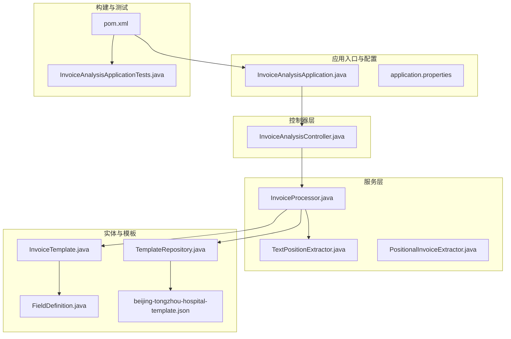
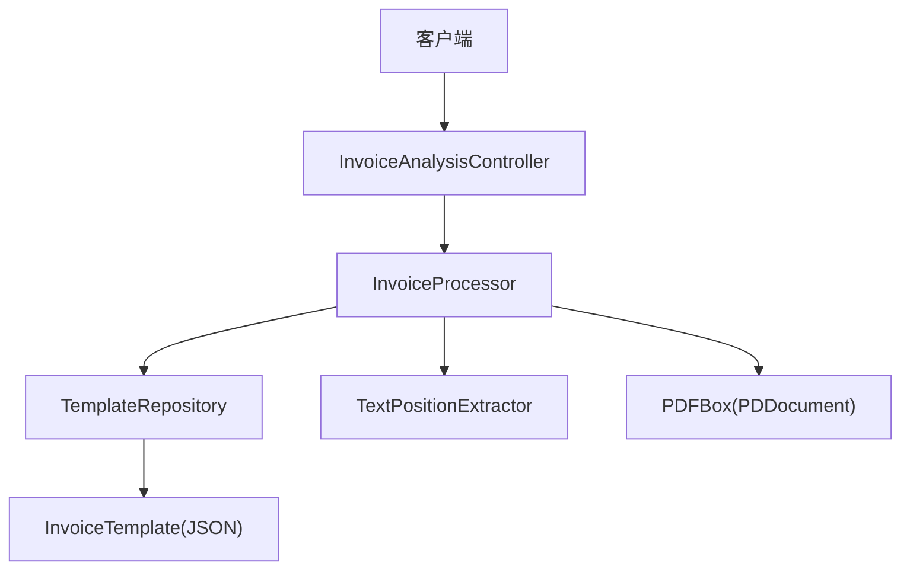
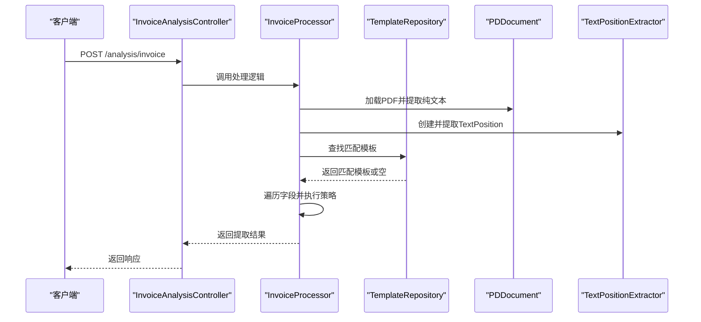
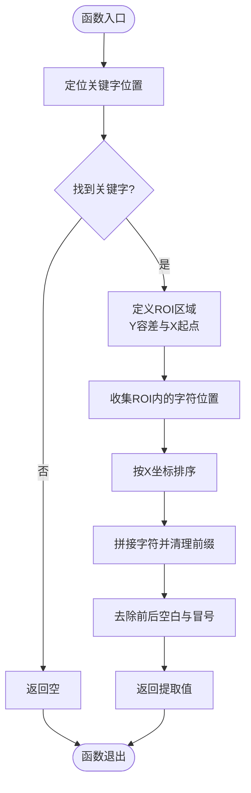
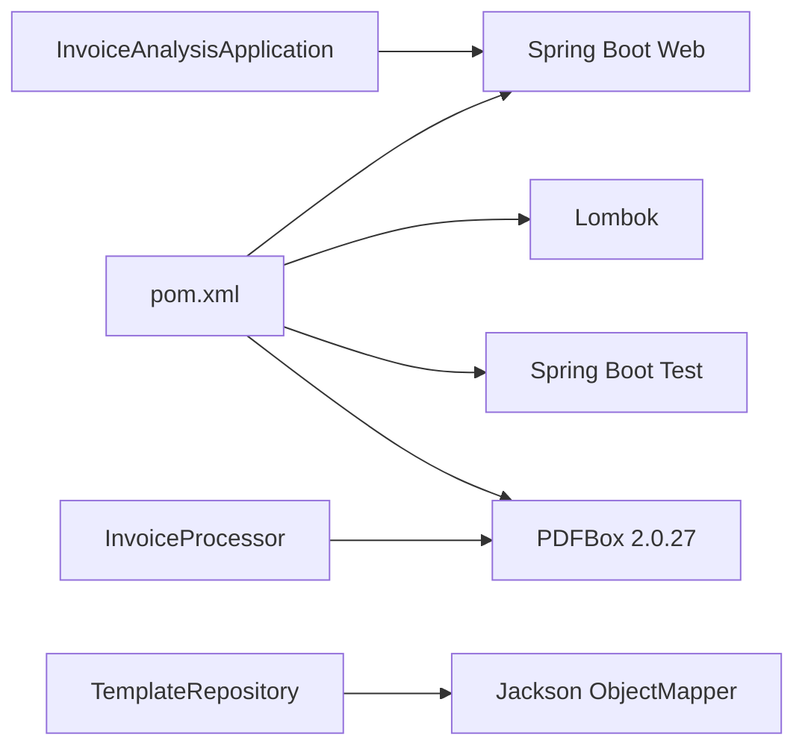

# 开发指南

<cite>
**本文引用的文件**
- [pom.xml](file://pom.xml)
- [InvoiceAnalysisApplication.java](file://src/main/java/com/kinghy/invoiceanalysis/InvoiceAnalysisApplication.java)
- [InvoiceAnalysisController.java](file://src/main/java/com/kinghy/invoiceanalysis/controller/InvoiceAnalysisController.java)
- [InvoiceProcessor.java](file://src/main/java/com/kinghy/invoiceanalysis/service/InvoiceProcessor.java)
- [PositionalInvoiceExtractor.java](file://src/main/java/com/kinghy/invoiceanalysis/service/PositionalInvoiceExtractor.java)
- [TextPositionExtractor.java](file://src/main/java/com/kinghy/invoiceanalysis/service/TextPositionExtractor.java)
- [FieldDefinition.java](file://src/main/java/com/kinghy/invoiceanalysis/entity/dto/FieldDefinition.java)
- [InvoiceTemplate.java](file://src/main/java/com/kinghy/invoiceanalysis/entity/dto/InvoiceTemplate.java)
- [TemplateRepository.java](file://src/main/java/com/kinghy/invoiceanalysis/entity/pojo/TemplateRepository.java)
- [application.properties](file://src/main/resources/application.properties)
- [InvoiceAnalysisApplicationTests.java](file://src/test/java/com/kinghy/invoiceanalysis/InvoiceAnalysisApplicationTests.java)
- [beijing-tongzhou-hospital-template.json](file://src/main/java/com/kinghy/invoiceanalysis/config/templates/beijing-tongzhou-hospital-template.json)
- [.gitignore](file://.gitignore)
</cite>

## 目录
1. [简介](#简介)
2. [项目结构](#项目结构)
3. [核心组件](#核心组件)
4. [架构总览](#架构总览)
5. [详细组件分析](#详细组件分析)
6. [依赖关系分析](#依赖关系分析)
7. [性能考虑](#性能考虑)
8. [故障排查指南](#故障排查指南)
9. [结论](#结论)
10. [附录](#附录)

## 简介
本开发指南面向参与发票分析系统开发的工程师，目标是帮助团队快速建立一致的开发环境、统一代码风格与命名约定、掌握模板与提取策略扩展方法、编写高质量单元测试、建立代码审查与质量保障流程，并提供调试技巧、性能优化建议以及贡献代码的标准流程。本指南严格基于仓库现有代码与配置进行说明，不引入外部假设。

## 项目结构
项目采用 Spring Boot 标准目录结构，主要源码位于 src/main/java 下，资源位于 src/main/resources，测试位于 src/test。核心模块包括：
- 应用入口与控制器层：应用启动类与 REST 控制器
- 服务层：发票处理与文本位置提取
- 实体与数据传输对象：模板与字段定义
- 配置与模板：JSON 模板文件存放于 config/templates

图表来源
- [InvoiceAnalysisApplication.java](file://src/main/java/com/kinghy/invoiceanalysis/InvoiceAnalysisApplication.java#L1-L14)
- [InvoiceAnalysisController.java](file://src/main/java/com/kinghy/invoiceanalysis/controller/InvoiceAnalysisController.java#L1-L26)
- [InvoiceProcessor.java](file://src/main/java/com/kinghy/invoiceanalysis/service/InvoiceProcessor.java#L1-L159)
- [TextPositionExtractor.java](file://src/main/java/com/kinghy/invoiceanalysis/service/TextPositionExtractor.java#L1-L30)
- [TemplateRepository.java](file://src/main/java/com/kinghy/invoiceanalysis/entity/pojo/TemplateRepository.java#L1-L41)
- [InvoiceTemplate.java](file://src/main/java/com/kinghy/invoiceanalysis/entity/dto/InvoiceTemplate.java#L1-L16)
- [FieldDefinition.java](file://src/main/java/com/kinghy/invoiceanalysis/entity/dto/FieldDefinition.java#L1-L14)
- [beijing-tongzhou-hospital-template.json](file://src/main/java/com/kinghy/invoiceanalysis/config/templates/beijing-tongzhou-hospital-template.json#L1-L55)
- [pom.xml](file://pom.xml#L1-L86)
- [InvoiceAnalysisApplicationTests.java](file://src/test/java/com/kinghy/invoiceanalysis/InvoiceAnalysisApplicationTests.java#L1-L14)

章节来源
- [InvoiceAnalysisApplication.java](file://src/main/java/com/kinghy/invoiceanalysis/InvoiceAnalysisApplication.java#L1-L14)
- [InvoiceAnalysisController.java](file://src/main/java/com/kinghy/invoiceanalysis/controller/InvoiceAnalysisController.java#L1-L26)
- [InvoiceProcessor.java](file://src/main/java/com/kinghy/invoiceanalysis/service/InvoiceProcessor.java#L1-L159)
- [TextPositionExtractor.java](file://src/main/java/com/kinghy/invoiceanalysis/service/TextPositionExtractor.java#L1-L30)
- [TemplateRepository.java](file://src/main/java/com/kinghy/invoiceanalysis/entity/pojo/TemplateRepository.java#L1-L41)
- [InvoiceTemplate.java](file://src/main/java/com/kinghy/invoiceanalysis/entity/dto/InvoiceTemplate.java#L1-L16)
- [FieldDefinition.java](file://src/main/java/com/kinghy/invoiceanalysis/entity/dto/FieldDefinition.java#L1-L14)
- [beijing-tongzhou-hospital-template.json](file://src/main/java/com/kinghy/invoiceanalysis/config/templates/beijing-tongzhou-hospital-template.json#L1-L55)
- [pom.xml](file://pom.xml#L1-L86)
- [InvoiceAnalysisApplicationTests.java](file://src/test/java/com/kinghy/invoiceanalysis/InvoiceAnalysisApplicationTests.java#L1-L14)

## 核心组件
- 应用入口与配置
  - 应用启动类负责引导 Spring Boot 应用
  - application.properties 提供基础应用名称配置
- 控制器层
  - REST 控制器提供 /analysis/invoice 接口，当前返回固定响应
- 服务层
  - 发票处理器负责加载模板、提取文本与位置信息、根据模板字段定义执行提取策略
  - 文本位置提取器继承 PDFTextStripper，收集每个字符的 TextPosition
  - 位置式提取器提供示例方法，展示在同一行右侧查找值的逻辑
- 实体与模板
  - 模板定义包含标识符、字段集合；字段定义包含字段名、关键字、策略与选项
  - 模板仓库负责扫描模板目录并解析 JSON 为模板对象
- 测试
  - Spring Boot 测试确保上下文加载成功

章节来源
- [InvoiceAnalysisApplication.java](file://src/main/java/com/kinghy/invoiceanalysis/InvoiceAnalysisApplication.java#L1-L14)
- [application.properties](file://src/main/resources/application.properties#L1-L2)
- [InvoiceAnalysisController.java](file://src/main/java/com/kinghy/invoiceanalysis/controller/InvoiceAnalysisController.java#L1-L26)
- [InvoiceProcessor.java](file://src/main/java/com/kinghy/invoiceanalysis/service/InvoiceProcessor.java#L1-L159)
- [TextPositionExtractor.java](file://src/main/java/com/kinghy/invoiceanalysis/service/TextPositionExtractor.java#L1-L30)
- [PositionalInvoiceExtractor.java](file://src/main/java/com/kinghy/invoiceanalysis/service/PositionalInvoiceExtractor.java#L1-L117)
- [InvoiceTemplate.java](file://src/main/java/com/kinghy/invoiceanalysis/entity/dto/InvoiceTemplate.java#L1-L16)
- [FieldDefinition.java](file://src/main/java/com/kinghy/invoiceanalysis/entity/dto/FieldDefinition.java#L1-L14)
- [TemplateRepository.java](file://src/main/java/com/kinghy/invoiceanalysis/entity/pojo/TemplateRepository.java#L1-L41)
- [InvoiceAnalysisApplicationTests.java](file://src/test/java/com/kinghy/invoiceanalysis/InvoiceAnalysisApplicationTests.java#L1-L14)

## 架构总览
系统采用分层架构：Web 层通过控制器接收请求，服务层负责业务处理（模板匹配与字段提取），实体层承载模板与字段定义，模板仓库负责模板加载与匹配。PDF 处理依赖 PDFBox，文本位置信息用于精确提取。

图表来源
- [InvoiceAnalysisController.java](file://src/main/java/com/kinghy/invoiceanalysis/controller/InvoiceAnalysisController.java#L1-L26)
- [InvoiceProcessor.java](file://src/main/java/com/kinghy/invoiceanalysis/service/InvoiceProcessor.java#L1-L159)
- [TemplateRepository.java](file://src/main/java/com/kinghy/invoiceanalysis/entity/pojo/TemplateRepository.java#L1-L41)
- [TextPositionExtractor.java](file://src/main/java/com/kinghy/invoiceanalysis/service/TextPositionExtractor.java#L1-L30)

## 详细组件分析

### 发票处理器（InvoiceProcessor）
职责与流程
- 加载模板：通过模板仓库扫描模板目录并解析为模板对象
- 提取文本与位置：使用 PDFTextStripper 获取纯文本；使用 TextPositionExtractor 收集字符位置
- 模板匹配：遍历模板标识符，判断 PDF 文本是否包含全部标识符
- 字段提取：遍历模板字段，依据策略执行提取（当前实现包含 SAME_LINE 分支）

图表来源
- [InvoiceAnalysisController.java](file://src/main/java/com/kinghy/invoiceanalysis/controller/InvoiceAnalysisController.java#L1-L26)
- [InvoiceProcessor.java](file://src/main/java/com/kinghy/invoiceanalysis/service/InvoiceProcessor.java#L1-L159)
- [TemplateRepository.java](file://src/main/java/com/kinghy/invoiceanalysis/entity/pojo/TemplateRepository.java#L1-L41)
- [TextPositionExtractor.java](file://src/main/java/com/kinghy/invoiceanalysis/service/TextPositionExtractor.java#L1-L30)

算法流程（在同一行右侧查找值）

图表来源
- [InvoiceProcessor.java](file://src/main/java/com/kinghy/invoiceanalysis/service/InvoiceProcessor.java#L96-L135)

章节来源
- [InvoiceProcessor.java](file://src/main/java/com/kinghy/invoiceanalysis/service/InvoiceProcessor.java#L1-L159)

### 文本位置提取器（TextPositionExtractor）
职责
- 继承 PDFTextStripper，重写 writeString 方法，将每个字符的 TextPosition 收集到列表中
- 提供访问器方法返回收集到的位置列表

章节来源
- [TextPositionExtractor.java](file://src/main/java/com/kinghy/invoiceanalysis/service/TextPositionExtractor.java#L1-L30)

### 模板与字段定义
- 模板对象包含模板名、标识符列表与字段列表
- 字段定义包含字段名、关键字列表、策略与可选参数
- 模板仓库扫描指定目录下的 JSON 文件，解析为模板对象，并根据标识符匹配 PDF 文本

章节来源
- [InvoiceTemplate.java](file://src/main/java/com/kinghy/invoiceanalysis/entity/dto/InvoiceTemplate.java#L1-L16)
- [FieldDefinition.java](file://src/main/java/com/kinghy/invoiceanalysis/entity/dto/FieldDefinition.java#L1-L14)
- [TemplateRepository.java](file://src/main/java/com/kinghy/invoiceanalysis/entity/pojo/TemplateRepository.java#L1-L41)

### 控制器与应用入口
- 控制器提供 /analysis/invoice 接口，当前日志记录后返回固定字符串
- 应用入口启动 Spring Boot 应用

章节来源
- [InvoiceAnalysisController.java](file://src/main/java/com/kinghy/invoiceanalysis/controller/InvoiceAnalysisController.java#L1-L26)
- [InvoiceAnalysisApplication.java](file://src/main/java/com/kinghy/invoiceanalysis/InvoiceAnalysisApplication.java#L1-L14)

## 依赖关系分析
- 构建工具与框架
  - Maven 作为构建工具，Spring Boot Starter Web 提供 Web 启动能力
  - Lombok 简化 POJO 代码
  - PDFBox 2.0.27 用于 PDF 文本与位置提取
- 运行时依赖
  - Spring Boot 自动装配与 Web MVC
  - Jackson 用于模板 JSON 解析（由 TemplateRepository 使用）

图表来源
- [pom.xml](file://pom.xml#L1-L86)
- [InvoiceAnalysisApplication.java](file://src/main/java/com/kinghy/invoiceanalysis/InvoiceAnalysisApplication.java#L1-L14)
- [InvoiceProcessor.java](file://src/main/java/com/kinghy/invoiceanalysis/service/InvoiceProcessor.java#L1-L159)
- [TemplateRepository.java](file://src/main/java/com/kinghy/invoiceanalysis/entity/pojo/TemplateRepository.java#L1-L41)

章节来源
- [pom.xml](file://pom.xml#L1-L86)

## 性能考虑
- PDF 文本与位置提取
  - 当前仅处理第一页，建议在生产环境中根据发票页数动态设置起止页
  - ROI 区域计算与排序操作为 O(n) 到 O(n log n)，在大文档中需关注内存占用
- 模板匹配
  - 模板扫描为 O(T)（T 为模板数量），逐个模板的标识符匹配为 O(S)（S 为标识符长度之和）
- 字符串匹配
  - 关键字匹配采用滑动窗口，复杂度 O(n*m)，其中 n 为字符数，m 为关键字长度
- 建议
  - 对关键字列表进行预处理（如排序、去重）以减少重复匹配
  - 对 ROI 计算增加边界检查，避免越界与无效区域
  - 在高并发场景下，考虑缓存常用模板与已解析的 PDF 文本

[本节为通用性能讨论，无需特定文件来源]

## 故障排查指南
- PDF 读取失败
  - 检查 PDF 文件路径与权限；确认 PDFBox 版本兼容性
- 模板未匹配
  - 确认模板 JSON 中的标识符是否存在于 PDF 文本中；检查编码与空白字符
- 提取结果为空
  - 检查关键字是否正确；确认 ROI 区域设置合理；验证字符排序与拼接逻辑
- 控制器接口无响应
  - 确认应用已启动且端口可用；检查日志输出

章节来源
- [InvoiceProcessor.java](file://src/main/java/com/kinghy/invoiceanalysis/service/InvoiceProcessor.java#L1-L159)
- [TemplateRepository.java](file://src/main/java/com/kinghy/invoiceanalysis/entity/pojo/TemplateRepository.java#L1-L41)
- [InvoiceAnalysisController.java](file://src/main/java/com/kinghy/invoiceanalysis/controller/InvoiceAnalysisController.java#L1-L26)

## 结论
本指南基于现有代码梳理了发票分析系统的核心模块、数据流与扩展点。当前实现提供了模板驱动的字段提取框架与位置式提取示例，后续可在策略模式基础上扩展更多提取策略，并完善测试覆盖与性能优化。

[本节为总结性内容，无需特定文件来源]

## 附录

### 开发环境搭建
- JDK 与 IDE
  - JDK 1.8 已在构建属性中声明，建议使用对应版本
  - IntelliJ IDEA、Eclipse 或 VS Code 均可；IDE 忽略文件已在 .gitignore 中配置
- Maven
  - 使用 Maven 3+，执行 mvn clean install 完成依赖下载与编译
- Spring Boot
  - 应用入口类负责启动，可通过 IDE 直接运行或使用 mvn spring-boot:run

章节来源
- [pom.xml](file://pom.xml#L29-L31)
- [.gitignore](file://.gitignore#L16-L33)
- [InvoiceAnalysisApplication.java](file://src/main/java/com/kinghy/invoiceanalysis/InvoiceAnalysisApplication.java#L1-L14)

### Maven 依赖管理与代码风格规范
- 依赖管理
  - Spring Boot Starter Web：提供 Web 启动能力
  - Lombok：简化 POJO 代码
  - Spring Boot Test：测试支持
  - PDFBox：PDF 文本与位置提取
- 代码风格
  - 命名采用驼峰命名法；包名遵循反向域名约定
  - 类与方法保持单一职责；日志使用 SLF4J 注解
  - 优先使用不可变数据结构与流式 API（如需要）

章节来源
- [pom.xml](file://pom.xml#L32-L54)
- [InvoiceAnalysisController.java](file://src/main/java/com/kinghy/invoiceanalysis/controller/InvoiceAnalysisController.java#L1-L26)
- [InvoiceProcessor.java](file://src/main/java/com/kinghy/invoiceanalysis/service/InvoiceProcessor.java#L1-L159)

### 添加新的发票类型支持与提取策略
- 新增模板
  - 在模板目录新增 JSON 文件，定义模板名、标识符与字段列表
  - 字段策略可选择 SAME_LINE、BELOW、AREA 等（当前实现包含 SAME_LINE 分支）
- 扩展提取策略
  - 在发票处理器中为不同策略添加分支逻辑
  - 可参考位置式提取器的方法，实现基于 ROI 的区域提取与基于行距的下方提取
- 验证与回归
  - 编写单元测试覆盖新模板与策略
  - 在本地运行主方法或控制器接口进行集成验证

章节来源
- [beijing-tongzhou-hospital-template.json](file://src/main/java/com/kinghy/invoiceanalysis/config/templates/beijing-tongzhou-hospital-template.json#L1-L55)
- [InvoiceProcessor.java](file://src/main/java/com/kinghy/invoiceanalysis/service/InvoiceProcessor.java#L54-L74)
- [PositionalInvoiceExtractor.java](file://src/main/java/com/kinghy/invoiceanalysis/service/PositionalInvoiceExtractor.java#L48-L93)

### 单元测试编写指南与测试覆盖率要求
- 测试范围
  - 模板匹配：构造包含与不包含标识符的 PDF 文本，验证模板匹配结果
  - 字段提取：针对 SAME_LINE、BELOW、AREA 等策略分别编写用例
  - 异常场景：空模板、关键字不存在、ROI 无字符等情况
- 测试工具
  - 使用 Spring Boot Test 与 JUnit 5
  - 可使用 Mockito 对外部依赖（如 PDFBox）进行模拟
- 覆盖率建议
  - 行覆盖率与分支覆盖率均达到 80% 以上
  - 关键路径（模板匹配、字段提取、异常处理）必须覆盖

章节来源
- [InvoiceAnalysisApplicationTests.java](file://src/test/java/com/kinghy/invoiceanalysis/InvoiceAnalysisApplicationTests.java#L1-L14)
- [TemplateRepository.java](file://src/main/java/com/kinghy/invoiceanalysis/entity/pojo/TemplateRepository.java#L25-L39)
- [InvoiceProcessor.java](file://src/main/java/com/kinghy/invoiceanalysis/service/InvoiceProcessor.java#L96-L135)

### 代码审查标准与质量保证流程
- 代码审查要点
  - 命名一致性与可读性
  - 错误处理与边界条件
  - 日志记录与异常传播
  - 模板与策略扩展的可维护性
- 质量保证流程
  - 提交前本地测试与格式化
  - CI/CD 集成测试与静态分析
  - 审查者至少一名，重点关注安全性与性能

[本节为通用流程建议，无需特定文件来源]

### 调试技巧与常见问题
- 调试技巧
  - 使用日志输出 PDF 文本与 ROI 区域
  - 在关键字定位与 ROI 收集处设置断点
  - 对比不同发票样式的模板差异
- 常见问题
  - 模板未匹配：检查标识符与编码
  - 提取为空：检查关键字与 ROI 设置
  - 性能瓶颈：优化关键字匹配与 ROI 计算

章节来源
- [InvoiceProcessor.java](file://src/main/java/com/kinghy/invoiceanalysis/service/InvoiceProcessor.java#L32-L51)
- [InvoiceProcessor.java](file://src/main/java/com/kinghy/invoiceanalysis/service/InvoiceProcessor.java#L96-L135)

### 贡献代码流程与规范
- 分支策略
  - 主分支保护，功能开发在特性分支完成
- 提交流程
  - 提交前运行测试与格式化
  - 提交信息清晰描述变更内容与动机
- 合并与审查
  - 通过 Pull Request 合并，至少一次审查同意

[本节为通用流程建议，无需特定文件来源]