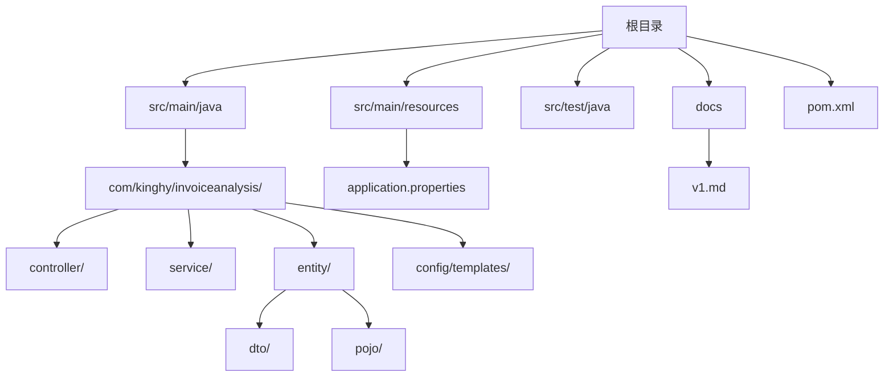
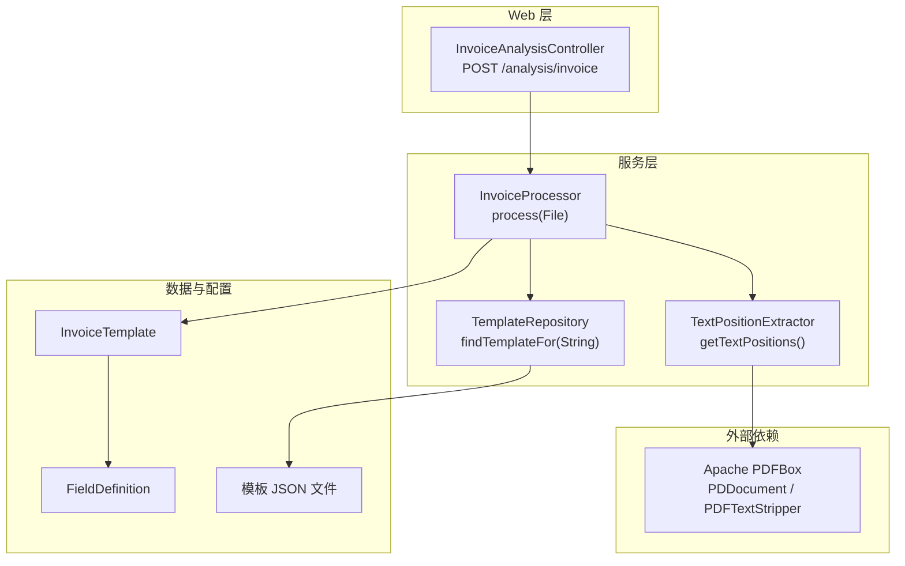
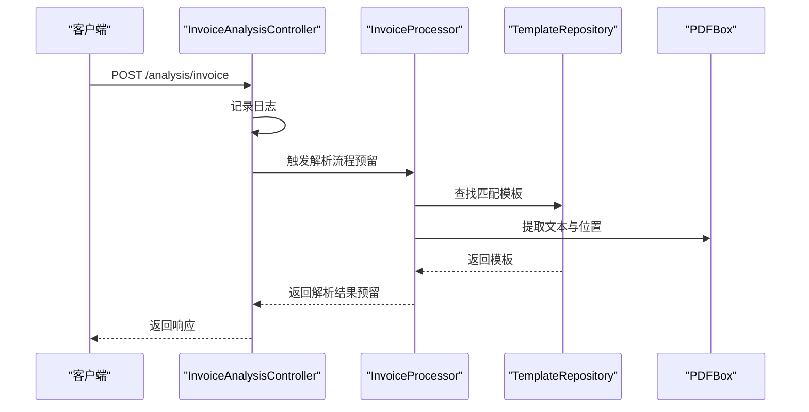
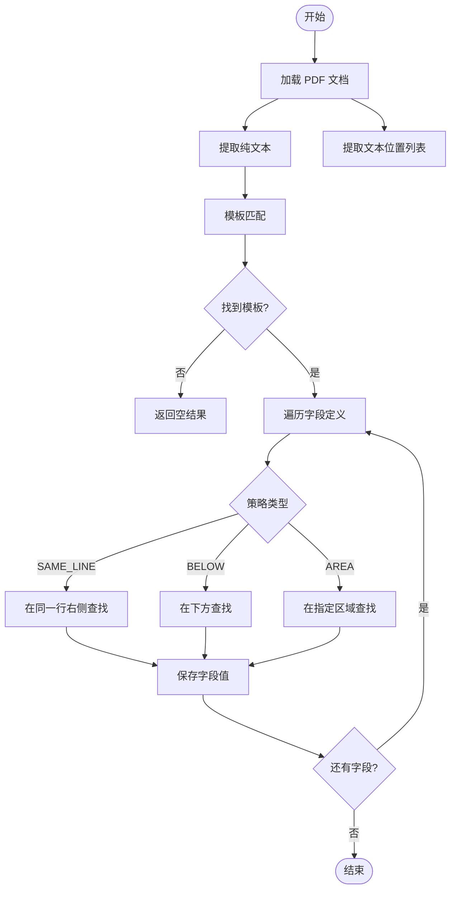
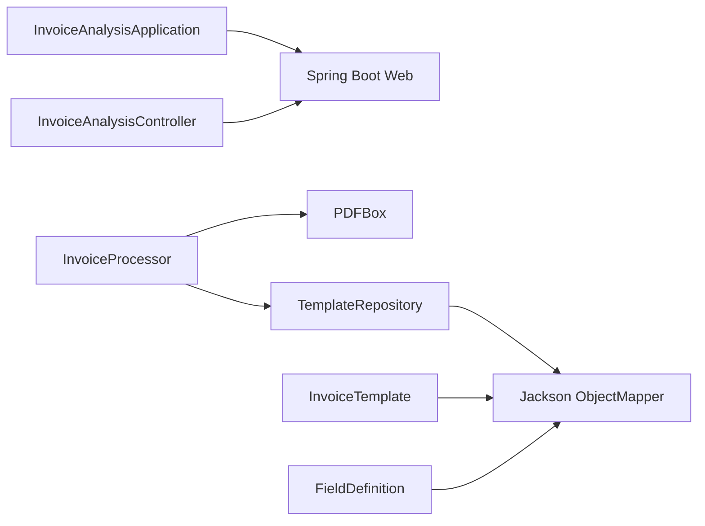

# 快速开始

<cite>
**本文引用的文件**
- [pom.xml](file://pom.xml)
- [InvoiceAnalysisApplication.java](file://src/main/java/com/kinghy/invoiceanalysis/InvoiceAnalysisApplication.java)
- [application.properties](file://src/main/resources/application.properties)
- [InvoiceAnalysisController.java](file://src/main/java/com/kinghy/invoiceanalysis/controller/InvoiceAnalysisController.java)
- [InvoiceProcessor.java](file://src/main/java/com/kinghy/invoiceanalysis/service/InvoiceProcessor.java)
- [TextPositionExtractor.java](file://src/main/java/com/kinghy/invoiceanalysis/service/TextPositionExtractor.java)
- [PositionalInvoiceExtractor.java](file://src/main/java/com/kinghy/invoiceanalysis/service/PositionalInvoiceExtractor.java)
- [TemplateRepository.java](file://src/main/java/com/kinghy/invoiceanalysis/entity/pojo/TemplateRepository.java)
- [FieldDefinition.java](file://src/main/java/com/kinghy/invoiceanalysis/entity/dto/FieldDefinition.java)
- [InvoiceTemplate.java](file://src/main/java/com/kinghy/invoiceanalysis/entity/dto/InvoiceTemplate.java)
- [beijing-tongzhou-hospital-template.json](file://src/main/java/com/kinghy/invoiceanalysis/config/templates/beijing-tongzhou-hospital-template-json)
- [InvoiceAnalysisApplicationTests.java](file://src/test/java/com/kinghy/invoiceanalysis/InvoiceAnalysisApplicationTests.java)
- [.gitignore](file://.gitignore)
- [v1.md](file://docs/v1.md)
</cite>

## 目录
1. [简介](#简介)
2. [项目结构](#项目结构)
3. [核心组件](#核心组件)
4. [架构总览](#架构总览)
5. [详细组件分析](#详细组件分析)
6. [依赖关系分析](#依赖关系分析)
7. [性能考虑](#性能考虑)
8. [故障排查指南](#故障排查指南)
9. [结论](#结论)
10. [附录](#附录)

## 简介
本指南面向新开发者，帮助你在30分钟内完成发票分析系统的环境搭建、编译运行与首次请求体验。系统基于 Spring Boot 与 PDFBox，采用 JSON 模板驱动的发票字段抽取引擎，支持通过模板配置快速适配不同版式发票。

## 项目结构
项目采用标准 Maven 结构，核心源码位于 src/main/java 下，资源文件位于 src/main/resources；测试位于 src/test。模板配置位于 config/templates 目录（当前仓库中为 Java 包路径下的模板文件）。

图表来源
- [pom.xml](file://pom.xml#L1-L86)
- [InvoiceAnalysisApplication.java](file://src/main/java/com/kinghy/invoiceanalysis/InvoiceAnalysisApplication.java#L1-L14)
- [application.properties](file://src/main/resources/application.properties#L1-L2)

章节来源
- [pom.xml](file://pom.xml#L1-L86)
- [InvoiceAnalysisApplication.java](file://src/main/java/com/kinghy/invoiceanalysis/InvoiceAnalysisApplication.java#L1-L14)
- [application.properties](file://src/main/resources/application.properties#L1-L2)

## 核心组件
- 启动入口：Spring Boot 应用入口类负责启动 Web 服务器。
- 控制器：提供 /analysis/invoice 接口，用于接收发票分析请求。
- 处理器：核心发票解析引擎，负责加载模板、提取文本位置信息、匹配模板并抽取字段。
- 模板仓库：扫描模板目录，根据 PDF 文本标识符选择适用模板。
- DTO：定义模板与字段的结构，便于 JSON 映射。
- 工具类：自定义 PDF 文本位置提取器，用于获取每个字符的精确位置信息。

章节来源
- [InvoiceAnalysisApplication.java](file://src/main/java/com/kinghy/invoiceanalysis/InvoiceAnalysisApplication.java#L1-L14)
- [InvoiceAnalysisController.java](file://src/main/java/com/kinghy/invoiceanalysis/controller/InvoiceAnalysisController.java#L1-L26)
- [InvoiceProcessor.java](file://src/main/java/com/kinghy/invoiceanalysis/service/InvoiceProcessor.java#L1-L159)
- [TemplateRepository.java](file://src/main/java/com/kinghy/invoiceanalysis/entity/pojo/TemplateRepository.java#L1-L41)
- [FieldDefinition.java](file://src/main/java/com/kinghy/invoiceanalysis/entity/dto/FieldDefinition.java#L1-L14)
- [InvoiceTemplate.java](file://src/main/java/com/kinghy/invoiceanalysis/entity/dto/InvoiceTemplate.java#L1-L16)
- [TextPositionExtractor.java](file://src/main/java/com/kinghy/invoiceanalysis/service/TextPositionExtractor.java#L1-L30)

## 架构总览
系统采用“模板驱动”的解析架构：PDF 解析器提取文本与位置信息，模板仓库根据标识符匹配模板，处理器依据模板字段规则抽取目标字段。

图表来源
- [InvoiceAnalysisController.java](file://src/main/java/com/kinghy/invoiceanalysis/controller/InvoiceAnalysisController.java#L1-L26)
- [InvoiceProcessor.java](file://src/main/java/com/kinghy/invoiceanalysis/service/InvoiceProcessor.java#L1-L159)
- [TemplateRepository.java](file://src/main/java/com/kinghy/invoiceanalysis/entity/pojo/TemplateRepository.java#L1-L41)
- [TextPositionExtractor.java](file://src/main/java/com/kinghy/invoiceanalysis/service/TextPositionExtractor.java#L1-L30)
- [InvoiceTemplate.java](file://src/main/java/com/kinghy/invoiceanalysis/entity/dto/InvoiceTemplate.java#L1-L16)
- [FieldDefinition.java](file://src/main/java/com/kinghy/invoiceanalysis/entity/dto/FieldDefinition.java#L1-L14)

## 详细组件分析

### 启动与配置
- 应用入口类负责启动 Spring Boot Web 服务。
- application.properties 当前为空，可扩展为端口、日志等配置项。

章节来源
- [InvoiceAnalysisApplication.java](file://src/main/java/com/kinghy/invoiceanalysis/InvoiceAnalysisApplication.java#L1-L14)
- [application.properties](file://src/main/resources/application.properties#L1-L2)

### 控制器：发票分析接口
- 提供 POST /analysis/invoice 接口，当前返回简单状态，后续可接入 InvoiceProcessor 执行解析。

图表来源
- [InvoiceAnalysisController.java](file://src/main/java/com/kinghy/invoiceanalysis/controller/InvoiceAnalysisController.java#L1-L26)
- [InvoiceProcessor.java](file://src/main/java/com/kinghy/invoiceanalysis/service/InvoiceProcessor.java#L1-L159)
- [TemplateRepository.java](file://src/main/java/com/kinghy/invoiceanalysis/entity/pojo/TemplateRepository.java#L1-L41)

章节来源
- [InvoiceAnalysisController.java](file://src/main/java/com/kinghy/invoiceanalysis/controller/InvoiceAnalysisController.java#L1-L26)

### 发票处理器：解析流程
- 加载模板目录，提取 PDF 文本与位置信息。
- 根据模板标识符匹配模板。
- 遍历字段定义，按策略抽取字段值。

图表来源
- [InvoiceProcessor.java](file://src/main/java/com/kinghy/invoiceanalysis/service/InvoiceProcessor.java#L1-L159)
- [TemplateRepository.java](file://src/main/java/com/kinghy/invoiceanalysis/entity/pojo/TemplateRepository.java#L1-L41)

章节来源
- [InvoiceProcessor.java](file://src/main/java/com/kinghy/invoiceanalysis/service/InvoiceProcessor.java#L1-L159)

### 模板仓库：模板匹配
- 扫描模板目录，读取 JSON 并映射为模板对象。
- 通过检查 PDF 文本是否包含模板的所有标识符来匹配模板。

章节来源
- [TemplateRepository.java](file://src/main/java/com/kinghy/invoiceanalysis/entity/pojo/TemplateRepository.java#L1-L41)

### 字段定义与模板结构
- InvoiceTemplate：模板名称、标识符集合、字段定义列表。
- FieldDefinition：字段名、关键字列表、策略类型、选项配置。

章节来源
- [InvoiceTemplate.java](file://src/main/java/com/kinghy/invoiceanalysis/entity/dto/InvoiceTemplate.java#L1-L16)
- [FieldDefinition.java](file://src/main/java/com/kinghy/invoiceanalysis/entity/dto/FieldDefinition.java#L1-L14)

### 文本位置提取器
- 继承 PDFTextStripper，收集每个字符的 TextPosition，便于基于坐标的字段抽取。

章节来源
- [TextPositionExtractor.java](file://src/main/java/com/kinghy/invoiceanalysis/service/TextPositionExtractor.java#L1-L30)

### 位置化抽取器（示例）
- PositionalInvoiceExtractor 展示了如何在关键字同一行右侧提取值，以及如何定位关键字位置。

章节来源
- [PositionalInvoiceExtractor.java](file://src/main/java/com/kinghy/invoiceanalysis/service/PositionalInvoiceExtractor.java#L1-L117)

### 模板示例：北京市通州区中医医院
- 模板包含标识符与多个字段定义，涵盖 SAME_LINE、BELOW、AREA 等策略示例。

章节来源
- [beijing-tongzhou-hospital-template.json](file://src/main/java/com/kinghy/invoiceanalysis/config/templates/beijing-tongzhou-hospital-template.json#L1-L55)

## 依赖关系分析
- Spring Boot Web：提供 Web 服务与控制器。
- Lombok：简化实体类与日志注解。
- PDFBox：解析 PDF 文本与位置信息。
- Jackson：模板 JSON 的读取与映射。

图表来源
- [pom.xml](file://pom.xml#L32-L54)
- [InvoiceProcessor.java](file://src/main/java/com/kinghy/invoiceanalysis/service/InvoiceProcessor.java#L1-L159)
- [TemplateRepository.java](file://src/main/java/com/kinghy/invoiceanalysis/entity/pojo/TemplateRepository.java#L1-L41)
- [InvoiceTemplate.java](file://src/main/java/com/kinghy/invoiceanalysis/entity/dto/InvoiceTemplate.java#L1-L16)
- [FieldDefinition.java](file://src/main/java/com/kinghy/invoiceanalysis/entity/dto/FieldDefinition.java#L1-L14)

章节来源
- [pom.xml](file://pom.xml#L29-L54)

## 性能考虑
- 单页解析：当前仅解析第一页，减少 CPU 与内存开销。
- 模板匹配：通过标识符集合快速筛选候选模板，避免全量扫描。
- 位置提取：TextPosition 列表按 X 坐标排序后拼接，时间复杂度近似 O(n log n)。
- 建议：对大文件可分页处理；对多模板场景可引入缓存与索引优化。

[本节为通用建议，不直接分析具体文件]

## 故障排查指南
- 环境要求不符
  - 现象：编译失败或运行报错。
  - 排查：确认 JDK 版本满足项目属性要求；确保 Maven 版本兼容。
  - 参考：[pom.xml](file://pom.xml#L29-L31)
- 依赖缺失
  - 现象：找不到 PDFBox 或 Jackson 类。
  - 排查：执行 Maven 依赖同步；检查网络代理设置。
  - 参考：[pom.xml](file://pom.xml#L48-L52)
- 模板路径错误
  - 现象：无法加载模板或提示路径不存在。
  - 排查：核对模板目录路径；确保模板文件为 JSON 格式。
  - 参考：[InvoiceProcessor.java](file://src/main/java/com/kinghy/invoiceanalysis/service/InvoiceProcessor.java#L23-L25)
- PDF 文件不可读
  - 现象：解析异常或空文本。
  - 排查：确认 PDF 文件未加密；尝试使用不同 PDFBox 版本；检查文件权限。
  - 参考：[InvoiceProcessor.java](file://src/main/java/com/kinghy/invoiceanalysis/service/InvoiceProcessor.java#L30-L37)
- 关键字未匹配
  - 现象：模板未命中或字段值为空。
  - 排查：调整模板标识符与关键字；检查关键字大小写与空格；确认 PDF 文本是否包含预期内容。
  - 参考：[TemplateRepository.java](file://src/main/java/com/kinghy/invoiceanalysis/entity/pojo/TemplateRepository.java#L25-L39)
- IDE 启动失败
  - 现象：IDE 启动报错或找不到主类。
  - 排查：刷新 Maven 项目；清理并重新导入；检查模块路径与 JDK 配置。
  - 参考：[InvoiceAnalysisApplication.java](file://src/main/java/com/kinghy/invoiceanalysis/InvoiceAnalysisApplication.java#L1-L14)

章节来源
- [pom.xml](file://pom.xml#L29-L54)
- [InvoiceProcessor.java](file://src/main/java/com/kinghy/invoiceanalysis/service/InvoiceProcessor.java#L23-L37)
- [TemplateRepository.java](file://src/main/java/com/kinghy/invoiceanalysis/entity/pojo/TemplateRepository.java#L15-L39)
- [InvoiceAnalysisApplication.java](file://src/main/java/com/kinghy/invoiceanalysis/InvoiceAnalysisApplication.java#L1-L14)

## 结论
本指南提供了从环境准备到首次请求的完整路径。当前控制器接口已就绪，处理器与模板系统已具备基础能力。建议先完成控制器与处理器的集成，再逐步完善策略实现与模板配置，以支撑更多发票版式。

[本节为总结性内容，不直接分析具体文件]

## 附录

### 环境搭建步骤
- 安装 JDK 8+
  - 下载并安装 JDK 8 或更高版本。
  - 配置 JAVA_HOME 与 PATH。
- 安装 Maven
  - 下载并安装 Maven。
  - 验证 mvn -version。
- 安装 IDE
  - 推荐 IntelliJ IDEA 或 Eclipse。
  - 导入项目为 Maven 项目。
- 克隆与编译
  - 使用 Git 克隆仓库。
  - 在项目根目录执行 mvn clean install。
- 运行
  - 启动应用入口类。
  - 或使用 mvn spring-boot:run。

章节来源
- [pom.xml](file://pom.xml#L29-L31)
- [InvoiceAnalysisApplication.java](file://src/main/java/com/kinghy/invoiceanalysis/InvoiceAnalysisApplication.java#L1-L14)

### 目录结构与核心文件说明
- src/main/java/com/kinghy/invoiceanalysis
  - controller：HTTP 接口层
  - service：解析引擎与工具
  - entity/dto：模板与字段定义
  - entity/pojo：模板仓库
  - config/templates：模板 JSON
- src/main/resources
  - application.properties：应用配置
- src/test/java/com/kinghy/invoiceanalysis
  - 应用上下文测试
- docs/v1.md
  - 设计文档与模板结构说明

章节来源
- [InvoiceAnalysisController.java](file://src/main/java/com/kinghy/invoiceanalysis/controller/InvoiceAnalysisController.java#L1-L26)
- [InvoiceProcessor.java](file://src/main/java/com/kinghy/invoiceanalysis/service/InvoiceProcessor.java#L1-L159)
- [TemplateRepository.java](file://src/main/java/com/kinghy/invoiceanalysis/entity/pojo/TemplateRepository.java#L1-L41)
- [FieldDefinition.java](file://src/main/java/com/kinghy/invoiceanalysis/entity/dto/FieldDefinition.java#L1-L14)
- [InvoiceTemplate.java](file://src/main/java/com/kinghy/invoiceanalysis/entity/dto/InvoiceTemplate.java#L1-L16)
- [beijing-tongzhou-hospital-template.json](file://src/main/java/com/kinghy/invoiceanalysis/config/templates/beijing-tongzhou-hospital-template.json#L1-L55)
- [application.properties](file://src/main/resources/application.properties#L1-L2)
- [InvoiceAnalysisApplicationTests.java](file://src/test/java/com/kinghy/invoiceanalysis/InvoiceAnalysisApplicationTests.java#L1-L14)
- [v1.md](file://docs/v1.md#L1-L297)

### 第一个发票分析请求示例
- 准备 PDF
  - 准备一张符合模板标识符的发票 PDF（例如“北京市医疗门诊收费票据”）。
- 启动服务
  - 运行应用入口类或使用 Maven 启动。
- 调用接口
  - 使用 HTTP 客户端向 POST /analysis/invoice 发送请求（当前接口返回简单状态，后续可接入解析流程）。
- 解析响应
  - 当前返回字符串“success”，后续将返回解析后的字段键值对。
- 模板与字段
  - 参考模板 JSON 中的标识符与字段定义，确保 PDF 文本包含相应关键字。

章节来源
- [InvoiceAnalysisController.java](file://src/main/java/com/kinghy/invoiceanalysis/controller/InvoiceAnalysisController.java#L18-L22)
- [beijing-tongzhou-hospital-template.json](file://src/main/java/com/kinghy/invoiceanalysis/config/templates/beijing-tongzhou-hospital-template.json#L1-L55)

### 常见问题与解决方案
- 编译报错：检查 JDK 与 Maven 版本；确保网络可访问 Maven 仓库。
- 运行报错：确认 application.properties 配置；检查端口占用。
- 模板不生效：核对标识符与关键字；确认模板 JSON 语法正确。
- PDF 解析异常：更换 PDFBox 版本；检查 PDF 是否加密或损坏。
- IDE 启动失败：刷新 Maven；清理项目；检查模块路径。

章节来源
- [pom.xml](file://pom.xml#L29-L54)
- [InvoiceProcessor.java](file://src/main/java/com/kinghy/invoiceanalysis/service/InvoiceProcessor.java#L23-L37)
- [TemplateRepository.java](file://src/main/java/com/kinghy/invoiceanalysis/entity/pojo/TemplateRepository.java#L15-L39)
- [beijing-tongzhou-hospital-template.json](file://src/main/java/com/kinghy/invoiceanalysis/config/templates/beijing-tongzhou-hospital-template.json#L1-L55)