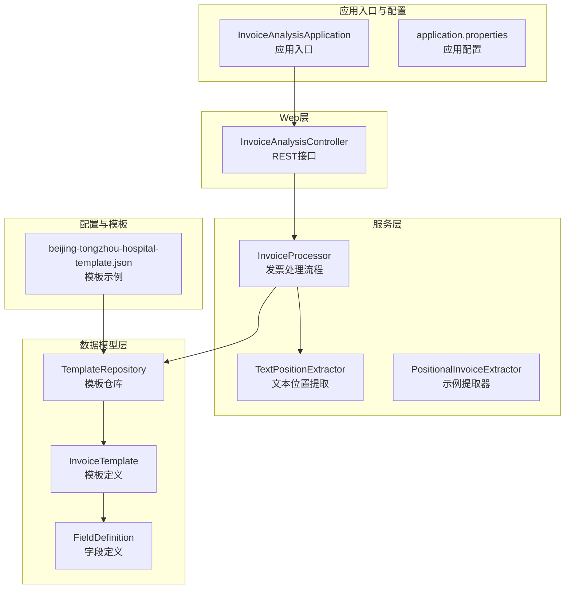
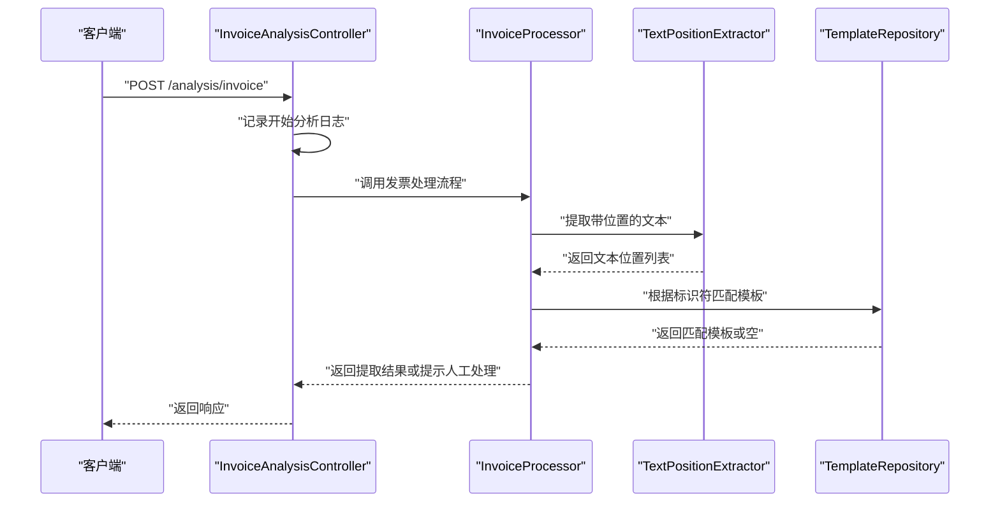
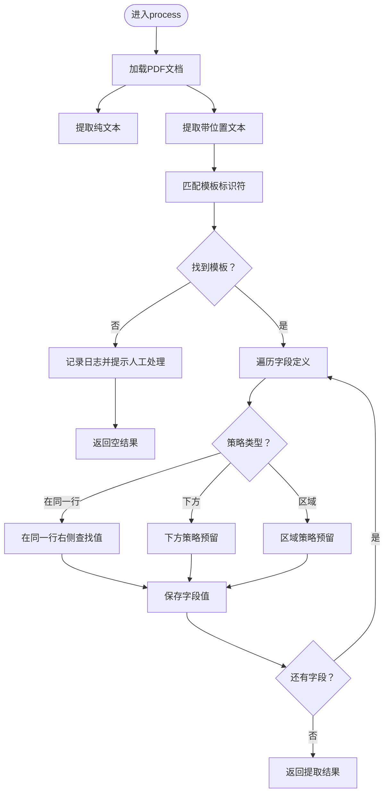
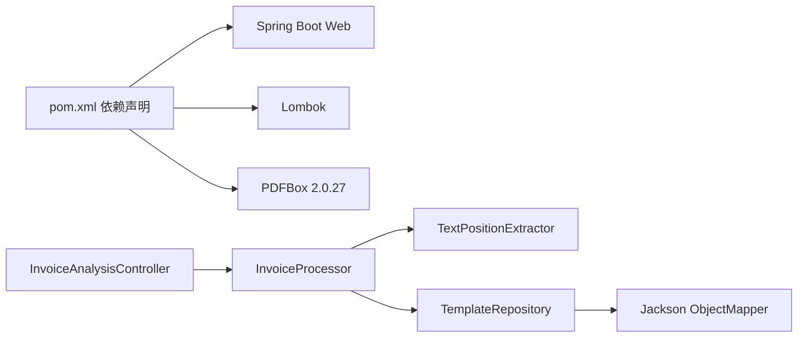

# 故障排查与FAQ

<cite>
**本文引用的文件**
- [InvoiceAnalysisApplication.java](file://src/main/java/com/kinghy/invoiceanalysis/InvoiceAnalysisApplication.java)
- [InvoiceAnalysisController.java](file://src/main/java/com/kinghy/invoiceanalysis/controller/InvoiceAnalysisController.java)
- [InvoiceProcessor.java](file://src/main/java/com/kinghy/invoiceanalysis/service/InvoiceProcessor.java)
- [PositionalInvoiceExtractor.java](file://src/main/java/com/kinghy/invoiceanalysis/service/PositionalInvoiceExtractor.java)
- [TextPositionExtractor.java](file://src/main/java/com/kinghy/invoiceanalysis/service/TextPositionExtractor.java)
- [TemplateRepository.java](file://src/main/java/com/kinghy/invoiceanalysis/entity/pojo/TemplateRepository.java)
- [FieldDefinition.java](file://src/main/java/com/kinghy/invoiceanalysis/entity/dto/FieldDefinition.java)
- [InvoiceTemplate.java](file://src/main/java/com/kinghy/invoiceanalysis/entity/dto/InvoiceTemplate.java)
- [beijing-tongzhou-hospital-template.json](file://src/main/java/com/kinghy/invoiceanalysis/config/templates/beijing-tongzhou-hospital-template.json)
- [application.properties](file://src/main/resources/application.properties)
- [pom.xml](file://pom.xml)
- [InvoiceAnalysisApplicationTests.java](file://src/test/java/com/kinghy/invoiceanalysis/InvoiceAnalysisApplicationTests.java)
</cite>

## 目录
1. [简介](#简介)
2. [项目结构](#项目结构)
3. [核心组件](#核心组件)
4. [架构总览](#架构总览)
5. [详细组件分析](#详细组件分析)
6. [依赖关系分析](#依赖关系分析)
7. [性能考虑](#性能考虑)
8. [故障排查指南](#故障排查指南)
9. [结论](#结论)
10. [附录](#附录)

## 简介
本文件面向发票分析系统的使用者与维护者，提供系统化的问题诊断方法、常见问题解答、日志分析技巧、调试工具使用、性能瓶颈识别与优化建议，以及不同PDF格式的兼容性处理方案。同时涵盖配置错误的常见原因与修复方法、版本升级注意事项与迁移指南，以及社区支持与问题反馈渠道。

## 项目结构
系统采用Spring Boot基础框架，主要模块划分如下：
- 应用入口与Web层：应用启动类与REST控制器
- 服务层：发票处理与文本位置提取逻辑
- 数据模型层：模板与字段定义的数据传输对象
- 配置与模板：JSON模板与Spring配置
- 依赖管理：Maven配置与第三方库

图表来源
- [InvoiceAnalysisApplication.java](file://src/main/java/com/kinghy/invoiceanalysis/InvoiceAnalysisApplication.java#L1-L14)
- [InvoiceAnalysisController.java](file://src/main/java/com/kinghy/invoiceanalysis/controller/InvoiceAnalysisController.java#L1-L26)
- [InvoiceProcessor.java](file://src/main/java/com/kinghy/invoiceanalysis/service/InvoiceProcessor.java#L1-L159)
- [TextPositionExtractor.java](file://src/main/java/com/kinghy/invoiceanalysis/service/TextPositionExtractor.java#L1-L30)
- [TemplateRepository.java](file://src/main/java/com/kinghy/invoiceanalysis/entity/pojo/TemplateRepository.java#L1-L41)
- [InvoiceTemplate.java](file://src/main/java/com/kinghy/invoiceanalysis/entity/dto/InvoiceTemplate.java#L1-L16)
- [FieldDefinition.java](file://src/main/java/com/kinghy/invoiceanalysis/entity/dto/FieldDefinition.java#L1-L14)
- [beijing-tongzhou-hospital-template.json](file://src/main/java/com/kinghy/invoiceanalysis/config/templates/beijing-tongzhou-hospital-template.json#L1-L55)

章节来源
- [InvoiceAnalysisApplication.java](file://src/main/java/com/kinghy/invoiceanalysis/InvoiceAnalysisApplication.java#L1-L14)
- [application.properties](file://src/main/resources/application.properties#L1-L2)

## 核心组件
- 应用入口与配置
  - 应用入口负责启动Spring Boot应用；应用配置文件提供基础属性。
- Web层
  - 控制器提供REST接口，当前实现记录日志并返回成功状态。
- 服务层
  - 发票处理器负责加载PDF、提取文本与位置、匹配模板、按策略提取字段。
  - 文本位置提取器继承PDFTextStripper以收集每个字符的精确位置。
  - 位置式提取器为示例实现，展示如何在同一行右侧查找关键字对应的值。
- 数据模型层
  - 模板定义包含标识符与字段集合；字段定义包含字段名、关键字、策略与选项。
  - 模板仓库负责读取模板目录下的JSON文件并构建模板集合。
- 配置与模板
  - 示例模板展示了不同策略（如在同一行、下方、区域）的字段定义。

章节来源
- [InvoiceAnalysisController.java](file://src/main/java/com/kinghy/invoiceanalysis/controller/InvoiceAnalysisController.java#L1-L26)
- [InvoiceProcessor.java](file://src/main/java/com/kinghy/invoiceanalysis/service/InvoiceProcessor.java#L1-L159)
- [TextPositionExtractor.java](file://src/main/java/com/kinghy/invoiceanalysis/service/TextPositionExtractor.java#L1-L30)
- [PositionalInvoiceExtractor.java](file://src/main/java/com/kinghy/invoiceanalysis/service/PositionalInvoiceExtractor.java#L1-L117)
- [TemplateRepository.java](file://src/main/java/com/kinghy/invoiceanalysis/entity/pojo/TemplateRepository.java#L1-L41)
- [InvoiceTemplate.java](file://src/main/java/com/kinghy/invoiceanalysis/entity/dto/InvoiceTemplate.java#L1-L16)
- [FieldDefinition.java](file://src/main/java/com/kinghy/invoiceanalysis/entity/dto/FieldDefinition.java#L1-L14)
- [beijing-tongzhou-hospital-template.json](file://src/main/java/com/kinghy/invoiceanalysis/config/templates/beijing-tongzhou-hospital-template.json#L1-L55)

## 架构总览
系统采用分层架构：Web层接收请求，服务层完成PDF解析与模板匹配，数据模型层承载模板与字段定义，模板仓库统一加载与匹配模板。日志通过SLF4J输出，便于问题定位。

图表来源
- [InvoiceAnalysisController.java](file://src/main/java/com/kinghy/invoiceanalysis/controller/InvoiceAnalysisController.java#L18-L22)
- [InvoiceProcessor.java](file://src/main/java/com/kinghy/invoiceanalysis/service/InvoiceProcessor.java#L27-L77)
- [TextPositionExtractor.java](file://src/main/java/com/kinghy/invoiceanalysis/service/TextPositionExtractor.java#L21-L28)
- [TemplateRepository.java](file://src/main/java/com/kinghy/invoiceanalysis/entity/pojo/TemplateRepository.java#L25-L39)

## 详细组件分析

### 组件A：发票处理流程（InvoiceProcessor）
- 功能概述
  - 加载PDF文档，提取纯文本与带位置文本。
  - 匹配模板（基于标识符），遍历字段定义并按策略提取值。
  - 当前实现支持“在同一行”策略，其他策略预留扩展点。
- 关键流程
  - 文本提取：使用PDFTextStripper与TextPositionExtractor分别获取纯文本与位置信息。
  - 模板匹配：TemplateRepository扫描模板目录，逐个检查标识符是否出现在文本中。
  - 字段提取：根据字段策略执行相应提取逻辑，当前仅实现“在同一行”策略。
- 性能与复杂度
  - 文本位置查找与关键字匹配为线性扫描，时间复杂度与文本长度与关键字长度相关。
  - ROI（感兴趣区域）过滤减少后续拼接字符数量，有助于提升效率。
- 错误与边界情况
  - 未匹配到模板时返回空结果并记录日志，提示人工处理。
  - 关键字未找到或ROI内无字符时返回空值。
  - PDF加载异常、IO异常需捕获并记录。

图表来源
- [InvoiceProcessor.java](file://src/main/java/com/kinghy/invoiceanalysis/service/InvoiceProcessor.java#L27-L77)
- [TemplateRepository.java](file://src/main/java/com/kinghy/invoiceanalysis/entity/pojo/TemplateRepository.java#L25-L39)

章节来源
- [InvoiceProcessor.java](file://src/main/java/com/kinghy/invoiceanalysis/service/InvoiceProcessor.java#L1-L159)

### 组件B：文本位置提取（TextPositionExtractor）
- 功能概述
  - 继承PDFTextStripper，在writeString回调中收集每个字符的TextPosition，形成完整的位置列表。
- 使用场景
  - 为字段提取提供精确的坐标信息，支撑“在同一行”等策略的ROI判断。
- 注意事项
  - 仅提取指定页码范围内的文本位置，避免全页扫描带来的开销。
  - 输出列表顺序与字符出现顺序一致，便于后续排序与拼接。

章节来源
- [TextPositionExtractor.java](file://src/main/java/com/kinghy/invoiceanalysis/service/TextPositionExtractor.java#L1-L30)

### 组件C：位置式提取示例（PositionalInvoiceExtractor）
- 功能概述
  - 展示在同一行右侧查找关键字对应值的实现思路，包含关键字定位与ROI筛选。
- 适用性
  - 可作为“在同一行”策略的参考实现，便于理解坐标系与容差设置。
- 扩展建议
  - 将该逻辑抽象为策略接口，结合InvoiceProcessor的策略注入机制进行替换与扩展。

章节来源
- [PositionalInvoiceExtractor.java](file://src/main/java/com/kinghy/invoiceanalysis/service/PositionalInvoiceExtractor.java#L1-L117)

### 组件D：模板与字段定义（InvoiceTemplate / FieldDefinition / TemplateRepository）
- 模板结构
  - 模板名称、标识符列表、字段集合。
  - 标识符用于快速筛选候选模板，字段包含字段名、关键字、策略与选项。
- 模板仓库
  - 扫描模板目录，读取JSON文件并反序列化为模板对象。
  - 匹配时要求所有标识符均存在于PDF文本中。
- 兼容性与可维护性
  - JSON模板易于维护与扩展，新增模板只需遵循相同结构。
  - 标识符应尽量稳定且唯一，避免误匹配。

章节来源
- [InvoiceTemplate.java](file://src/main/java/com/kinghy/invoiceanalysis/entity/dto/InvoiceTemplate.java#L1-L16)
- [FieldDefinition.java](file://src/main/java/com/kinghy/invoiceanalysis/entity/dto/FieldDefinition.java#L1-L14)
- [TemplateRepository.java](file://src/main/java/com/kinghy/invoiceanalysis/entity/pojo/TemplateRepository.java#L1-L41)
- [beijing-tongzhou-hospital-template.json](file://src/main/java/com/kinghy/invoiceanalysis/config/templates/beijing-tongzhou-hospital-template.json#L1-L55)

## 依赖关系分析
- 外部依赖
  - Spring Boot Web：提供REST接口能力。
  - Lombok：简化实体与日志注解。
  - PDFBox：PDF文本与位置提取。
- 内部耦合
  - 控制器依赖服务层；服务层依赖模板仓库与文本位置提取器。
  - 模板仓库依赖Jackson进行JSON解析。
- 版本与兼容性
  - Java版本为1.8；Spring Boot版本较旧，建议评估升级路径。

图表来源
- [pom.xml](file://pom.xml#L32-L54)
- [InvoiceAnalysisController.java](file://src/main/java/com/kinghy/invoiceanalysis/controller/InvoiceAnalysisController.java#L1-L26)
- [InvoiceProcessor.java](file://src/main/java/com/kinghy/invoiceanalysis/service/InvoiceProcessor.java#L1-L159)
- [TextPositionExtractor.java](file://src/main/java/com/kinghy/invoiceanalysis/service/TextPositionExtractor.java#L1-L30)
- [TemplateRepository.java](file://src/main/java/com/kinghy/invoiceanalysis/entity/pojo/TemplateRepository.java#L1-L41)

章节来源
- [pom.xml](file://pom.xml#L1-L86)

## 性能考虑
- 文本提取与匹配
  - ROI过滤可显著减少后续处理的字符数量，建议根据实际布局调整容差参数。
  - 关键字匹配为线性扫描，若关键字较多可考虑预处理或索引化（如按首字母分组）。
- 模板匹配
  - 标识符越多越精确但匹配成本越高；建议保留最少必要标识符以平衡准确率与性能。
- PDF处理
  - 仅提取所需页码范围，避免全页扫描。
  - 大文件PDF建议分页处理或限制页数。
- 日志与I/O
  - 避免在高频路径打印大文本；可按级别控制日志输出。
  - 模板文件读取在应用启动时完成，运行时避免重复IO。

[本节为通用性能建议，不直接分析具体文件]

## 故障排查指南

### 一、发票解析失败
- 现象
  - 返回空结果或提示人工处理。
- 排查步骤
  1) 检查PDF是否可正常打开与读取（确认文件完整性与格式）。
  2) 查看日志中是否输出了PDF文本内容，确认文本提取是否成功。
  3) 确认模板目录路径正确且包含有效JSON文件。
  4) 检查模板标识符是否覆盖了PDF文本中的关键信息。
  5) 若关键字不在同一行，确认字段策略是否正确（当前仅实现“在同一行”）。
- 相关实现参考
  - 文本提取与模板匹配流程见发票处理流程图与实现文件。

章节来源
- [InvoiceProcessor.java](file://src/main/java/com/kinghy/invoiceanalysis/service/InvoiceProcessor.java#L27-L77)
- [TemplateRepository.java](file://src/main/java/com/kinghy/invoiceanalysis/entity/pojo/TemplateRepository.java#L25-L39)

### 二、模板匹配错误
- 现象
  - 匹配到错误模板或未匹配到模板。
- 排查步骤
  1) 核对模板标识符是否与PDF文本一致（大小写、空格、特殊字符）。
  2) 增加唯一性更强的标识符，避免多模板冲突。
  3) 检查模板JSON语法与字段命名是否规范。
  4) 对比多个PDF样本，验证标识符覆盖范围。
- 相关实现参考
  - 模板匹配逻辑与JSON读取见模板仓库实现。

章节来源
- [TemplateRepository.java](file://src/main/java/com/kinghy/invoiceanalysis/entity/pojo/TemplateRepository.java#L15-L41)
- [beijing-tongzhou-hospital-template.json](file://src/main/java/com/kinghy/invoiceanalysis/config/templates/beijing-tongzhou-hospital-template.json#L1-L55)

### 三、性能问题
- 现象
  - 处理耗时较长或内存占用偏高。
- 排查步骤
  1) 分析日志中各阶段耗时（文本提取、模板匹配、字段提取）。
  2) 减少ROI区域或缩小搜索范围，降低字符处理量。
  3) 限制页数或分页处理，避免一次性加载整页。
  4) 优化模板标识符数量与匹配算法（如预处理关键字）。
- 相关实现参考
  - ROI与关键字匹配逻辑见发票处理流程与位置式提取示例。

章节来源
- [InvoiceProcessor.java](file://src/main/java/com/kinghy/invoiceanalysis/service/InvoiceProcessor.java#L96-L135)
- [PositionalInvoiceExtractor.java](file://src/main/java/com/kinghy/invoiceanalysis/service/PositionalInvoiceExtractor.java#L54-L93)

### 四、不同PDF格式的兼容性问题
- 常见问题
  - 文字编码异常、字体嵌入问题导致文本缺失或乱码。
  - 扫描版PDF文字不可选，仅能识别图片文字（需OCR）。
  - 不同软件生成的PDF布局差异较大，影响ROI判定。
- 解决建议
  1) 确保PDF为可编辑文本（非扫描版）。
  2) 如遇编码问题，尝试转换PDF或调整文本提取参数。
  3) 针对布局差异，增加模板数量并细化标识符与字段策略。
  4) 对于OCR需求，可在现有流程外增加OCR前置步骤（当前实现未包含）。

[本节为通用兼容性建议，不直接分析具体文件]

### 五、配置错误与修复方法
- application.properties
  - 当前为空配置，如需扩展端口、日志级别等，请在此文件添加相应属性。
- 模板路径
  - 确认InvoiceProcessor构造时传入的模板目录路径与实际路径一致。
- Maven依赖
  - 确认PDFBox版本与项目Java版本兼容；如需升级，请同步评估Spring Boot与Lombok版本。
- 单元测试
  - 测试类已存在，可作为应用上下文加载的健康检查。

章节来源
- [application.properties](file://src/main/resources/application.properties#L1-L2)
- [InvoiceProcessor.java](file://src/main/java/com/kinghy/invoiceanalysis/service/InvoiceProcessor.java#L23-L25)
- [pom.xml](file://pom.xml#L29-L54)
- [InvoiceAnalysisApplicationTests.java](file://src/test/java/com/kinghy/invoiceanalysis/InvoiceAnalysisApplicationTests.java#L1-L14)

### 六、版本升级与迁移指南
- Spring Boot版本
  - 当前使用2.1.7.RELEASE，建议评估升级至更现代的版本，注意依赖兼容性与注解处理配置。
- Java版本
  - 当前为1.8，若升级至更高版本，需同步更新编译与打包插件配置。
- PDFBox版本
  - 当前为2.0.27，建议升级至最新稳定版，关注API变更与行为差异。
- 迁移建议
  1) 逐步升级依赖，先升级PDFBox与Java，再升级Spring Boot。
  2) 更新注解处理器与插件配置，确保编译与打包顺利。
  3) 编写回归测试，覆盖发票处理流程与模板匹配逻辑。

章节来源
- [pom.xml](file://pom.xml#L5-L10)
- [pom.xml](file://pom.xml#L29-L54)

### 七、日志分析技巧与调试工具
- 日志输出
  - 控制器与处理器均使用SLF4J输出日志，建议在开发环境开启DEBUG级别，生产环境保持INFO或WARN。
- 关键日志点
  - 开始分析、PDF文本内容、模板匹配结果、字段提取详情。
- 调试建议
  - 使用IDE断点调试，重点观察模板匹配与字段提取过程。
  - 通过命令行运行主函数或独立示例，快速验证单个PDF文件的处理结果。

章节来源
- [InvoiceAnalysisController.java](file://src/main/java/com/kinghy/invoiceanalysis/controller/InvoiceAnalysisController.java#L18-L22)
- [InvoiceProcessor.java](file://src/main/java/com/kinghy/invoiceanalysis/service/InvoiceProcessor.java#L37-L52)

### 八、社区支持与问题反馈
- 问题反馈渠道
  - 建议通过项目仓库的Issue功能提交问题，附带PDF样例、日志片段与期望结果。
- 社区协作
  - 可贡献更多模板与策略实现，共同完善系统对不同发票格式的支持。

[本节为通用支持建议，不直接分析具体文件]

## 结论
本系统提供了基于PDF文本位置与模板标识符的发票字段提取能力。通过合理的模板设计、ROI参数调优与策略扩展，可有效提升解析准确性与性能。建议优先完善模板与字段策略，逐步引入OCR与更高效的匹配算法，并在升级依赖时做好兼容性评估与回归测试。

[本节为总结性内容，不直接分析具体文件]

## 附录

### A. 快速检查清单
- PDF文件是否可正常打开与读取？
- 模板目录路径是否正确且包含有效JSON文件？
- 模板标识符是否覆盖PDF文本中的关键信息？
- 字段策略是否与布局一致（当前仅实现“在同一行”）？
- 日志中是否输出了PDF文本与匹配结果？

### B. 常见问题FAQ
- Q：为什么总是提示人工处理？
  - A：通常表示未匹配到模板。请检查模板标识符与PDF文本的一致性。
- Q：如何添加新的发票模板？
  - A：在模板目录下新增JSON文件，遵循模板结构并提供唯一标识符。
- Q：如何优化处理速度？
  - A：缩小ROI范围、减少页数、优化关键字匹配与模板数量。

[本节为通用FAQ，不直接分析具体文件]