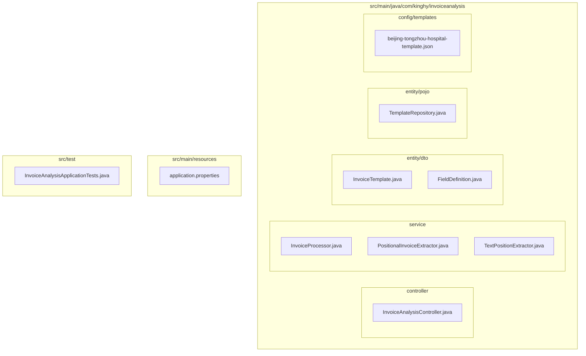
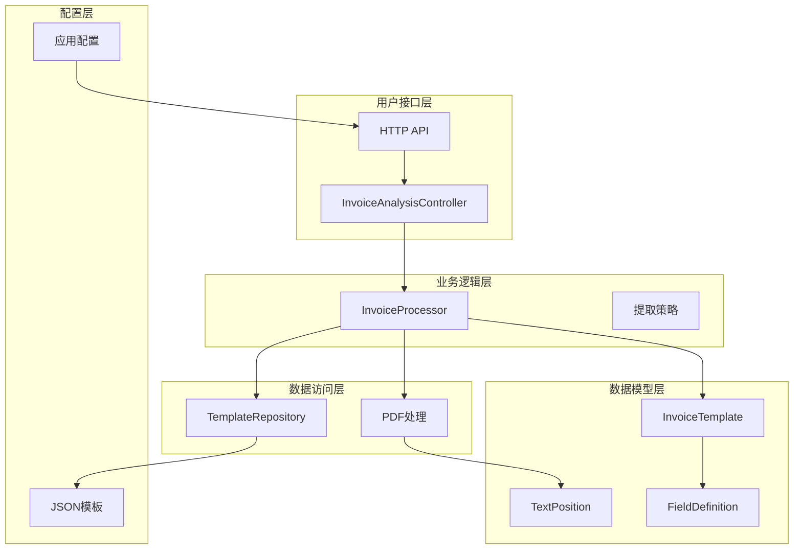
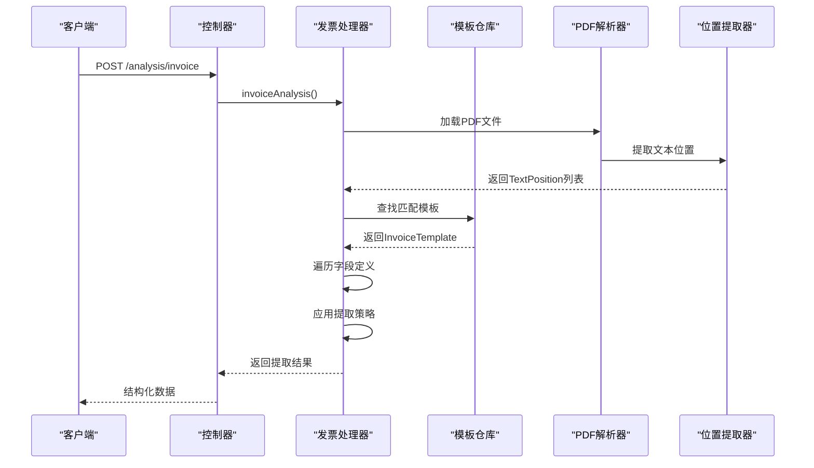
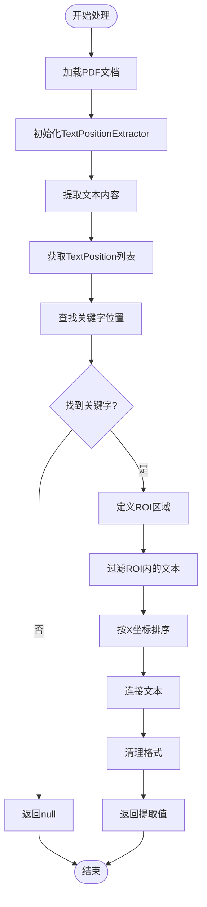
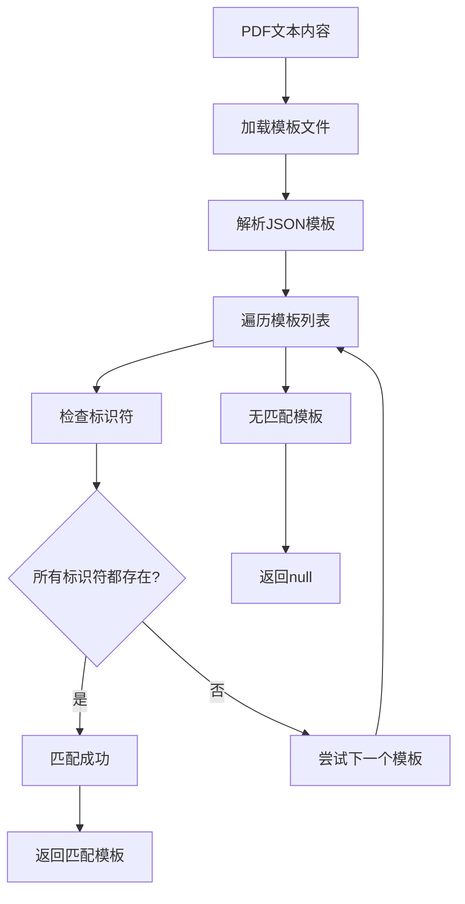
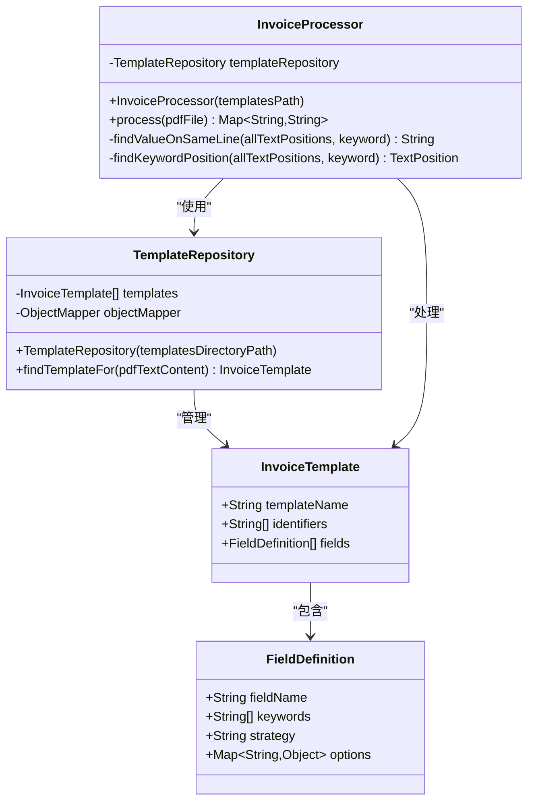
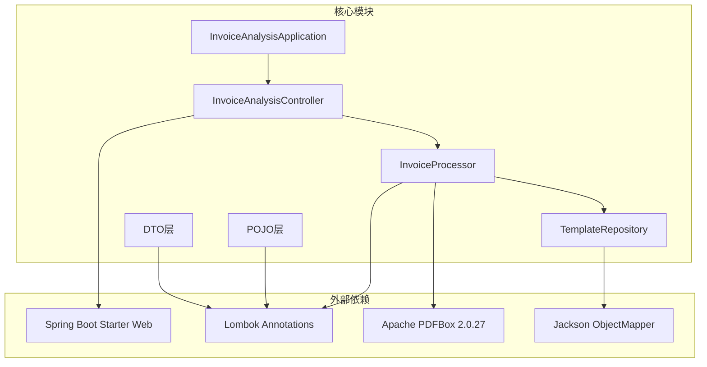
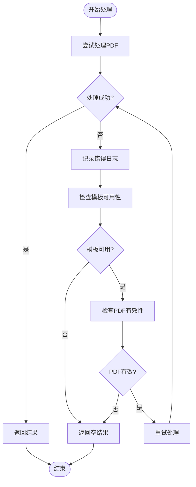

# 数据流设计

<cite>
**本文档引用的文件**
- [InvoiceAnalysisApplication.java](file://src/main/java/com/kinghy/invoiceanalysis/InvoiceAnalysisApplication.java)
- [InvoiceAnalysisController.java](file://src/main/java/com/kinghy/invoiceanalysis/controller/InvoiceAnalysisController.java)
- [InvoiceTemplate.java](file://src/main/java/com/kinghy/invoiceanalysis/entity/dto/InvoiceTemplate.java)
- [FieldDefinition.java](file://src/main/java/com/kinghy/invoiceanalysis/entity/dto/FieldDefinition.java)
- [InvoiceProcessor.java](file://src/main/java/com/kinghy/invoiceanalysis/service/InvoiceProcessor.java)
- [PositionalInvoiceExtractor.java](file://src/main/java/com/kinghy/invoiceanalysis/service/PositionalInvoiceExtractor.java)
- [TextPositionExtractor.java](file://src/main/java/com/kinghy/invoiceanalysis/service/TextPositionExtractor.java)
- [TemplateRepository.java](file://src/main/java/com/kinghy/invoiceanalysis/entity/pojo/TemplateRepository.java)
- [application.properties](file://src/main/resources/application.properties)
- [beijing-tongzhou-hospital-template.json](file://src/main/java/com/kinghy/invoiceanalysis/config/templates/beijing-tongzhou-hospital-template.json)
- [pom.xml](file://pom.xml)
</cite>

## 目录
1. [引言](#引言)
2. [项目结构](#项目结构)
3. [核心组件](#核心组件)
4. [架构概览](#架构概览)
5. [详细组件分析](#详细组件分析)
6. [依赖关系分析](#依赖关系分析)
7. [性能考虑](#性能考虑)
8. [故障排除指南](#故障排除指南)
9. [结论](#结论)

## 引言

本项目是一个基于Spring Boot的发票分析系统，专注于从PDF发票中提取结构化数据。该系统实现了完整的数据流处理管道，从PDF文件输入到结构化数据输出，包括模板匹配、文本位置分析、字段提取和数据验证等关键环节。

系统的核心目标是通过预定义的模板和策略模式，自动识别和提取发票中的关键字段信息，为后续的数据处理和存储提供标准化的结构化数据。

## 项目结构

项目采用标准的Spring Boot目录结构，按照功能模块进行组织：

**图表来源**
- [InvoiceAnalysisApplication.java](file://src/main/java/com/kinghy/invoiceanalysis/InvoiceAnalysisApplication.java#L1-L14)
- [InvoiceAnalysisController.java](file://src/main/java/com/kinghy/invoiceanalysis/controller/InvoiceAnalysisController.java#L1-L26)
- [InvoiceProcessor.java](file://src/main/java/com/kinghy/invoiceanalysis/service/InvoiceProcessor.java#L1-L159)

**章节来源**
- [InvoiceAnalysisApplication.java](file://src/main/java/com/kinghy/invoiceanalysis/InvoiceAnalysisApplication.java#L1-L14)
- [application.properties](file://src/main/resources/application.properties#L1-L2)

## 核心组件

### 数据模型层

系统的核心数据模型由两个主要类组成：

#### InvoiceTemplate（发票模板）
- **作用**：定义发票识别和字段提取的规则集合
- **关键属性**：
  - `templateName`：模板名称标识
  - `identifiers`：识别关键字列表，用于匹配特定类型的发票
  - `fields`：字段定义列表，包含提取规则

#### FieldDefinition（字段定义）
- **作用**：描述单个字段的提取规则
- **关键属性**：
  - `fieldName`：字段标识符
  - `keywords`：关键字列表，用于定位字段值
  - `strategy`：提取策略类型（SAME_LINE、BELOW、AREA）
  - `options`：策略相关的配置选项

### 处理服务层

#### InvoiceProcessor（发票处理器）
- **职责**：协调整个发票处理流程
- **核心功能**：
  - PDF文本提取和位置分析
  - 模板匹配和选择
  - 字段值提取和数据整理

#### TemplateRepository（模板仓库）
- **职责**：管理模板文件的加载和查找
- **核心功能**：
  - JSON模板文件解析
  - 模板匹配算法实现

**章节来源**
- [InvoiceTemplate.java](file://src/main/java/com/kinghy/invoiceanalysis/entity/dto/InvoiceTemplate.java#L1-L16)
- [FieldDefinition.java](file://src/main/java/com/kinghy/invoiceanalysis/entity/dto/FieldDefinition.java#L1-L14)
- [InvoiceProcessor.java](file://src/main/java/com/kinghy/invoiceanalysis/service/InvoiceProcessor.java#L1-L159)
- [TemplateRepository.java](file://src/main/java/com/kinghy/invoiceanalysis/entity/pojo/TemplateRepository.java#L1-L41)

## 架构概览

系统采用分层架构设计，实现了清晰的关注点分离：

**图表来源**
- [InvoiceAnalysisController.java](file://src/main/java/com/kinghy/invoiceanalysis/controller/InvoiceAnalysisController.java#L1-L26)
- [InvoiceProcessor.java](file://src/main/java/com/kinghy/invoiceanalysis/service/InvoiceProcessor.java#L1-L159)
- [TemplateRepository.java](file://src/main/java/com/kinghy/invoiceanalysis/entity/pojo/TemplateRepository.java#L1-L41)

## 详细组件分析

### 发票处理流程

系统的核心处理流程如下：

**图表来源**
- [InvoiceAnalysisController.java](file://src/main/java/com/kinghy/invoiceanalysis/controller/InvoiceAnalysisController.java#L18-L22)
- [InvoiceProcessor.java](file://src/main/java/com/kinghy/invoiceanalysis/service/InvoiceProcessor.java#L27-L77)
- [TemplateRepository.java](file://src/main/java/com/kinghy/invoiceanalysis/entity/pojo/TemplateRepository.java#L25-L39)

### 文本位置提取算法

系统实现了精确的文本位置分析算法：

**图表来源**
- [TextPositionExtractor.java](file://src/main/java/com/kinghy/invoiceanalysis/service/TextPositionExtractor.java#L21-L28)
- [InvoiceProcessor.java](file://src/main/java/com/kinghy/invoiceanalysis/service/InvoiceProcessor.java#L96-L135)

### 模板匹配机制

模板匹配采用关键字匹配策略：

**图表来源**
- [TemplateRepository.java](file://src/main/java/com/kinghy/invoiceanalysis/entity/pojo/TemplateRepository.java#L15-L23)
- [TemplateRepository.java](file://src/main/java/com/kinghy/invoiceanalysis/entity/pojo/TemplateRepository.java#L25-L39)

### 数据模型设计

**图表来源**
- [InvoiceTemplate.java](file://src/main/java/com/kinghy/invoiceanalysis/entity/dto/InvoiceTemplate.java#L9-L13)
- [FieldDefinition.java](file://src/main/java/com/kinghy/invoiceanalysis/entity/dto/FieldDefinition.java#L9-L13)
- [TemplateRepository.java](file://src/main/java/com/kinghy/invoiceanalysis/entity/pojo/TemplateRepository.java#L11-L23)
- [InvoiceProcessor.java](file://src/main/java/com/kinghy/invoiceanalysis/service/InvoiceProcessor.java#L19-L25)

**章节来源**
- [InvoiceProcessor.java](file://src/main/java/com/kinghy/invoiceanalysis/service/InvoiceProcessor.java#L27-L77)
- [TemplateRepository.java](file://src/main/java/com/kinghy/invoiceanalysis/entity/pojo/TemplateRepository.java#L25-L39)
- [TextPositionExtractor.java](file://src/main/java/com/kinghy/invoiceanalysis/service/TextPositionExtractor.java#L13-L29)

## 依赖关系分析

系统依赖关系清晰明确，遵循了良好的分层设计原则：

**图表来源**
- [pom.xml](file://pom.xml#L32-L53)
- [InvoiceAnalysisApplication.java](file://src/main/java/com/kinghy/invoiceanalysis/InvoiceAnalysisApplication.java#L1-L14)
- [InvoiceProcessor.java](file://src/main/java/com/kinghy/invoiceanalysis/service/InvoiceProcessor.java#L1-L159)

**章节来源**
- [pom.xml](file://pom.xml#L29-L53)
- [InvoiceProcessor.java](file://src/main/java/com/kinghy/invoiceanalysis/service/InvoiceProcessor.java#L1-L159)

## 性能考虑

### 文本处理优化

1. **内存管理**：使用try-with-resources确保PDF文档正确关闭
2. **延迟加载**：模板文件按需加载和解析
3. **缓存策略**：可考虑实现模板缓存减少重复解析

### 算法复杂度

- **模板匹配**：O(n*m*k)，其中n为模板数量，m为标识符数量，k为文本长度
- **关键字查找**：O(p*q)，其中p为文本位置数，q为关键字长度
- **文本排序**：O(r*log(r))，其中r为ROI区域内文本数

### 可扩展性建议

1. **策略模式**：已预留策略接口，便于添加新的提取策略
2. **并发处理**：可支持多线程处理多个PDF文件
3. **配置驱动**：通过JSON配置文件实现灵活的模板管理

## 故障排除指南

### 常见问题及解决方案

#### 模板匹配失败
- **症状**：日志显示"没有找到适用于文件的模板"
- **原因**：PDF文本内容不包含模板标识符
- **解决方案**：检查模板JSON文件中的标识符配置，确认PDF内容格式

#### 关键字未找到
- **症状**：字段值提取返回null
- **原因**：关键字不在同一行或位置不匹配
- **解决方案**：调整关键字列表，检查PDF字体和布局

#### PDF解析错误
- **症状**：IOException异常
- **原因**：PDF文件损坏或格式不支持
- **解决方案**：验证PDF文件完整性，检查文件路径

### 错误处理策略

**图表来源**
- [InvoiceProcessor.java](file://src/main/java/com/kinghy/invoiceanalysis/service/InvoiceProcessor.java#L47-L51)

**章节来源**
- [InvoiceProcessor.java](file://src/main/java/com/kinghy/invoiceanalysis/service/InvoiceProcessor.java#L47-L51)

## 结论

本发票分析系统实现了从PDF发票到结构化数据的完整数据流处理。系统采用模块化设计，具有以下特点：

1. **清晰的架构分层**：控制器、服务、数据模型各司其职
2. **灵活的模板机制**：通过JSON配置实现可扩展的模板管理
3. **精确的文本分析**：基于位置信息的精确字段提取
4. **良好的错误处理**：完善的异常处理和降级策略

系统目前实现了SAME_LINE策略的基础功能，预留了BELOW和AREA策略的扩展接口，为未来的功能增强奠定了基础。通过合理的配置管理和算法优化，系统能够稳定地处理各种格式的发票数据。