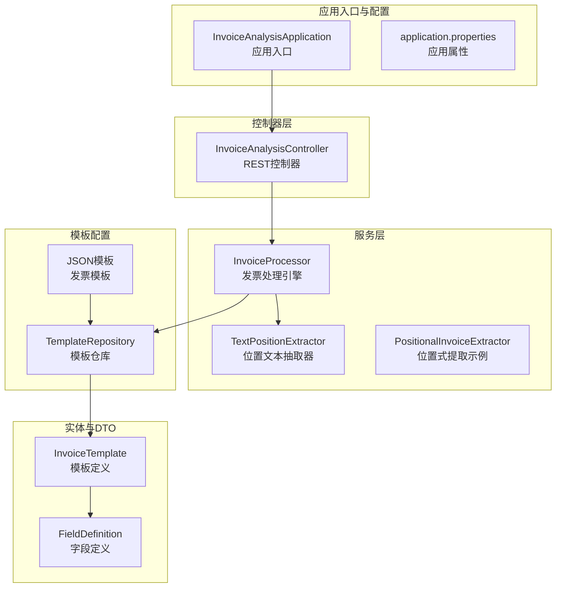
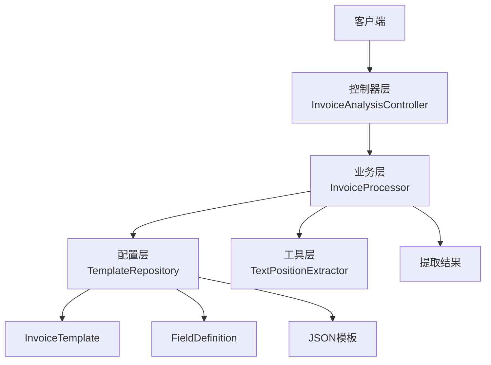
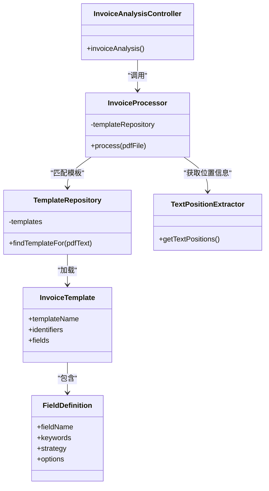
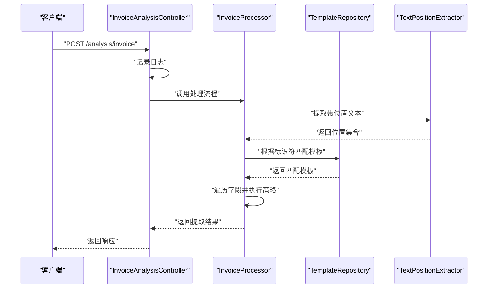
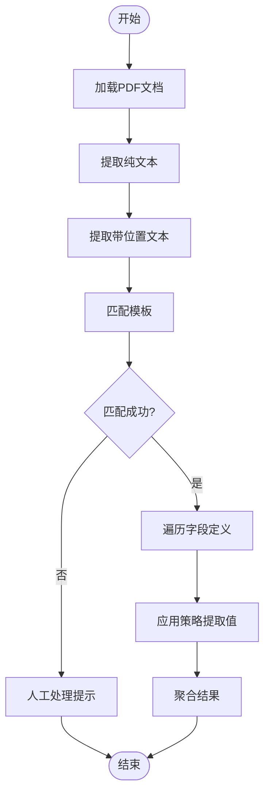
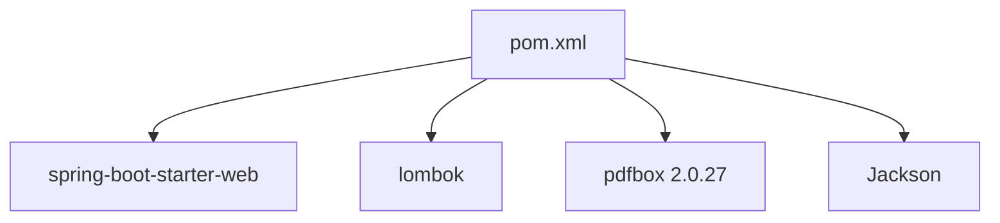

# 架构设计

<cite>
**本文引用的文件**
- [InvoiceAnalysisApplication.java](file://src/main/java/com/kinghy/invoiceanalysis/InvoiceAnalysisApplication.java)
- [InvoiceAnalysisController.java](file://src/main/java/com/kinghy/invoiceanalysis/controller/InvoiceAnalysisController.java)
- [InvoiceProcessor.java](file://src/main/java/com/kinghy/invoiceanalysis/service/InvoiceProcessor.java)
- [TemplateRepository.java](file://src/main/java/com/kinghy/invoiceanalysis/entity/pojo/TemplateRepository.java)
- [TextPositionExtractor.java](file://src/main/java/com/kinghy/invoiceanalysis/service/TextPositionExtractor.java)
- [PositionalInvoiceExtractor.java](file://src/main/java/com/kinghy/invoiceanalysis/service/PositionalInvoiceExtractor.java)
- [InvoiceTemplate.java](file://src/main/java/com/kinghy/invoiceanalysis/entity/dto/InvoiceTemplate.java)
- [FieldDefinition.java](file://src/main/java/com/kinghy/invoiceanalysis/entity/dto/FieldDefinition.java)
- [beijing-tongzhou-hospital-template.json](file://src/main/java/com/kinghy/invoiceanalysis/config/templates/beijing-tongzhou-hospital-template.json)
- [application.properties](file://src/main/resources/application.properties)
- [pom.xml](file://pom.xml)
- [v1.md](file://docs/v1.md)
</cite>

## 目录
1. [引言](#引言)
2. [项目结构](#项目结构)
3. [核心组件](#核心组件)
4. [架构总览](#架构总览)
5. [详细组件分析](#详细组件分析)
6. [依赖分析](#依赖分析)
7. [性能考量](#性能考量)
8. [故障排查指南](#故障排查指南)
9. [结论](#结论)
10. [附录](#附录)

## 引言
本架构设计文档面向发票分析系统，聚焦于整体架构模式（MVC分层设计、策略模式的应用、模板方法模式的实现）、各层职责与交互关系、核心组件设计思路与实现细节，以及配置驱动的设计理念与扩展性、性能优化策略。系统采用Spring Boot作为基础框架，结合PDFBox进行文本与位置信息抽取，通过JSON模板驱动的策略化提取流程，实现对不同发票版式的快速适配与维护。

## 项目结构
项目采用基于功能域的分层组织方式，主要模块如下：
- 入口与配置：应用入口、Spring配置
- 控制器层：HTTP请求入口与简单日志记录
- 服务层：核心处理流程（发票处理、文本位置抽取）
- 实体与数据传输对象：模板与字段定义
- 配置模板：JSON模板目录
- 构建与依赖：Maven配置

图表来源
- [InvoiceAnalysisApplication.java](file://src/main/java/com/kinghy/invoiceanalysis/InvoiceAnalysisApplication.java#L1-L14)
- [application.properties](file://src/main/resources/application.properties#L1-L2)
- [InvoiceAnalysisController.java](file://src/main/java/com/kinghy/invoiceanalysis/controller/InvoiceAnalysisController.java#L1-L26)
- [InvoiceProcessor.java](file://src/main/java/com/kinghy/invoiceanalysis/service/InvoiceProcessor.java#L1-L159)
- [TextPositionExtractor.java](file://src/main/java/com/kinghy/invoiceanalysis/service/TextPositionExtractor.java#L1-L30)
- [PositionalInvoiceExtractor.java](file://src/main/java/com/kinghy/invoiceanalysis/service/PositionalInvoiceExtractor.java#L1-L117)
- [TemplateRepository.java](file://src/main/java/com/kinghy/invoiceanalysis/entity/pojo/TemplateRepository.java#L1-L41)
- [InvoiceTemplate.java](file://src/main/java/com/kinghy/invoiceanalysis/entity/dto/InvoiceTemplate.java#L1-L16)
- [FieldDefinition.java](file://src/main/java/com/kinghy/invoiceanalysis/entity/dto/FieldDefinition.java#L1-L14)
- [beijing-tongzhou-hospital-template.json](file://src/main/java/com/kinghy/invoiceanalysis/config/templates/beijing-tongzhou-hospital-template.json#L1-L55)

章节来源
- [InvoiceAnalysisApplication.java](file://src/main/java/com/kinghy/invoiceanalysis/InvoiceAnalysisApplication.java#L1-L14)
- [application.properties](file://src/main/resources/application.properties#L1-L2)
- [InvoiceAnalysisController.java](file://src/main/java/com/kinghy/invoiceanalysis/controller/InvoiceAnalysisController.java#L1-L26)
- [InvoiceProcessor.java](file://src/main/java/com/kinghy/invoiceanalysis/service/InvoiceProcessor.java#L1-L159)
- [TemplateRepository.java](file://src/main/java/com/kinghy/invoiceanalysis/entity/pojo/TemplateRepository.java#L1-L41)
- [TextPositionExtractor.java](file://src/main/java/com/kinghy/invoiceanalysis/service/TextPositionExtractor.java#L1-L30)
- [PositionalInvoiceExtractor.java](file://src/main/java/com/kinghy/invoiceanalysis/service/PositionalInvoiceExtractor.java#L1-L117)
- [InvoiceTemplate.java](file://src/main/java/com/kinghy/invoiceanalysis/entity/dto/InvoiceTemplate.java#L1-L16)
- [FieldDefinition.java](file://src/main/java/com/kinghy/invoiceanalysis/entity/dto/FieldDefinition.java#L1-L14)
- [beijing-tongzhou-hospital-template.json](file://src/main/java/com/kinghy/invoiceanalysis/config/templates/beijing-tongzhou-hospital-template.json#L1-L55)

## 核心组件
- 发票处理引擎（InvoiceProcessor）：负责PDF加载、文本与位置信息抽取、模板匹配、字段提取与结果聚合。当前已实现基于关键字同线提取策略的简化流程，并预留策略模式扩展点。
- 模板仓库（TemplateRepository）：负责扫描模板目录、解析JSON模板、根据PDF文本标识符进行模板匹配。
- 文本位置抽取器（TextPositionExtractor）：继承PDFBox的PDFTextStripper，覆盖写入回调以收集每个字符的精确位置信息。
- 位置式提取示例（PositionalInvoiceExtractor）：提供同线查找与关键字定位的实现示例，便于理解位置信息的使用方式。
- 数据模型（InvoiceTemplate、FieldDefinition）：承载模板元数据与字段提取规则，支持策略类型与选项配置。
- REST控制器（InvoiceAnalysisController）：当前提供简单的分析入口，便于后续接入完整业务流程。
- 应用入口（InvoiceAnalysisApplication）与配置（application.properties）：Spring Boot启动入口与应用名称配置。

章节来源
- [InvoiceProcessor.java](file://src/main/java/com/kinghy/invoiceanalysis/service/InvoiceProcessor.java#L1-L159)
- [TemplateRepository.java](file://src/main/java/com/kinghy/invoiceanalysis/entity/pojo/TemplateRepository.java#L1-L41)
- [TextPositionExtractor.java](file://src/main/java/com/kinghy/invoiceanalysis/service/TextPositionExtractor.java#L1-L30)
- [PositionalInvoiceExtractor.java](file://src/main/java/com/kinghy/invoiceanalysis/service/PositionalInvoiceExtractor.java#L1-L117)
- [InvoiceTemplate.java](file://src/main/java/com/kinghy/invoiceanalysis/entity/dto/InvoiceTemplate.java#L1-L16)
- [FieldDefinition.java](file://src/main/java/com/kinghy/invoiceanalysis/entity/dto/FieldDefinition.java#L1-L14)
- [InvoiceAnalysisController.java](file://src/main/java/com/kinghy/invoiceanalysis/controller/InvoiceAnalysisController.java#L1-L26)
- [InvoiceAnalysisApplication.java](file://src/main/java/com/kinghy/invoiceanalysis/InvoiceAnalysisApplication.java#L1-L14)
- [application.properties](file://src/main/resources/application.properties#L1-L2)

## 架构总览
系统采用MVC分层与配置驱动的架构模式：
- 表现层（Controller）：接收HTTP请求，记录日志，后续可接入业务编排与结果返回。
- 业务层（Service）：核心处理逻辑，包括PDF解析、模板匹配、字段提取。
- 数据访问/配置层（TemplateRepository + JSON模板）：模板加载与匹配，实现版式自动识别。
- 工具层（TextPositionExtractor）：提供精确文本位置信息，支撑位置相关策略。

图表来源
- [InvoiceAnalysisController.java](file://src/main/java/com/kinghy/invoiceanalysis/controller/InvoiceAnalysisController.java#L1-L26)
- [InvoiceProcessor.java](file://src/main/java/com/kinghy/invoiceanalysis/service/InvoiceProcessor.java#L1-L159)
- [TemplateRepository.java](file://src/main/java/com/kinghy/invoiceanalysis/entity/pojo/TemplateRepository.java#L1-L41)
- [TextPositionExtractor.java](file://src/main/java/com/kinghy/invoiceanalysis/service/TextPositionExtractor.java#L1-L30)
- [InvoiceTemplate.java](file://src/main/java/com/kinghy/invoiceanalysis/entity/dto/InvoiceTemplate.java#L1-L16)
- [FieldDefinition.java](file://src/main/java/com/kinghy/invoiceanalysis/entity/dto/FieldDefinition.java#L1-L14)
- [beijing-tongzhou-hospital-template.json](file://src/main/java/com/kinghy/invoiceanalysis/config/templates/beijing-tongzhou-hospital-template.json#L1-L55)

## 详细组件分析

### MVC分层设计
- 表现层：提供REST接口，当前仅记录日志；建议后续接入业务编排、参数校验、异常处理与结果封装。
- 业务层：集中处理PDF解析、模板匹配与字段提取；当前实现以关键字同线策略为主，预留策略模式扩展。
- 配置层：通过JSON模板实现版式识别与字段提取规则的集中管理，降低代码耦合度。
- 工具层：提供位置信息抽取能力，支撑复杂版式场景。

图表来源
- [InvoiceAnalysisController.java](file://src/main/java/com/kinghy/invoiceanalysis/controller/InvoiceAnalysisController.java#L1-L26)
- [InvoiceProcessor.java](file://src/main/java/com/kinghy/invoiceanalysis/service/InvoiceProcessor.java#L1-L159)
- [TemplateRepository.java](file://src/main/java/com/kinghy/invoiceanalysis/entity/pojo/TemplateRepository.java#L1-L41)
- [TextPositionExtractor.java](file://src/main/java/com/kinghy/invoiceanalysis/service/TextPositionExtractor.java#L1-L30)
- [InvoiceTemplate.java](file://src/main/java/com/kinghy/invoiceanalysis/entity/dto/InvoiceTemplate.java#L1-L16)
- [FieldDefinition.java](file://src/main/java/com/kinghy/invoiceanalysis/entity/dto/FieldDefinition.java#L1-L14)

章节来源
- [InvoiceAnalysisController.java](file://src/main/java/com/kinghy/invoiceanalysis/controller/InvoiceAnalysisController.java#L1-L26)
- [InvoiceProcessor.java](file://src/main/java/com/kinghy/invoiceanalysis/service/InvoiceProcessor.java#L1-L159)
- [TemplateRepository.java](file://src/main/java/com/kinghy/invoiceanalysis/entity/pojo/TemplateRepository.java#L1-L41)
- [TextPositionExtractor.java](file://src/main/java/com/kinghy/invoiceanalysis/service/TextPositionExtractor.java#L1-L30)
- [InvoiceTemplate.java](file://src/main/java/com/kinghy/invoiceanalysis/entity/dto/InvoiceTemplate.java#L1-L16)
- [FieldDefinition.java](file://src/main/java/com/kinghy/invoiceanalysis/entity/dto/FieldDefinition.java#L1-L14)

### 策略模式的应用
- 当前实现：在发票处理流程中，针对字段提取策略（如同线、下方、区域）采用条件分支进行处理，体现了策略模式的雏形。
- 扩展方向：将每种策略封装为独立实现类，通过工厂或映射注册策略实例，由InvoiceProcessor依据字段定义的strategy动态选择具体策略，从而提升可扩展性与可维护性。

图表来源
- [InvoiceAnalysisController.java](file://src/main/java/com/kinghy/invoiceanalysis/controller/InvoiceAnalysisController.java#L1-L26)
- [InvoiceProcessor.java](file://src/main/java/com/kinghy/invoiceanalysis/service/InvoiceProcessor.java#L1-L159)
- [TemplateRepository.java](file://src/main/java/com/kinghy/invoiceanalysis/entity/pojo/TemplateRepository.java#L1-L41)
- [TextPositionExtractor.java](file://src/main/java/com/kinghy/invoiceanalysis/service/TextPositionExtractor.java#L1-L30)

章节来源
- [InvoiceProcessor.java](file://src/main/java/com/kinghy/invoiceanalysis/service/InvoiceProcessor.java#L1-L159)
- [TemplateRepository.java](file://src/main/java/com/kinghy/invoiceanalysis/entity/pojo/TemplateRepository.java#L1-L41)
- [TextPositionExtractor.java](file://src/main/java/com/kinghy/invoiceanalysis/service/TextPositionExtractor.java#L1-L30)

### 模板方法模式的实现
- 模板方法：InvoiceProcessor的process方法定义了“提取PDF文本与位置信息—匹配模板—遍历字段—执行策略—聚合结果”的标准流程骨架。
- 可变点：字段提取策略（同线/下方/区域）与模板匹配逻辑可替换，符合模板方法模式“稳定骨架、可变步骤”的思想。

图表来源
- [InvoiceProcessor.java](file://src/main/java/com/kinghy/invoiceanalysis/service/InvoiceProcessor.java#L1-L159)
- [TemplateRepository.java](file://src/main/java/com/kinghy/invoiceanalysis/entity/pojo/TemplateRepository.java#L1-L41)

章节来源
- [InvoiceProcessor.java](file://src/main/java/com/kinghy/invoiceanalysis/service/InvoiceProcessor.java#L1-L159)
- [TemplateRepository.java](file://src/main/java/com/kinghy/invoiceanalysis/entity/pojo/TemplateRepository.java#L1-L41)

### 组件设计细节

#### InvoiceProcessor 设计思路
- 职责：统一协调PDF解析、模板匹配与字段提取。
- 处理流程：加载PDF → 提取纯文本与位置信息 → 匹配模板 → 遍历字段并执行策略 → 返回结果。
- 策略扩展：当前以条件分支实现同线策略，建议引入策略接口与工厂，按字段定义的strategy动态选择实现。
- 性能与健壮性：建议增加超时控制、异常捕获与日志分级；对大文件分页处理；缓存常用模板与位置信息。

章节来源
- [InvoiceProcessor.java](file://src/main/java/com/kinghy/invoiceanalysis/service/InvoiceProcessor.java#L1-L159)

#### TemplateRepository 设计思路
- 职责：扫描模板目录、解析JSON为模板对象、根据PDF文本标识符匹配模板。
- 匹配策略：要求PDF文本同时包含模板的所有标识符，确保模板适用性。
- 扩展性：支持多模板并行匹配与优先级排序；可引入权重与相似度评估。

章节来源
- [TemplateRepository.java](file://src/main/java/com/kinghy/invoiceanalysis/entity/pojo/TemplateRepository.java#L1-L41)
- [InvoiceTemplate.java](file://src/main/java/com/kinghy/invoiceanalysis/entity/dto/InvoiceTemplate.java#L1-L16)

#### TextPositionExtractor 设计思路
- 职责：继承PDFTextStripper，覆盖写入回调以收集每个字符的TextPosition，便于后续基于坐标的提取策略。
- 使用方式：设置起止页码，调用getText获取纯文本，调用getTextPositions获取位置集合。

章节来源
- [TextPositionExtractor.java](file://src/main/java/com/kinghy/invoiceanalysis/service/TextPositionExtractor.java#L1-L30)

#### PositionalInvoiceExtractor 设计思路
- 职责：提供同线查找与关键字定位的示例实现，展示如何利用TextPosition进行区域限定与字符拼接。
- 算法要点：ROI（感兴趣区域）定义、Y容差、X起点、排序拼接与前后缀清理。

章节来源
- [PositionalInvoiceExtractor.java](file://src/main/java/com/kinghy/invoiceanalysis/service/PositionalInvoiceExtractor.java#L1-L117)

#### 数据模型设计思路
- InvoiceTemplate：模板名称、标识符集合、字段定义列表。
- FieldDefinition：字段名、关键字列表、策略类型、策略选项。
- 配置驱动：通过JSON模板定义版式与提取规则，实现“规则即配置”。

章节来源
- [InvoiceTemplate.java](file://src/main/java/com/kinghy/invoiceanalysis/entity/dto/InvoiceTemplate.java#L1-L16)
- [FieldDefinition.java](file://src/main/java/com/kinghy/invoiceanalysis/entity/dto/FieldDefinition.java#L1-L14)
- [beijing-tongzhou-hospital-template.json](file://src/main/java/com/kinghy/invoiceanalysis/config/templates/beijing-tongzhou-hospital-template.json#L1-L55)

## 依赖分析
- Spring Boot：提供Web启动能力与依赖管理。
- Lombok：减少样板代码，提升开发效率。
- PDFBox：提供PDF文本与位置信息抽取能力。
- Jackson：解析JSON模板为Java对象。

图表来源
- [pom.xml](file://pom.xml#L1-L86)

章节来源
- [pom.xml](file://pom.xml#L1-L86)

## 性能考量
- PDF解析：限制解析页数（当前仅第一页），对大文件可采用分页或流式处理；避免重复加载与多次解析。
- 模板匹配：对标识符集合进行短路判断；可引入索引或预编译标识符以加速匹配。
- 字符串匹配：同线查找采用滑动窗口比较，建议对关键字长度进行排序以减少比较次数；对位置集合先按Y近似分组再按X排序，降低比较成本。
- I/O与内存：模板加载一次性完成；位置信息集合较大时需注意内存占用，必要时采用流式输出或分批处理。
- 并发与缓存：在高并发场景下可引入线程池与模板缓存；对热点模板与常见关键字建立缓存。

## 故障排查指南
- 模板未匹配：确认PDF文本是否包含模板标识符；检查模板JSON语法与字段完整性。
- 关键字未定位：检查关键字是否存在于位置信息集合；确认ROI参数（Y容差、X起点）是否合理。
- 结果为空：核对策略类型与选项配置；确认字段是否在预期区域内；检查前后缀清理规则。
- 日志与异常：控制器层记录请求日志；业务层捕获IO与解析异常并返回明确错误信息；建议引入统一异常处理与监控埋点。

章节来源
- [InvoiceAnalysisController.java](file://src/main/java/com/kinghy/invoiceanalysis/controller/InvoiceAnalysisController.java#L1-L26)
- [InvoiceProcessor.java](file://src/main/java/com/kinghy/invoiceanalysis/service/InvoiceProcessor.java#L1-L159)
- [TemplateRepository.java](file://src/main/java/com/kinghy/invoiceanalysis/entity/pojo/TemplateRepository.java#L1-L41)

## 结论
本系统通过MVC分层与配置驱动实现了发票解析的可扩展与易维护性。当前以关键字同线策略为核心，结合模板仓库与位置抽取器，完成了从PDF到结构化数据的初步流程。建议进一步引入策略模式与模板方法模式，完善多策略支持与流程骨架；增强异常处理与性能优化；并通过JSON模板实现业务规则的快速迭代与上线。

## 附录
- 技术选型说明
  - Spring Boot：提供开箱即用的Web能力与依赖管理，适合快速搭建与部署。
  - Lombok：减少样板代码，提升开发效率。
  - PDFBox：成熟的PDF处理库，支持文本与位置信息抽取。
  - Jackson：轻量级JSON解析库，便于模板配置的读取与映射。
- 配置驱动实现方式
  - 通过模板目录下的JSON文件定义模板名称、标识符与字段规则，运行时动态加载并匹配，实现“规则即配置、无需改动代码”的维护模式。
- 扩展性设计建议
  - 策略模式：将字段提取策略抽象为接口，按strategy动态绑定实现。
  - 模板方法：将匹配模板、遍历字段、聚合结果等稳定流程固化为模板方法，策略作为可变步骤。
  - 配置热加载：在生产环境支持模板目录热更新，避免频繁重启。
- 性能优化策略
  - 解析范围控制、I/O与内存优化、缓存与并发处理、日志分级与监控埋点。

章节来源
- [v1.md](file://docs/v1.md#L1-L297)
- [pom.xml](file://pom.xml#L1-L86)
- [beijing-tongzhou-hospital-template.json](file://src/main/java/com/kinghy/invoiceanalysis/config/templates/beijing-tongzhou-hospital-template.json#L1-L55)