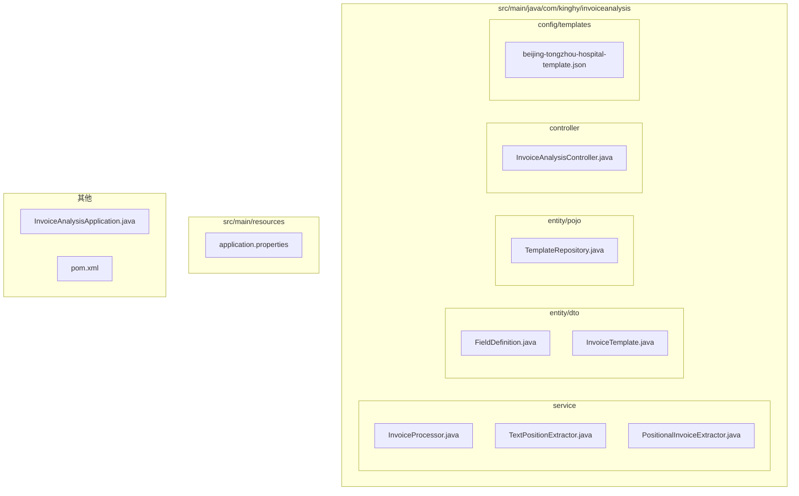
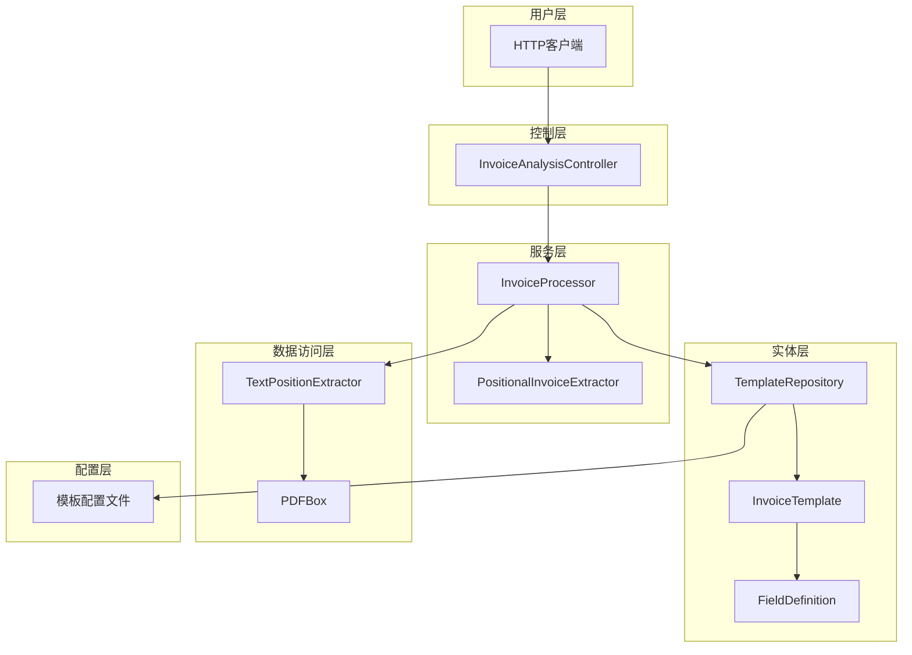
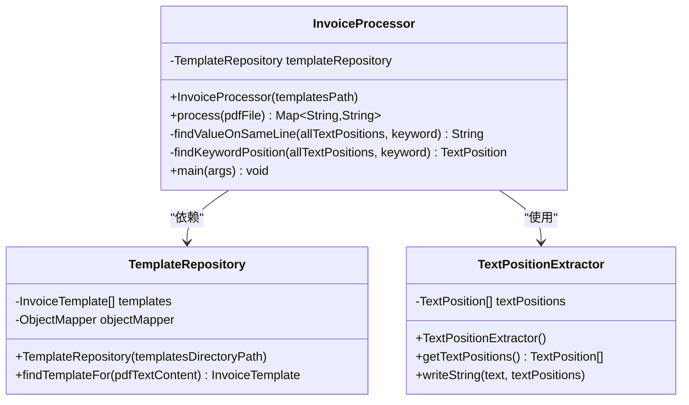
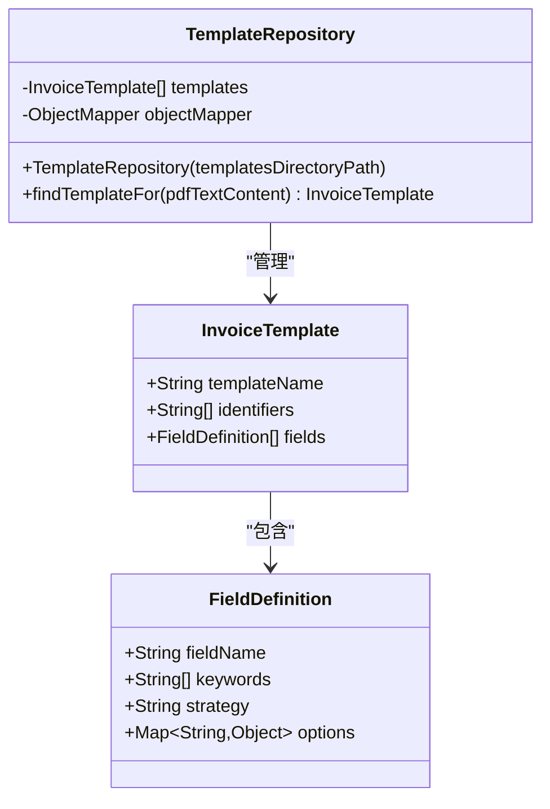
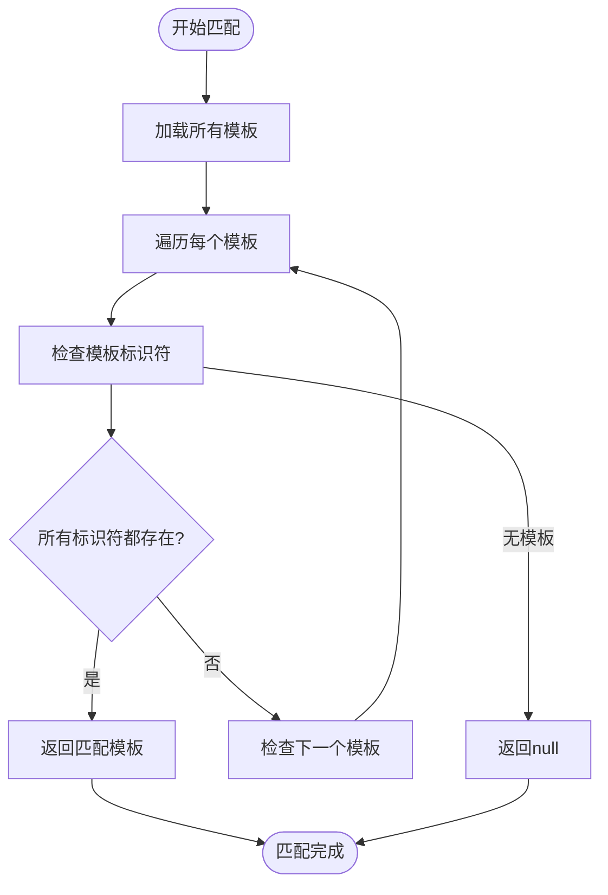
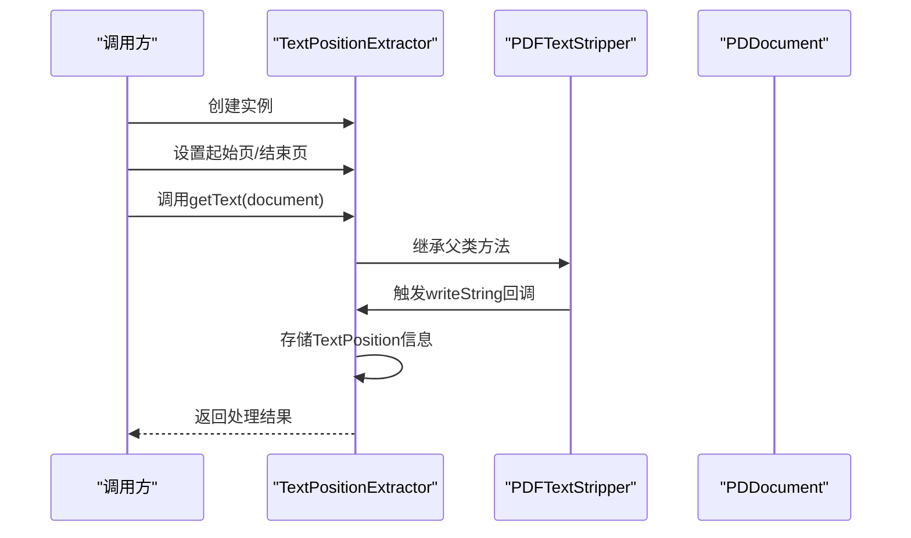
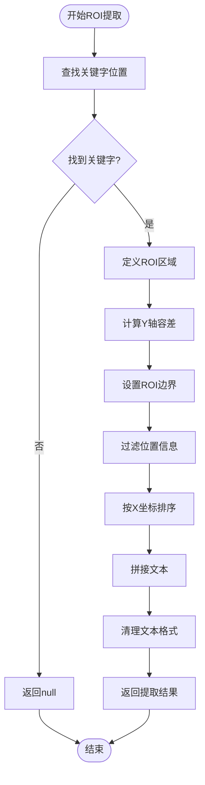
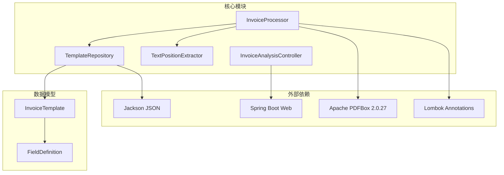

# 核心组件设计

<cite>
**本文档引用的文件**
- [InvoiceProcessor.java](file://src/main/java/com/kinghy/invoiceanalysis/service/InvoiceProcessor.java)
- [TextPositionExtractor.java](file://src/main/java/com/kinghy/invoiceanalysis/service/TextPositionExtractor.java)
- [TemplateRepository.java](file://src/main/java/com/kinghy/invoiceanalysis/entity/pojo/TemplateRepository.java)
- [FieldDefinition.java](file://src/main/java/com/kinghy/invoiceanalysis/entity/dto/FieldDefinition.java)
- [InvoiceTemplate.java](file://src/main/java/com/kinghy/invoiceanalysis/entity/dto/InvoiceTemplate.java)
- [beijing-tongzhou-hospital-template.json](file://src/main/java/com/kinghy/invoiceanalysis/config/templates/beijing-tongzhou-hospital-template.json)
- [PositionalInvoiceExtractor.java](file://src/main/java/com/kinghy/invoiceanalysis/service/PositionalInvoiceExtractor.java)
- [InvoiceAnalysisController.java](file://src/main/java/com/kinghy/invoiceanalysis/controller/InvoiceAnalysisController.java)
- [InvoiceAnalysisApplication.java](file://src/main/java/com/kinghy/invoiceanalysis/InvoiceAnalysisApplication.java)
- [pom.xml](file://pom.xml)
- [application.properties](file://src/main/resources/application.properties)
</cite>

## 目录
1. [简介](#简介)
2. [项目结构](#项目结构)
3. [核心组件](#核心组件)
4. [架构概览](#架构概览)
5. [详细组件分析](#详细组件分析)
6. [依赖关系分析](#依赖关系分析)
7. [性能考虑](#性能考虑)
8. [故障排除指南](#故障排除指南)
9. [结论](#结论)

## 简介

本项目是一个基于Java的发票分析系统，旨在通过PDFBox库提取发票文本内容，并根据预定义的模板规则自动识别和提取发票字段信息。系统采用模块化设计，主要包含三个核心组件：InvoiceProcessor发票处理器、TemplateRepository模板仓库、TextPositionExtractor文本位置提取器。

该系统支持多种提取策略，包括同线提取(SAME_LINE)、下方提取(BELOW)和区域提取(AREA)，并通过JSON配置文件实现模板的灵活管理。项目基于Spring Boot框架构建，提供了RESTful API接口用于发票分析服务。

## 项目结构

项目采用标准的Maven目录结构，按照功能模块进行组织：

**图表来源**
- [InvoiceProcessor.java](file://src/main/java/com/kinghy/invoiceanalysis/service/InvoiceProcessor.java#L1-L159)
- [TemplateRepository.java](file://src/main/java/com/kinghy/invoiceanalysis/entity/pojo/TemplateRepository.java#L1-L41)
- [TextPositionExtractor.java](file://src/main/java/com/kinghy/invoiceanalysis/service/TextPositionExtractor.java#L1-L30)

**章节来源**
- [InvoiceAnalysisApplication.java](file://src/main/java/com/kinghy/invoiceanalysis/InvoiceAnalysisApplication.java#L1-L14)
- [pom.xml](file://pom.xml#L1-L86)

## 核心组件

系统的核心组件围绕发票处理流程展开，每个组件都有明确的职责边界和接口设计：

### 组件职责边界

1. **InvoiceProcessor发票处理器**
   - 负责整个发票处理流程的协调
   - 管理模板匹配和字段提取逻辑
   - 处理PDF文档的加载和数据提取

2. **TemplateRepository模板仓库**
   - 负责模板文件的加载和管理
   - 提供模板匹配算法
   - 支持多模板的动态加载

3. **TextPositionExtractor文本位置提取器**
   - 继承PDFBox的PDFTextStripper类
   - 提供精确的文本位置信息提取
   - 支持ROI(感兴趣区域)的定义和查询

**章节来源**
- [InvoiceProcessor.java](file://src/main/java/com/kinghy/invoiceanalysis/service/InvoiceProcessor.java#L17-L25)
- [TemplateRepository.java](file://src/main/java/com/kinghy/invoiceanalysis/entity/pojo/TemplateRepository.java#L11-L23)
- [TextPositionExtractor.java](file://src/main/java/com/kinghy/invoiceanalysis/service/TextPositionExtractor.java#L13-L19)

## 架构概览

系统采用分层架构设计，各组件之间通过清晰的接口进行交互：

**图表来源**
- [InvoiceAnalysisController.java](file://src/main/java/com/kinghy/invoiceanalysis/controller/InvoiceAnalysisController.java#L14-L26)
- [InvoiceProcessor.java](file://src/main/java/com/kinghy/invoiceanalysis/service/InvoiceProcessor.java#L17-L25)
- [TemplateRepository.java](file://src/main/java/com/kinghy/invoiceanalysis/entity/pojo/TemplateRepository.java#L11-L23)

## 详细组件分析

### InvoiceProcessor发票处理器

InvoiceProcessor是系统的核心协调者，负责整个发票处理流程的编排。其设计体现了良好的单一职责原则和开闭原则。

#### 主要接口设计

**图表来源**
- [InvoiceProcessor.java](file://src/main/java/com/kinghy/invoiceanalysis/service/InvoiceProcessor.java#L17-L25)
- [TemplateRepository.java](file://src/main/java/com/kinghy/invoiceanalysis/entity/pojo/TemplateRepository.java#L11-L13)
- [TextPositionExtractor.java](file://src/main/java/com/kinghy/invoiceanalysis/service/TextPositionExtractor.java#L13-L15)

#### 内部工作机制

InvoiceProcessor采用三阶段处理流程：

1. **文本提取阶段**：使用PDFTextStripper提取纯文本，同时使用TextPositionExtractor提取带位置信息的文本
2. **模板匹配阶段**：通过TemplateRepository查找最适合的模板
3. **字段提取阶段**：根据模板定义的策略提取各个字段

#### 设计模式应用

- **策略模式**：代码注释中明确提到应该使用策略模式来注入不同的ExtractionStrategy实现
- **模板方法模式**：process方法定义了处理流程的骨架，具体的提取策略由子类实现

**章节来源**
- [InvoiceProcessor.java](file://src/main/java/com/kinghy/invoiceanalysis/service/InvoiceProcessor.java#L27-L77)

### TemplateRepository模板仓库

TemplateRepository负责模板的生命周期管理，包括加载、存储和匹配。

#### 数据模型设计

**图表来源**
- [TemplateRepository.java](file://src/main/java/com/kinghy/invoiceanalysis/entity/pojo/TemplateRepository.java#L11-L13)
- [InvoiceTemplate.java](file://src/main/java/com/kinghy/invoiceanalysis/entity/dto/InvoiceTemplate.java#L9-L13)
- [FieldDefinition.java](file://src/main/java/com/kinghy/invoiceanalysis/entity/dto/FieldDefinition.java#L9-L14)

#### 匹配算法实现

TemplateRepository实现了基于标识符的模板匹配算法：

**图表来源**
- [TemplateRepository.java](file://src/main/java/com/kinghy/invoiceanalysis/entity/pojo/TemplateRepository.java#L25-L39)

**章节来源**
- [TemplateRepository.java](file://src/main/java/com/kinghy/invoiceanalysis/entity/pojo/TemplateRepository.java#L15-L39)

### TextPositionExtractor文本位置提取器

TextPositionExtractor继承自PDFBox的PDFTextStripper，专门用于提取带有精确位置信息的文本。

#### 核心实现机制

**图表来源**
- [TextPositionExtractor.java](file://src/main/java/com/kinghy/invoiceanalysis/service/TextPositionExtractor.java#L21-L24)

#### ROI区域定义算法

TextPositionExtractor提供了精确的文本定位能力，通过ROI(感兴趣区域)定义来提取特定位置的文本：

**图表来源**
- [InvoiceProcessor.java](file://src/main/java/com/kinghy/invoiceanalysis/service/InvoiceProcessor.java#L96-L135)

**章节来源**
- [TextPositionExtractor.java](file://src/main/java/com/kinghy/invoiceanalysis/service/TextPositionExtractor.java#L13-L29)

### 字段提取策略

系统支持三种主要的字段提取策略：

1. **SAME_LINE同线提取**：在同一行右侧提取值
2. **BELOW下方提取**：在关键字下方指定范围内提取
3. **AREA区域提取**：在指定矩形区域内提取

每种策略都通过模板配置文件中的`strategy`字段进行定义，并支持相应的选项配置。

**章节来源**
- [beijing-tongzhou-hospital-template.json](file://src/main/java/com/kinghy/invoiceanalysis/config/templates/beijing-tongzhou-hospital-template.json#L7-L53)

## 依赖关系分析

系统采用松耦合的设计，通过接口和抽象类实现组件间的解耦：

**图表来源**
- [pom.xml](file://pom.xml#L32-L53)
- [InvoiceProcessor.java](file://src/main/java/com/kinghy/invoiceanalysis/service/InvoiceProcessor.java#L3-L9)

### 外部依赖管理

系统的主要外部依赖包括：

- **Apache PDFBox**：用于PDF文档解析和文本提取
- **Jackson**：用于JSON模板文件的序列化和反序列化
- **Spring Boot**：提供Web框架和依赖注入功能
- **Lombok**：简化Java代码，减少样板代码

**章节来源**
- [pom.xml](file://pom.xml#L32-L53)

## 性能考虑

### 文本提取优化

1. **内存管理**：使用try-with-resources确保PDDocument正确关闭
2. **批量处理**：一次加载多个模板文件，避免重复I/O操作
3. **缓存策略**：可以考虑添加模板缓存机制

### 算法复杂度分析

- **模板匹配**：O(n*m*k)，其中n为模板数量，m为标识符数量，k为平均文本长度
- **关键字查找**：O(m*p)，其中m为文本位置数量，p为关键字长度
- **ROI过滤**：O(m)，其中m为文本位置数量

### 扩展性建议

1. **策略模式实现**：将不同提取策略封装为独立的Strategy类
2. **并发处理**：支持多线程处理多个发票文件
3. **配置驱动**：完全基于配置文件的可插拔架构

## 故障排除指南

### 常见问题及解决方案

1. **模板匹配失败**
   - 检查模板JSON文件的完整性
   - 验证标识符字符串的准确性
   - 确认PDF文本编码格式

2. **文本位置提取异常**
   - 验证PDF文件的可读性
   - 检查页面范围设置
   - 确认字体嵌入情况

3. **字段提取不准确**
   - 调整ROI区域参数
   - 修改关键字匹配策略
   - 优化文本清理规则

### 日志监控

系统使用SLF4J进行日志记录，关键处理步骤都有相应的日志输出，便于问题诊断和性能监控。

**章节来源**
- [InvoiceProcessor.java](file://src/main/java/com/kinghy/invoiceanalysis/service/InvoiceProcessor.java#L37-L51)

## 结论

本发票分析系统通过精心设计的模块化架构，实现了发票文本的自动化提取和字段识别。三个核心组件各司其职，通过清晰的接口和约定实现了高内聚、低耦合的设计目标。

### 主要优势

1. **模块化设计**：每个组件职责明确，易于维护和扩展
2. **配置驱动**：通过JSON模板实现灵活的业务规则配置
3. **算法优化**：基于位置信息的精确提取算法
4. **可扩展性**：支持新的提取策略和模板类型

### 改进建议

1. **完整策略模式实现**：目前代码注释中提到应该使用策略模式，但尚未完全实现
2. **错误处理增强**：增加更完善的异常处理和恢复机制
3. **性能优化**：考虑添加缓存和并发处理能力
4. **测试覆盖**：增加单元测试和集成测试

该系统为发票数字化处理提供了坚实的技术基础，通过持续的优化和扩展，可以满足更多复杂的业务场景需求。