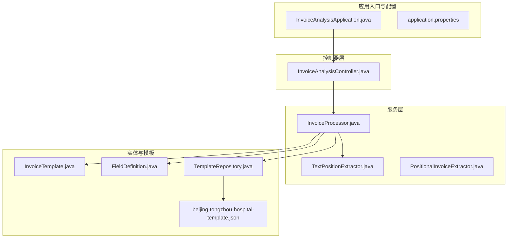
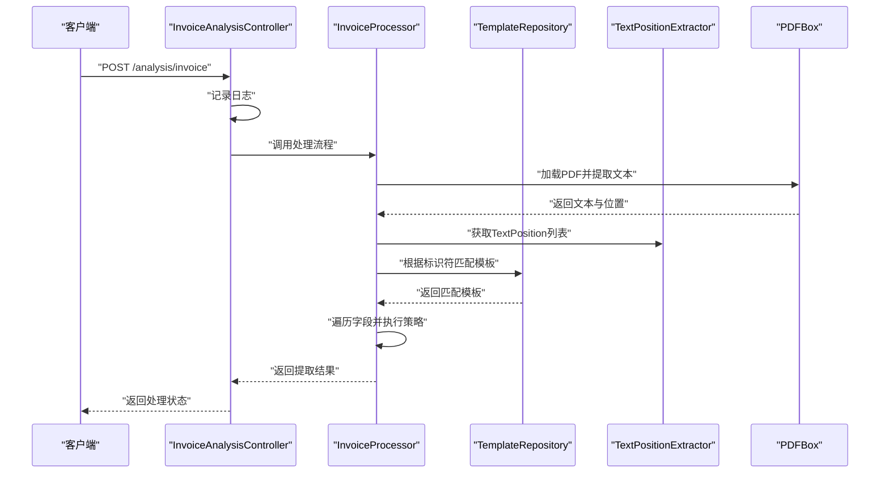
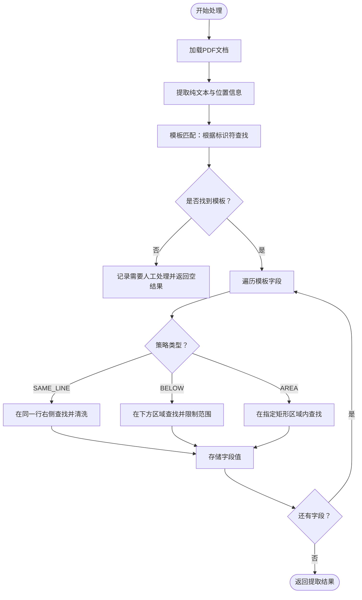
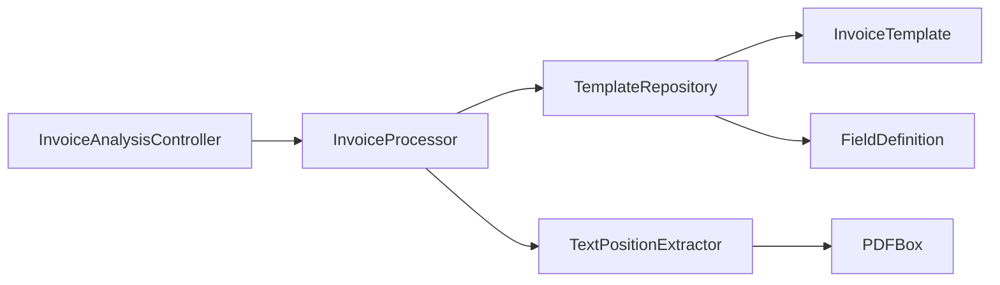

# 系统概览

<cite>
**本文引用的文件**
- [InvoiceAnalysisApplication.java](file://src/main/java/com/kinghy/invoiceanalysis/InvoiceAnalysisApplication.java)
- [InvoiceAnalysisController.java](file://src/main/java/com/kinghy/invoiceanalysis/controller/InvoiceAnalysisController.java)
- [InvoiceProcessor.java](file://src/main/java/com/kinghy/invoiceanalysis/service/InvoiceProcessor.java)
- [TextPositionExtractor.java](file://src/main/java/com/kinghy/invoiceanalysis/service/TextPositionExtractor.java)
- [PositionalInvoiceExtractor.java](file://src/main/java/com/kinghy/invoiceanalysis/service/PositionalInvoiceExtractor.java)
- [FieldDefinition.java](file://src/main/java/com/kinghy/invoiceanalysis/entity/dto/FieldDefinition.java)
- [InvoiceTemplate.java](file://src/main/java/com/kinghy/invoiceanalysis/entity/dto/InvoiceTemplate.java)
- [TemplateRepository.java](file://src/main/java/com/kinghy/invoiceanalysis/entity/pojo/TemplateRepository.java)
- [application.properties](file://src/main/resources/application.properties)
- [beijing-tongzhou-hospital-template.json](file://src/main/java/com/kinghy/invoiceanalysis/config/templates/beijing-tongzhou-hospital-template.json)
- [pom.xml](file://pom.xml)
- [v1.md](file://docs/v1.md)
</cite>

## 目录
1. [引言](#引言)
2. [项目结构](#项目结构)
3. [核心组件](#核心组件)
4. [架构总览](#架构总览)
5. [详细组件分析](#详细组件分析)
6. [依赖关系分析](#依赖关系分析)
7. [性能考量](#性能考量)
8. [故障排查指南](#故障排查指南)
9. [结论](#结论)
10. [附录](#附录)

## 引言
本文件为发票分析系统的整体概览文档，面向技术与非技术读者，系统性阐述系统的整体架构模式、MVC分层设计、主要功能模块及其关系、业务与技术目标、架构优势、扩展性与可维护性考虑，并提供架构图与组件关系图。系统采用 Spring Boot 启动，结合 PDF 文本位置提取与 JSON 驱动的模板策略，实现对多版式发票的自动化字段抽取。

## 项目结构
系统采用基于包的分层组织方式：
- 应用入口与配置：入口类、Spring 配置
- 控制器层：HTTP 接口暴露
- 服务层：核心业务处理（PDF 解析、字段提取、模板匹配）
- 实体与数据传输对象：模板与字段定义
- 资源与模板：应用配置与发票模板 JSON

图表来源
- [InvoiceAnalysisApplication.java](file://src/main/java/com/kinghy/invoiceanalysis/InvoiceAnalysisApplication.java#L1-L14)
- [application.properties](file://src/main/resources/application.properties#L1-L2)
- [InvoiceAnalysisController.java](file://src/main/java/com/kinghy/invoiceanalysis/controller/InvoiceAnalysisController.java#L1-L26)
- [InvoiceProcessor.java](file://src/main/java/com/kinghy/invoiceanalysis/service/InvoiceProcessor.java#L1-L159)
- [TextPositionExtractor.java](file://src/main/java/com/kinghy/invoiceanalysis/service/TextPositionExtractor.java#L1-L30)
- [PositionalInvoiceExtractor.java](file://src/main/java/com/kinghy/invoiceanalysis/service/PositionalInvoiceExtractor.java#L1-L117)
- [InvoiceTemplate.java](file://src/main/java/com/kinghy/invoiceanalysis/entity/dto/InvoiceTemplate.java#L1-L16)
- [FieldDefinition.java](file://src/main/java/com/kinghy/invoiceanalysis/entity/dto/FieldDefinition.java#L1-L14)
- [TemplateRepository.java](file://src/main/java/com/kinghy/invoiceanalysis/entity/pojo/TemplateRepository.java#L1-L41)
- [beijing-tongzhou-hospital-template.json](file://src/main/java/com/kinghy/invoiceanalysis/config/templates/beijing-tongzhou-hospital-template.json#L1-L55)

章节来源
- [InvoiceAnalysisApplication.java](file://src/main/java/com/kinghy/invoiceanalysis/InvoiceAnalysisApplication.java#L1-L14)
- [application.properties](file://src/main/resources/application.properties#L1-L2)
- [pom.xml](file://pom.xml#L1-L86)

## 核心组件
- 应用入口与启动：Spring Boot 入口类负责应用初始化与启动。
- 控制器：提供 HTTP 接口，接收发票分析请求。
- 处理器：核心业务引擎，负责 PDF 文本提取、模板匹配与字段抽取。
- 模板仓库：加载与管理 JSON 模板，支持多版式发票识别。
- 字段定义与模板模型：描述发票字段、关键字、提取策略与选项。
- 文本位置提取器：继承 PDFBox 抽取器，收集文本位置信息以支持位置型策略。

章节来源
- [InvoiceAnalysisApplication.java](file://src/main/java/com/kinghy/invoiceanalysis/InvoiceAnalysisApplication.java#L1-L14)
- [InvoiceAnalysisController.java](file://src/main/java/com/kinghy/invoiceanalysis/controller/InvoiceAnalysisController.java#L1-L26)
- [InvoiceProcessor.java](file://src/main/java/com/kinghy/invoiceanalysis/service/InvoiceProcessor.java#L1-L159)
- [TemplateRepository.java](file://src/main/java/com/kinghy/invoiceanalysis/entity/pojo/TemplateRepository.java#L1-L41)
- [InvoiceTemplate.java](file://src/main/java/com/kinghy/invoiceanalysis/entity/dto/InvoiceTemplate.java#L1-L16)
- [FieldDefinition.java](file://src/main/java/com/kinghy/invoiceanalysis/entity/dto/FieldDefinition.java#L1-L14)
- [TextPositionExtractor.java](file://src/main/java/com/kinghy/invoiceanalysis/service/TextPositionExtractor.java#L1-L30)

## 架构总览
系统采用 Spring Boot MVC 分层架构，结合 PDFBox 的文本与位置信息抽取能力，通过 JSON 模板驱动的策略模式实现多版式发票的自动化字段提取。整体流程如下：

图表来源
- [InvoiceAnalysisController.java](file://src/main/java/com/kinghy/invoiceanalysis/controller/InvoiceAnalysisController.java#L18-L22)
- [InvoiceProcessor.java](file://src/main/java/com/kinghy/invoiceanalysis/service/InvoiceProcessor.java#L27-L77)
- [TemplateRepository.java](file://src/main/java/com/kinghy/invoiceanalysis/entity/pojo/TemplateRepository.java#L25-L39)
- [TextPositionExtractor.java](file://src/main/java/com/kinghy/invoiceanalysis/service/TextPositionExtractor.java#L21-L28)

## 详细组件分析

### 应用入口与启动
- 入口类使用 Spring Boot 注解启用自动装配与组件扫描，启动 Web 容器。
- 应用名称在配置文件中定义，便于统一管理。

章节来源
- [InvoiceAnalysisApplication.java](file://src/main/java/com/kinghy/invoiceanalysis/InvoiceAnalysisApplication.java#L6-L11)
- [application.properties](file://src/main/resources/application.properties#L1-L2)

### 控制器层
- 提供 REST 接口，当前实现返回成功状态，日志记录分析开始。
- 可扩展为接收文件上传、参数校验与结果封装。

章节来源
- [InvoiceAnalysisController.java](file://src/main/java/com/kinghy/invoiceanalysis/controller/InvoiceAnalysisController.java#L18-L22)

### 服务层：核心处理引擎
- 负责 PDF 加载、文本与位置信息提取、模板匹配与字段抽取。
- 支持 SAME_LINE、BELOW、AREA 等策略（注释中预留扩展点）。
- 关键算法：
  - 关键字定位：在文本序列中查找关键字并返回其最后字符位置。
  - ROI 区域查找：基于关键字位置与容差计算，筛选同一行右侧的候选字符并排序拼接。
  - 模板匹配：通过模板标识符集合判断是否命中。

图表来源
- [InvoiceProcessor.java](file://src/main/java/com/kinghy/invoiceanalysis/service/InvoiceProcessor.java#L27-L77)
- [InvoiceProcessor.java](file://src/main/java/com/kinghy/invoiceanalysis/service/InvoiceProcessor.java#L96-L135)
- [InvoiceProcessor.java](file://src/main/java/com/kinghy/invoiceanalysis/service/InvoiceProcessor.java#L143-L157)

章节来源
- [InvoiceProcessor.java](file://src/main/java/com/kinghy/invoiceanalysis/service/InvoiceProcessor.java#L1-L159)

### 文本位置提取器
- 继承 PDFBox 的文本剥离器，覆盖写入回调以收集每个字符的精确位置。
- 提供统一接口获取所有 TextPosition 列表，供策略算法使用。

章节来源
- [TextPositionExtractor.java](file://src/main/java/com/kinghy/invoiceanalysis/service/TextPositionExtractor.java#L1-L30)

### 位置型提取器（演示）
- 独立演示 SAME_LINE 策略的实现，展示关键字定位与值拼接流程。
- 可作为策略模式的参考实现之一。

章节来源
- [PositionalInvoiceExtractor.java](file://src/main/java/com/kinghy/invoiceanalysis/service/PositionalInvoiceExtractor.java#L1-L117)

### 模板仓库与 JSON 驱动
- 从模板目录加载多个 JSON 模板，解析为模板对象。
- 通过模板标识符集合判断是否匹配当前 PDF 内容。
- 模板 JSON 示例展示了 SAME_LINE、BELOW、AREA 等策略与选项。

章节来源
- [TemplateRepository.java](file://src/main/java/com/kinghy/invoiceanalysis/entity/pojo/TemplateRepository.java#L15-L39)
- [beijing-tongzhou-hospital-template.json](file://src/main/java/com/kinghy/invoiceanalysis/config/templates/beijing-tongzhou-hospital-template.json#L1-L55)

### 数据模型
- 模板模型：包含模板名称、标识符集合与字段定义列表。
- 字段定义：包含字段名、关键字列表、策略类型与选项。

章节来源
- [InvoiceTemplate.java](file://src/main/java/com/kinghy/invoiceanalysis/entity/dto/InvoiceTemplate.java#L1-L16)
- [FieldDefinition.java](file://src/main/java/com/kinghy/invoiceanalysis/entity/dto/FieldDefinition.java#L1-L14)

## 依赖关系分析
系统依赖关系清晰，职责边界明确：
- 控制器依赖处理器；处理器依赖模板仓库与文本位置提取器。
- 模板仓库依赖 JSON 解析库与模板模型。
- 文本位置提取器依赖 PDFBox。

图表来源
- [InvoiceAnalysisController.java](file://src/main/java/com/kinghy/invoiceanalysis/controller/InvoiceAnalysisController.java#L1-L26)
- [InvoiceProcessor.java](file://src/main/java/com/kinghy/invoiceanalysis/service/InvoiceProcessor.java#L1-L159)
- [TemplateRepository.java](file://src/main/java/com/kinghy/invoiceanalysis/entity/pojo/TemplateRepository.java#L1-L41)
- [TextPositionExtractor.java](file://src/main/java/com/kinghy/invoiceanalysis/service/TextPositionExtractor.java#L1-L30)
- [InvoiceTemplate.java](file://src/main/java/com/kinghy/invoiceanalysis/entity/dto/InvoiceTemplate.java#L1-L16)
- [FieldDefinition.java](file://src/main/java/com/kinghy/invoiceanalysis/entity/dto/FieldDefinition.java#L1-L14)

章节来源
- [pom.xml](file://pom.xml#L32-L53)

## 性能考量
- PDF 文档加载与文本提取：建议限制处理页数与并发量，避免内存峰值过高。
- 模板匹配：标识符匹配为线性扫描，模板数量较多时可考虑预索引或缓存。
- 关键字定位与 ROI 查找：当前实现为顺序扫描，可优化为滑动窗口或二分查找以提升大文本场景性能。
- 日志与异常：在生产环境建议降低日志级别，集中错误处理与指标上报。

## 故障排查指南
- 模板未匹配：检查模板标识符是否与 PDF 文本一致，确认模板 JSON 是否正确加载。
- 关键字未找到：核对关键字列表与策略配置，确认 PDF 文本是否包含预期关键字。
- 位置型策略异常：检查关键字位置与 ROI 容差设置，确保字符排序与拼接逻辑正确。
- 文件路径问题：确认模板目录路径与 PDF 文件路径有效。

章节来源
- [InvoiceProcessor.java](file://src/main/java/com/kinghy/invoiceanalysis/service/InvoiceProcessor.java#L47-L51)
- [TemplateRepository.java](file://src/main/java/com/kinghy/invoiceanalysis/entity/pojo/TemplateRepository.java#L25-L39)

## 结论
该系统通过 Spring Boot MVC 架构与 JSON 驱动的模板策略，实现了对多版式发票的可配置化抽取。其优势在于：
- 规则与引擎分离，模板可热更新，降低维护成本；
- 位置型策略支持高精度字段定位；
- 分层清晰，扩展性强，便于引入更多策略与集成。

## 附录
- 业务目标：实现发票字段自动化抽取，减少人工干预，提高处理效率与一致性。
- 技术目标：构建可配置、可扩展、可维护的发票解析引擎，支持多版式与多策略组合。