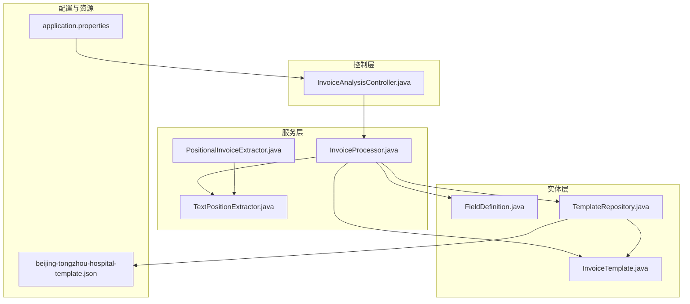
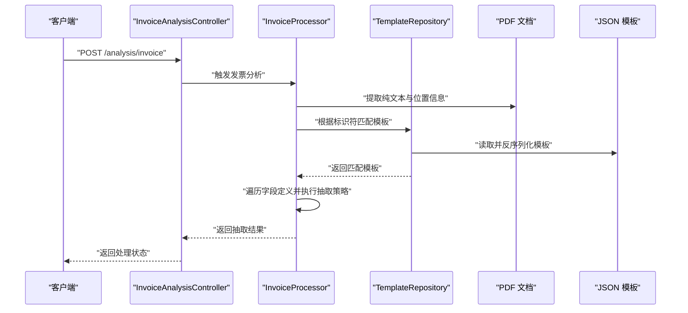
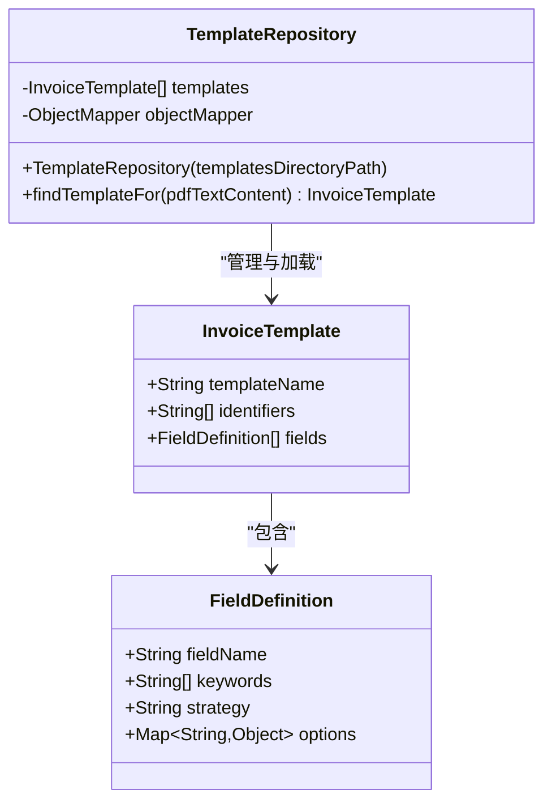
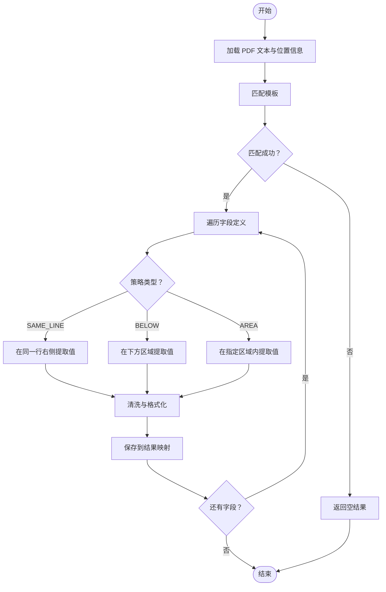
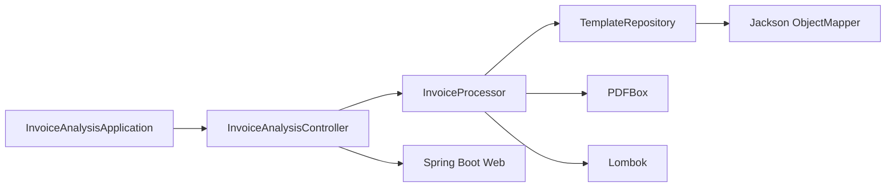

# 配置驱动模式

<cite>
**本文引用的文件**
- [TemplateRepository.java](file://src/main/java/com/kinghy/invoiceanalysis/entity/pojo/TemplateRepository.java)
- [InvoiceTemplate.java](file://src/main/java/com/kinghy/invoiceanalysis/entity/dto/InvoiceTemplate.java)
- [FieldDefinition.java](file://src/main/java/com/kinghy/invoiceanalysis/entity/dto/FieldDefinition.java)
- [beijing-tongzhou-hospital-template.json](file://src/main/java/com/kinghy/invoiceanalysis/config/templates/beijing-tongzhou-hospital-template.json)
- [InvoiceProcessor.java](file://src/main/java/com/kinghy/invoiceanalysis/service/InvoiceProcessor.java)
- [TextPositionExtractor.java](file://src/main/java/com/kinghy/invoiceanalysis/service/TextPositionExtractor.java)
- [PositionalInvoiceExtractor.java](file://src/main/java/com/kinghy/invoiceanalysis/service/PositionalInvoiceExtractor.java)
- [InvoiceAnalysisController.java](file://src/main/java/com/kinghy/invoiceanalysis/controller/InvoiceAnalysisController.java)
- [application.properties](file://src/main/resources/application.properties)
- [pom.xml](file://pom.xml)
- [InvoiceAnalysisApplication.java](file://src/main/java/com/kinghy/invoiceanalysis/InvoiceAnalysisApplication.java)
</cite>

## 目录
1. [引言](#引言)
2. [项目结构](#项目结构)
3. [核心组件](#核心组件)
4. [架构总览](#架构总览)
5. [详细组件分析](#详细组件分析)
6. [依赖关系分析](#依赖关系分析)
7. [性能考虑](#性能考虑)
8. [故障排查指南](#故障排查指南)
9. [结论](#结论)
10. [附录](#附录)

## 引言
本文件围绕“配置驱动模式”展开，系统性阐述基于 JSON 配置文件的模板系统设计理念与实现方式。该系统以 JSON 文件作为模板配置，通过 TemplateRepository 统一加载、管理与分发模板；InvoiceProcessor 根据 PDF 文本内容与模板规则完成字段抽取。本文将重点解析：
- TemplateRepository 如何管理与加载配置文件
- JSON 模板的结构设计与字段定义规则
- 配置驱动相较硬编码的优势与适用场景
- 配置文件的最佳实践与维护指南
- 配置版本管理与向后兼容策略
- 如何通过配置灵活调整业务规则

## 项目结构
该项目采用分层与按职责划分的组织方式：
- entity 层：数据传输对象（DTO）与持久化对象（POJO）
- service 层：业务处理与文本位置提取
- controller 层：Web 接口入口
- config/templates：JSON 模板配置目录
- resources：应用配置文件
- pom.xml：构建与依赖管理

图表来源
- [TemplateRepository.java](file://src/main/java/com/kinghy/invoiceanalysis/entity/pojo/TemplateRepository.java#L1-L41)
- [InvoiceTemplate.java](file://src/main/java/com/kinghy/invoiceanalysis/entity/dto/InvoiceTemplate.java#L1-L16)
- [FieldDefinition.java](file://src/main/java/com/kinghy/invoiceanalysis/entity/dto/FieldDefinition.java#L1-L14)
- [beijing-tongzhou-hospital-template.json](file://src/main/java/com/kinghy/invoiceanalysis/config/templates/beijing-tongzhou-hospital-template.json#L1-L55)
- [InvoiceProcessor.java](file://src/main/java/com/kinghy/invoiceanalysis/service/InvoiceProcessor.java#L1-L159)
- [TextPositionExtractor.java](file://src/main/java/com/kinghy/invoiceanalysis/service/TextPositionExtractor.java#L1-L30)
- [PositionalInvoiceExtractor.java](file://src/main/java/com/kinghy/invoiceanalysis/service/PositionalInvoiceExtractor.java#L1-L117)
- [InvoiceAnalysisController.java](file://src/main/java/com/kinghy/invoiceanalysis/controller/InvoiceAnalysisController.java#L1-L26)
- [application.properties](file://src/main/resources/application.properties#L1-L2)

章节来源
- [pom.xml](file://pom.xml#L1-L86)
- [InvoiceAnalysisApplication.java](file://src/main/java/com/kinghy/invoiceanalysis/InvoiceAnalysisApplication.java#L1-L14)

## 核心组件
- TemplateRepository：负责扫描模板目录、读取 JSON 文件并反序列化为 InvoiceTemplate 列表；提供根据 PDF 文本标识符匹配模板的能力。
- InvoiceTemplate：模板元数据模型，包含模板名称、识别关键字集合、字段定义列表。
- FieldDefinition：字段级配置模型，包含字段名、关键字列表、抽取策略、可选参数。
- InvoiceProcessor：业务主流程，负责 PDF 文本与位置信息提取、模板匹配、字段抽取。
- TextPositionExtractor：继承 PDFTextStripper，收集每个字符的精确位置信息。
- PositionalInvoiceExtractor：独立示例，展示基于位置信息的字段抽取逻辑。
- JSON 模板：以 JSON 形式描述模板与字段抽取规则，便于非技术人员维护与扩展。

章节来源
- [TemplateRepository.java](file://src/main/java/com/kinghy/invoiceanalysis/entity/pojo/TemplateRepository.java#L11-L40)
- [InvoiceTemplate.java](file://src/main/java/com/kinghy/invoiceanalysis/entity/dto/InvoiceTemplate.java#L9-L13)
- [FieldDefinition.java](file://src/main/java/com/kinghy/invoiceanalysis/entity/dto/FieldDefinition.java#L9-L14)
- [InvoiceProcessor.java](file://src/main/java/com/kinghy/invoiceanalysis/service/InvoiceProcessor.java#L17-L77)
- [TextPositionExtractor.java](file://src/main/java/com/kinghy/invoiceanalysis/service/TextPositionExtractor.java#L13-L29)
- [PositionalInvoiceExtractor.java](file://src/main/java/com/kinghy/invoiceanalysis/service/PositionalInvoiceExtractor.java#L15-L117)

## 架构总览
系统采用“配置驱动 + 策略扩展”的架构思路：
- 配置驱动：模板与字段规则由 JSON 文件集中管理，运行时动态加载。
- 策略扩展：当前实现中 SAME_LINE 抽取策略已落地，BELOW/AREA 等策略预留接口，便于后续扩展。
- 数据流：PDF 解析 → 文本与位置信息 → 模板匹配 → 字段抽取 → 结果输出。

图表来源
- [InvoiceAnalysisController.java](file://src/main/java/com/kinghy/invoiceanalysis/controller/InvoiceAnalysisController.java#L18-L22)
- [InvoiceProcessor.java](file://src/main/java/com/kinghy/invoiceanalysis/service/InvoiceProcessor.java#L27-L77)
- [TemplateRepository.java](file://src/main/java/com/kinghy/invoiceanalysis/entity/pojo/TemplateRepository.java#L15-L39)
- [beijing-tongzhou-hospital-template.json](file://src/main/java/com/kinghy/invoiceanalysis/config/templates/beijing-tongzhou-hospital-template.json#L1-L55)

## 详细组件分析

### TemplateRepository：模板仓库与加载机制
- 职责
  - 扫描指定目录下的 JSON 模板文件
  - 使用 Jackson ObjectMapper 反序列化为 InvoiceTemplate 对象
  - 提供 findTemplateFor 方法，基于模板的 identifiers 列表与 PDF 文本进行匹配
- 设计要点
  - 仅加载 .json 文件，避免无关文件干扰
  - 匹配策略：只要 PDF 文本包含模板的所有标识符，则认为匹配成功
  - 模板列表在构造时一次性加载，运行期直接遍历匹配，时间复杂度 O(N×M)，N 为模板数，M 为标识符数
- 可扩展点
  - 支持多级目录与命名规范约定
  - 可引入缓存与热更新机制（如监听文件变更）

图表来源
- [TemplateRepository.java](file://src/main/java/com/kinghy/invoiceanalysis/entity/pojo/TemplateRepository.java#L11-L40)
- [InvoiceTemplate.java](file://src/main/java/com/kinghy/invoiceanalysis/entity/dto/InvoiceTemplate.java#L9-L13)
- [FieldDefinition.java](file://src/main/java/com/kinghy/invoiceanalysis/entity/dto/FieldDefinition.java#L9-L14)

章节来源
- [TemplateRepository.java](file://src/main/java/com/kinghy/invoiceanalysis/entity/pojo/TemplateRepository.java#L15-L39)

### JSON 模板结构与字段定义规则
- 模板根对象字段
  - templateName：模板名称，用于日志与调试
  - identifiers：字符串数组，用于快速筛选匹配模板
  - fields：字段定义数组，描述每个字段的抽取规则
- 字段定义对象字段
  - fieldName：字段名，用于最终结果映射
  - keywords：关键字列表，用于定位字段值
  - strategy：抽取策略类型（当前实现支持 SAME_LINE，预留 BELOW/AREA）
  - options：策略相关选项（如 trimChars、valuePattern、maxLinesBelow、stopAtKeywords、坐标区域等）
- 示例参考
  - 北京市医疗门诊收费票据模板展示了 SAME_LINE 策略与 AREA 策略的典型用法

章节来源
- [beijing-tongzhou-hospital-template.json](file://src/main/java/com/kinghy/invoiceanalysis/config/templates/beijing-tongzhou-hospital-template.json#L1-L55)
- [InvoiceTemplate.java](file://src/main/java/com/kinghy/invoiceanalysis/entity/dto/InvoiceTemplate.java#L9-L13)
- [FieldDefinition.java](file://src/main/java/com/kinghy/invoiceanalysis/entity/dto/FieldDefinition.java#L9-L14)

### InvoiceProcessor：抽取流程与策略执行
- 流程概览
  - 加载 PDF 文本与位置信息
  - 通过 TemplateRepository 匹配模板
  - 遍历字段定义，按策略抽取值
  - 返回键值对结果
- 当前策略实现
  - SAME_LINE：基于关键字在同一行右侧的 ROI 区域提取字符，再进行清洗
  - BELOW/AREA：预留策略，待实现
- 位置信息提取
  - TextPositionExtractor 继承 PDFTextStripper，收集每个字符的 TextPosition
  - PositionalInvoiceExtractor 展示了基于位置信息的抽取示例

图表来源
- [InvoiceProcessor.java](file://src/main/java/com/kinghy/invoiceanalysis/service/InvoiceProcessor.java#L27-L77)
- [TextPositionExtractor.java](file://src/main/java/com/kinghy/invoiceanalysis/service/TextPositionExtractor.java#L13-L29)
- [PositionalInvoiceExtractor.java](file://src/main/java/com/kinghy/invoiceanalysis/service/PositionalInvoiceExtractor.java#L54-L93)

章节来源
- [InvoiceProcessor.java](file://src/main/java/com/kinghy/invoiceanalysis/service/InvoiceProcessor.java#L27-L77)
- [TextPositionExtractor.java](file://src/main/java/com/kinghy/invoiceanalysis/service/TextPositionExtractor.java#L13-L29)
- [PositionalInvoiceExtractor.java](file://src/main/java/com/kinghy/invoiceanalysis/service/PositionalInvoiceExtractor.java#L54-L93)

### 控制器与应用入口
- 控制器：提供 /analysis/invoice 接口，便于外部调用发票分析功能
- 应用入口：Spring Boot 启动类，承载 Web 与业务组件装配

章节来源
- [InvoiceAnalysisController.java](file://src/main/java/com/kinghy/invoiceanalysis/controller/InvoiceAnalysisController.java#L18-L22)
- [InvoiceAnalysisApplication.java](file://src/main/java/com/kinghy/invoiceanalysis/InvoiceAnalysisApplication.java#L9-L11)

## 依赖关系分析
- 外部依赖
  - Spring Boot Web：提供 Web 控制器能力
  - Lombok：简化 DTO/POJO 代码
  - PDFBox：PDF 文本与位置信息提取
- 内部耦合
  - InvoiceProcessor 依赖 TemplateRepository 与 DTO 模型
  - TextPositionExtractor 作为 PDFBox 的扩展，被 InvoiceProcessor 使用
  - 控制器依赖服务层，形成清晰的分层

图表来源
- [pom.xml](file://pom.xml#L32-L54)
- [InvoiceProcessor.java](file://src/main/java/com/kinghy/invoiceanalysis/service/InvoiceProcessor.java#L17-L25)
- [TemplateRepository.java](file://src/main/java/com/kinghy/invoiceanalysis/entity/pojo/TemplateRepository.java#L3-L13)

章节来源
- [pom.xml](file://pom.xml#L29-L54)

## 性能考虑
- 模板加载
  - 构造函数一次性加载所有 JSON 模板，避免运行时 IO 开销
  - 若模板数量较多，可考虑懒加载或缓存策略
- 匹配算法
  - 当前为线性扫描，时间复杂度 O(N×M)；若模板增多，建议引入索引或更高效的匹配结构
- 文本与位置提取
  - PDFBox 提取文本与位置信息成本较高，建议限制页码范围与缓存中间结果
- 策略执行
  - SAME_LINE 策略涉及 ROI 计算与排序，建议对关键字与候选字符进行预过滤

## 故障排查指南
- 模板未匹配
  - 检查 identifiers 是否足够稳定且唯一
  - 确认 PDF 文本是否包含模板标识符
- 字段抽取为空
  - 检查 keywords 是否与 PDF 中关键字一致（大小写、标点）
  - 对 SAME_LINE 策略，确认关键字在同一行右侧存在值
- 位置信息异常
  - 确认 TextPositionExtractor 正常工作，且 PDF 为可提取文本格式
- 配置文件错误
  - 检查 JSON 语法与字段类型是否符合 InvoiceTemplate/FieldDefinition 定义

章节来源
- [InvoiceProcessor.java](file://src/main/java/com/kinghy/invoiceanalysis/service/InvoiceProcessor.java#L47-L51)
- [TemplateRepository.java](file://src/main/java/com/kinghy/invoiceanalysis/entity/pojo/TemplateRepository.java#L25-L39)

## 结论
本系统通过“配置驱动 + 策略扩展”的方式，实现了模板与抽取逻辑的解耦。JSON 模板降低了业务规则变更的成本，使非技术人员也能参与维护。当前实现以 SAME_LINE 策略为核心，BELOW/AREA 等策略预留良好，便于后续扩展。建议在生产环境中引入缓存、索引与热更新机制，以提升性能与可维护性。

## 附录

### 配置驱动模式的优势与适用场景
- 优势
  - 快速迭代：业务规则变更无需重新编译
  - 易于协作：业务方可直接维护模板
  - 可观测性：模板名称与标识符便于日志追踪
- 适用场景
  - 多样化票据/单据格式
  - 需要频繁调整抽取规则的场景
  - 团队成员具备 JSON 维护能力

### 配置文件最佳实践与维护指南
- 命名规范
  - 模板文件命名应体现机构/业务类型，如 {org}-{area}-{business}-template.json
- 字段设计
  - identifiers 应尽量稳定且唯一，避免误匹配
  - keywords 保持简洁明确，必要时提供多个候选
  - options 仅包含必要参数，避免过度复杂
- 版本管理
  - 使用语义化版本命名模板文件，如 template_v1.json、template_v2.json
  - 保留历史模板，逐步迁移
- 向后兼容
  - 新增字段时保留旧字段，设置默认值或兼容策略
  - 修改字段名时提供映射与迁移脚本
- 审核与测试
  - 模板变更需通过回归测试
  - 建立模板校验工具，确保 JSON 结构正确

### 配置版本管理与向后兼容策略
- 版本标识
  - 在模板根对象中增加 version 字段，记录模板版本
- 兼容策略
  - 升级时保留旧字段与默认行为
  - 通过策略映射表将旧字段映射到新字段
- 迁移路径
  - 提供迁移脚本与自动化工具
  - 分阶段灰度发布，逐步替换旧模板

### 通过配置实现业务规则的灵活调整
- 动态字段抽取：通过新增/修改 fields，快速调整抽取目标
- 策略扩展：在 options 中微调参数，如 trimChars、valuePattern、坐标区域等
- 规则优先级：通过 identifiers 的顺序与组合，控制匹配优先级
- 人工干预：当模板无法匹配时，返回空结果并提示人工处理，保障系统稳健性