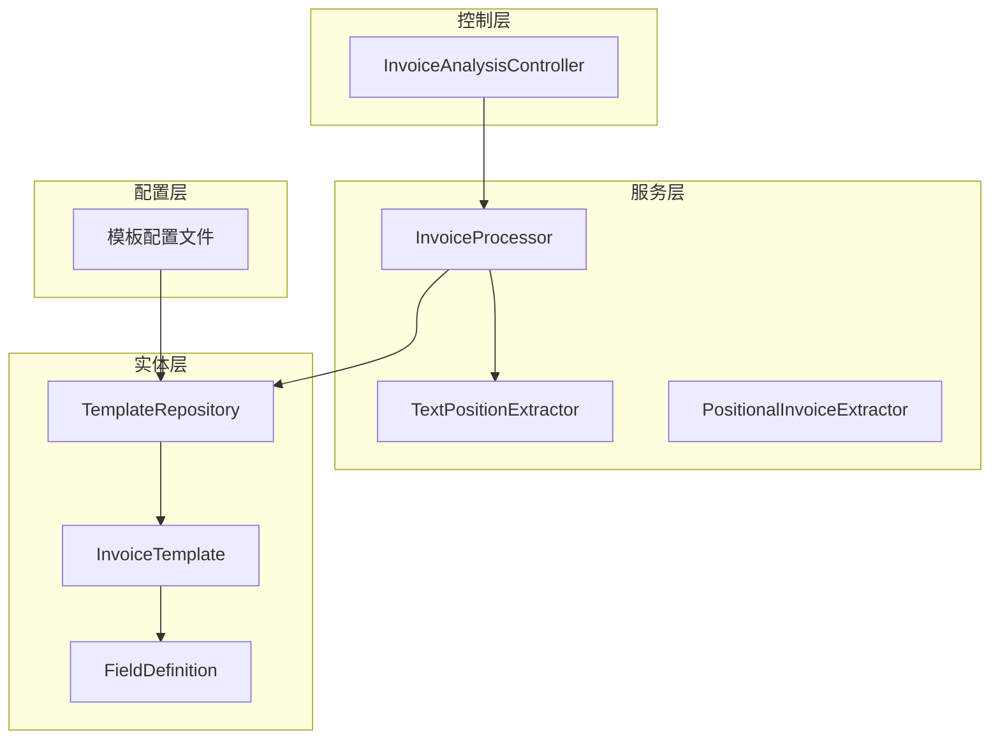
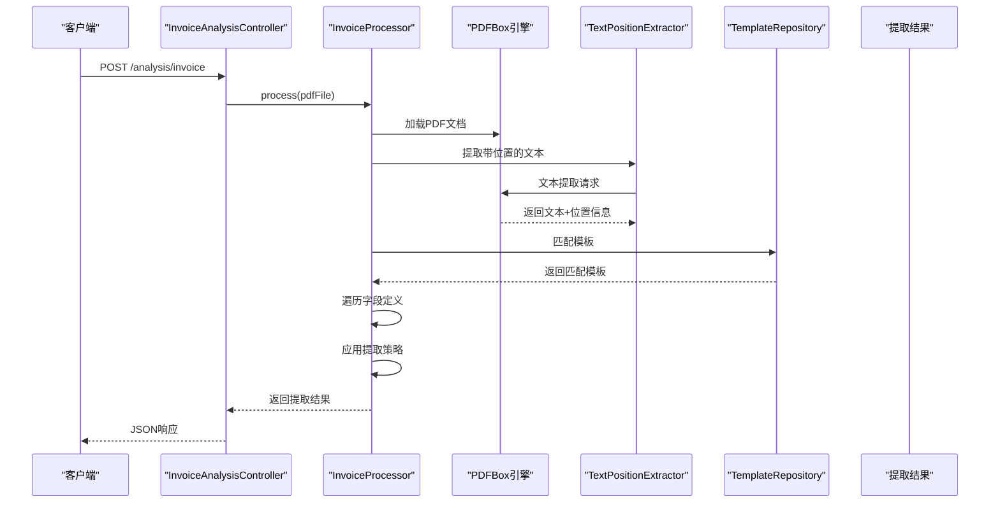
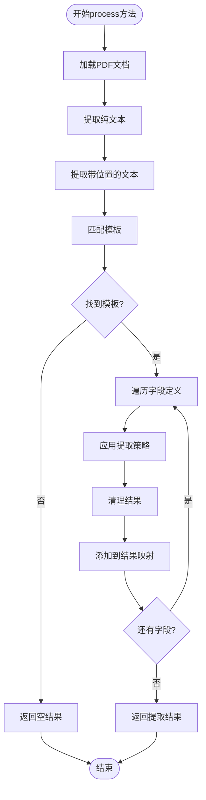
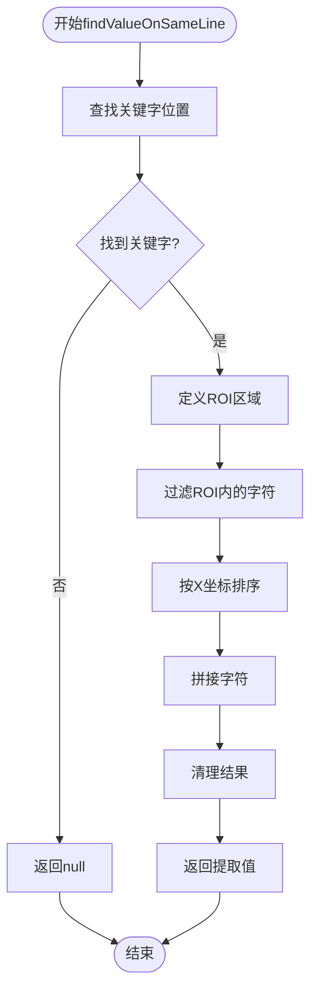
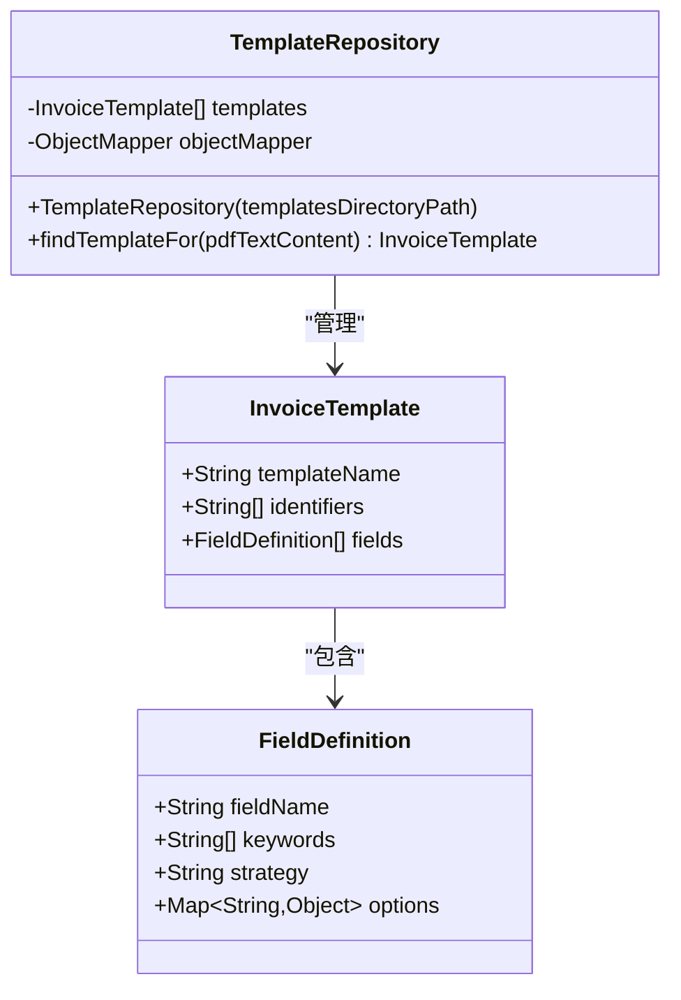
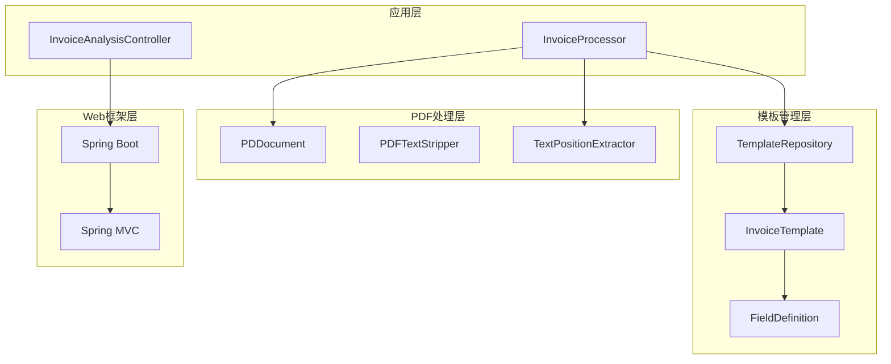

# 发票分析引擎

<cite>
**本文档引用的文件**
- [InvoiceProcessor.java](file://src/main/java/com/kinghy/invoiceanalysis/service/InvoiceProcessor.java)
- [TextPositionExtractor.java](file://src/main/java/com/kinghy/invoiceanalysis/service/TextPositionExtractor.java)
- [PositionalInvoiceExtractor.java](file://src/main/java/com/kinghy/invoiceanalysis/service/PositionalInvoiceExtractor.java)
- [FieldDefinition.java](file://src/main/java/com/kinghy/invoiceanalysis/entity/dto/FieldDefinition.java)
- [InvoiceTemplate.java](file://src/main/java/com/kinghy/invoiceanalysis/entity/dto/InvoiceTemplate.java)
- [TemplateRepository.java](file://src/main/java/com/kinghy/invoiceanalysis/entity/pojo/TemplateRepository.java)
- [InvoiceAnalysisController.java](file://src/main/java/com/kinghy/invoiceanalysis/controller/InvoiceAnalysisController.java)
- [beijing-tongzhou-hospital-template.json](file://src/main/java/com/kinghy/invoiceanalysis/config/templates/beijing-tongzhou-hospital-template.json)
- [application.properties](file://src/main/resources/application.properties)
- [pom.xml](file://pom.xml)
- [InvoiceAnalysisApplication.java](file://src/main/java/com/kinghy/invoiceanalysis/InvoiceAnalysisApplication.java)
</cite>

## 目录
1. [简介](#简介)
2. [项目结构](#项目结构)
3. [核心组件](#核心组件)
4. [架构总览](#架构总览)
5. [详细组件分析](#详细组件分析)
6. [依赖关系分析](#依赖关系分析)
7. [性能考虑](#性能考虑)
8. [故障排除指南](#故障排除指南)
9. [结论](#结论)
10. [附录](#附录)

## 简介
本项目是一个基于PDFBox的发票分析引擎，能够自动从发票PDF中提取关键字段。系统通过三步法实现：文本提取、模板匹配、字段提取。核心类InvoiceProcessor负责协调整个流程，利用PDFBox解析PDF内容，结合模板配置完成字段抽取。系统支持多种提取策略（如同一行提取、下方提取、区域提取），并通过JSON模板配置实现灵活扩展。

## 项目结构
项目采用标准的Spring Boot目录结构，主要分为以下模块：
- service层：核心业务逻辑，包括发票处理器、文本位置提取器等
- entity层：数据传输对象和持久化实体
- controller层：Web接口控制器
- config/templates：模板配置文件
- resources：应用配置文件

**图表来源**
- [InvoiceProcessor.java](file://src/main/java/com/kinghy/invoiceanalysis/service/InvoiceProcessor.java#L17-L77)
- [TextPositionExtractor.java](file://src/main/java/com/kinghy/invoiceanalysis/service/TextPositionExtractor.java#L13-L29)
- [TemplateRepository.java](file://src/main/java/com/kinghy/invoiceanalysis/entity/pojo/TemplateRepository.java#L11-L40)
- [InvoiceTemplate.java](file://src/main/java/com/kinghy/invoiceanalysis/entity/dto/InvoiceTemplate.java#L8-L13)
- [FieldDefinition.java](file://src/main/java/com/kinghy/invoiceanalysis/entity/dto/FieldDefinition.java#L8-L13)
- [InvoiceAnalysisController.java](file://src/main/java/com/kinghy/invoiceanalysis/controller/InvoiceAnalysisController.java#L14-L25)

**章节来源**
- [InvoiceAnalysisApplication.java](file://src/main/java/com/kinghy/invoiceanalysis/InvoiceAnalysisApplication.java#L6-L13)
- [application.properties](file://src/main/resources/application.properties#L1-L2)

## 核心组件
本节详细介绍发票分析引擎的核心组件及其职责。

### InvoiceProcessor类
InvoiceProcessor是整个发票分析引擎的核心，负责协调PDF处理的完整流程。该类实现了三步法：
1. PDF文档加载和基础文本提取
2. 模板匹配和选择
3. 字段提取和结果组装

该类的主要特性包括：
- 使用PDFBox的PDDocument管理PDF生命周期
- 通过TextPositionExtractor获取精确的文本位置信息
- 基于模板配置进行智能字段提取
- 支持多种提取策略的扩展

### TextPositionExtractor类
这是一个继承自PDFTextStripper的自定义提取器，专门用于收集PDF中每个字符的精确位置信息。它重写了writeString方法，在每次提取文本时同时保存对应的TextPosition列表，为后续的精确定位提供基础数据。

### TemplateRepository类
负责管理模板配置，支持从指定目录加载多个JSON格式的模板文件。每个模板包含标识符集合和字段定义列表，系统通过匹配标识符来选择合适的模板。

**章节来源**
- [InvoiceProcessor.java](file://src/main/java/com/kinghy/invoiceanalysis/service/InvoiceProcessor.java#L17-L77)
- [TextPositionExtractor.java](file://src/main/java/com/kinghy/invoiceanalysis/service/TextPositionExtractor.java#L13-L29)
- [TemplateRepository.java](file://src/main/java/com/kinghy/invoiceanalysis/entity/pojo/TemplateRepository.java#L11-L40)

## 架构总览
发票分析引擎采用分层架构设计，各层职责清晰，耦合度低，便于维护和扩展。

**图表来源**
- [InvoiceAnalysisController.java](file://src/main/java/com/kinghy/invoiceanalysis/controller/InvoiceAnalysisController.java#L18-L22)
- [InvoiceProcessor.java](file://src/main/java/com/kinghy/invoiceanalysis/service/InvoiceProcessor.java#L27-L77)
- [TemplateRepository.java](file://src/main/java/com/kinghy/invoiceanalysis/entity/pojo/TemplateRepository.java#L25-L39)

## 详细组件分析

### InvoiceProcessor.process方法详解
process方法是发票分析的核心流程，实现了完整的三步法：

#### 步骤1：PDF文档加载和文本提取
- 使用PDDocument.load()安全地加载PDF文件
- 通过PDFTextStripper提取纯文本内容
- 使用TextPositionExtractor获取带位置的文本信息

#### 步骤2：模板匹配
- 调用TemplateRepository.findTemplateFor()方法
- 通过识别符匹配算法选择最合适的模板
- 如果没有匹配模板，返回空结果集

#### 步骤3：字段提取
- 遍历模板中的每个字段定义
- 根据策略类型调用相应的提取方法
- 支持SAME_LINE、BELOW、AREA三种策略
- 清理提取结果并添加到最终映射中

**图表来源**
- [InvoiceProcessor.java](file://src/main/java/com/kinghy/invoiceanalysis/service/InvoiceProcessor.java#L27-L77)

**章节来源**
- [InvoiceProcessor.java](file://src/main/java/com/kinghy/invoiceanalysis/service/InvoiceProcessor.java#L27-L77)

### 文本位置提取算法
findValueOnSameLine方法实现了基于位置信息的精确提取：

#### ROI（感兴趣区域）定义
- Y坐标容差：基于关键字字符高度的一半
- X坐标起点：关键字结束位置右侧
- X坐标终点：页面右边界或合理上限

#### 关键字定位
- 通过findKeywordPosition方法在文本序列中搜索关键字
- 返回关键字最后一个字符的TextPosition，确保获取正确的结束坐标

#### 结果拼接
- 过滤ROI内的所有字符位置
- 按X坐标排序后拼接成字符串
- 应用正则表达式清理不需要的字符

**图表来源**
- [InvoiceProcessor.java](file://src/main/java/com/kinghy/invoiceanalysis/service/InvoiceProcessor.java#L96-L135)

**章节来源**
- [InvoiceProcessor.java](file://src/main/java/com/kinghy/invoiceanalysis/service/InvoiceProcessor.java#L96-L135)

### 模板系统设计
模板系统采用JSON配置文件，支持灵活的字段定义和提取策略：

#### 模板结构
- templateName：模板名称
- identifiers：识别符数组，用于模板匹配
- fields：字段定义列表

#### 字段定义结构
- fieldName：字段在结果中的键名
- keywords：关键字列表，用于定位字段值
- strategy：提取策略类型
- options：策略相关的配置选项

**图表来源**
- [InvoiceTemplate.java](file://src/main/java/com/kinghy/invoiceanalysis/entity/dto/InvoiceTemplate.java#L8-L13)
- [FieldDefinition.java](file://src/main/java/com/kinghy/invoiceanalysis/entity/dto/FieldDefinition.java#L8-L13)
- [TemplateRepository.java](file://src/main/java/com/kinghy/invoiceanalysis/entity/pojo/TemplateRepository.java#L11-L40)

**章节来源**
- [InvoiceTemplate.java](file://src/main/java/com/kinghy/invoiceanalysis/entity/dto/InvoiceTemplate.java#L8-L13)
- [FieldDefinition.java](file://src/main/java/com/kinghy/invoiceanalysis/entity/dto/FieldDefinition.java#L8-L13)
- [TemplateRepository.java](file://src/main/java/com/kinghy/invoiceanalysis/entity/pojo/TemplateRepository.java#L11-L40)

### Web接口集成
系统提供了RESTful API接口，支持HTTP方式调用发票分析功能：

#### 接口规范
- 路径：/analysis/invoice
- 方法：POST
- 功能：触发发票分析流程
- 返回：成功状态信息

**章节来源**
- [InvoiceAnalysisController.java](file://src/main/java/com/kinghy/invoiceanalysis/controller/InvoiceAnalysisController.java#L14-L25)

## 依赖关系分析

### 外部依赖
系统主要依赖以下外部库：

#### PDFBox
- 版本：2.0.27
- 用途：PDF文档解析和文本提取
- 核心类：PDDocument、PDFTextStripper

#### Spring Boot
- 版本：2.1.7.RELEASE
- 用途：Web框架和依赖注入
- 核心类：SpringApplication

#### Lombok
- 用途：简化Java代码，减少样板代码
- 主要注解：@Slf4j、@Data

**图表来源**
- [pom.xml](file://pom.xml#L32-L54)
- [InvoiceProcessor.java](file://src/main/java/com/kinghy/invoiceanalysis/service/InvoiceProcessor.java#L7-L9)
- [InvoiceAnalysisController.java](file://src/main/java/com/kinghy/invoiceanalysis/controller/InvoiceAnalysisController.java#L3-L6)

**章节来源**
- [pom.xml](file://pom.xml#L29-L54)

### 内部组件依赖
各内部组件之间的依赖关系清晰明确：

- InvoiceProcessor依赖TemplateRepository和TextPositionExtractor
- TemplateRepository管理InvoiceTemplate和FieldDefinition
- 控制器依赖InvoiceProcessor进行业务处理

**章节来源**
- [InvoiceProcessor.java](file://src/main/java/com/kinghy/invoiceanalysis/service/InvoiceProcessor.java#L19-L25)
- [TemplateRepository.java](file://src/main/java/com/kinghy/invoiceanalysis/entity/pojo/TemplateRepository.java#L11-L23)

## 性能考虑
基于当前实现，以下是性能优化建议：

### PDF处理优化
1. **多线程处理**：对于批量PDF处理，可以考虑使用线程池并发处理多个文件
2. **内存管理**：确保PDDocument正确关闭，避免内存泄漏
3. **分页处理**：对于多页PDF，可以考虑分页异步处理

### 模板匹配优化
1. **索引构建**：对模板识别符建立索引，提高匹配效率
2. **缓存机制**：缓存已匹配的模板结果
3. **预编译正则**：如果使用正则表达式，预编译以提高性能

### 文本提取优化
1. **ROI计算优化**：优化区域判断算法，减少不必要的遍历
2. **字符排序优化**：使用更高效的排序算法
3. **字符串拼接优化**：使用StringBuilder进行大量字符串拼接

### 存储优化
1. **模板文件缓存**：将JSON模板文件缓存在内存中
2. **结果缓存**：缓存重复的分析结果

## 故障排除指南

### 常见问题及解决方案

#### PDF文件无法加载
- 检查文件路径是否正确
- 确认PDF文件完整性
- 验证文件权限

#### 模板匹配失败
- 检查模板JSON文件格式
- 验证识别符是否准确
- 确认PDF文本内容包含识别符

#### 字段提取不准确
- 调整ROI区域参数
- 检查关键字匹配逻辑
- 验证提取策略选择

#### 性能问题
- 监控内存使用情况
- 检查是否有内存泄漏
- 考虑增加硬件资源

**章节来源**
- [InvoiceProcessor.java](file://src/main/java/com/kinghy/invoiceanalysis/service/InvoiceProcessor.java#L47-L51)

## 结论
发票分析引擎采用模块化设计，通过PDFBox的强大功能和灵活的模板系统，实现了高效的发票字段提取。系统具有良好的扩展性，支持多种提取策略和自定义模板。通过合理的性能优化和错误处理机制，可以满足生产环境的需求。未来可以在模板策略扩展、性能优化和错误处理方面进一步完善。

## 附录

### 使用示例
以下是如何使用发票分析引擎的基本步骤：

1. 创建InvoiceProcessor实例
2. 准备PDF文件路径
3. 调用process方法
4. 处理返回的结果映射

### 配置说明
- 模板文件放置在config/templates目录下
- 模板文件必须是JSON格式
- 支持多个模板文件同时存在

### 开发建议
- 为不同类型的发票创建专用模板
- 建立模板版本管理机制
- 添加单元测试覆盖关键功能
- 实现日志记录和监控

**章节来源**
- [InvoiceProcessor.java](file://src/main/java/com/kinghy/invoiceanalysis/service/InvoiceProcessor.java#L79-L85)
- [beijing-tongzhou-hospital-template.json](file://src/main/java/com/kinghy/invoiceanalysis/config/templates/beijing-tongzhou-hospital-template.json#L1-L55)