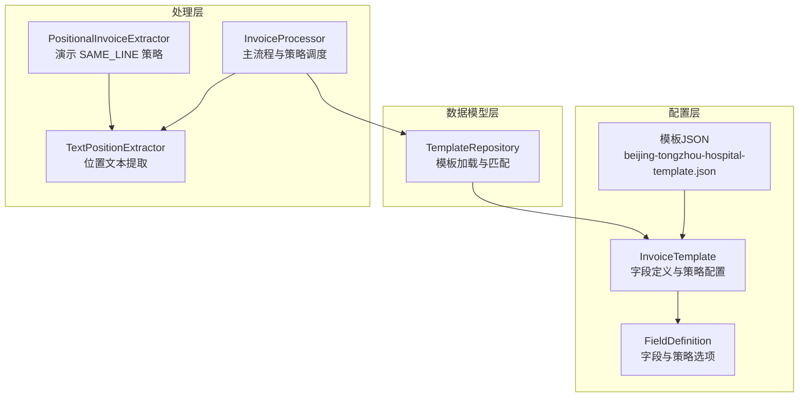
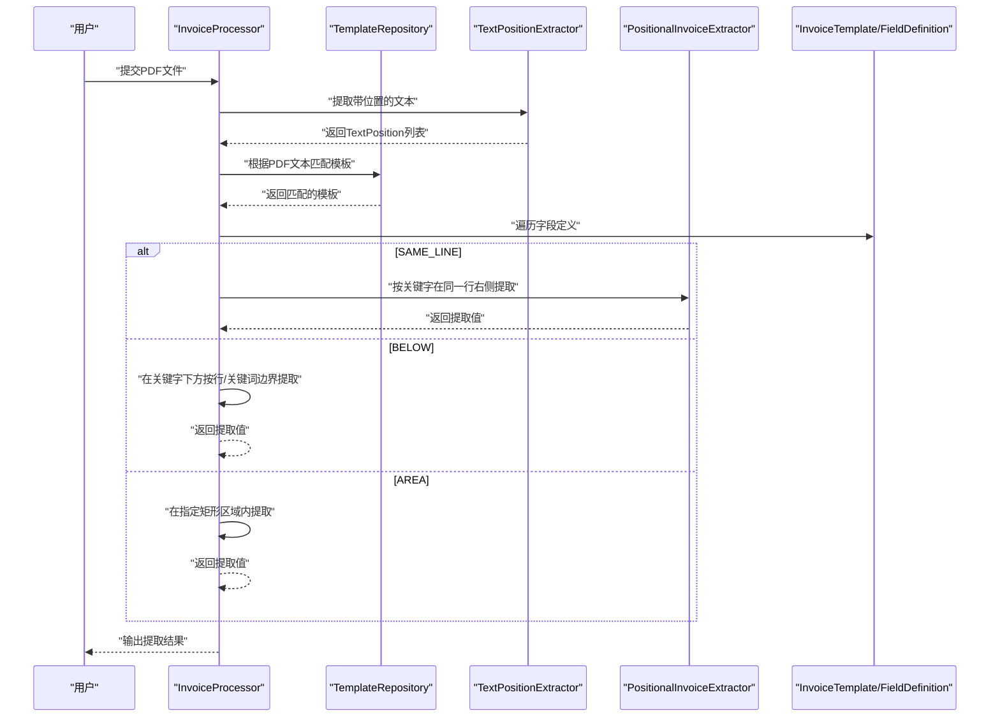
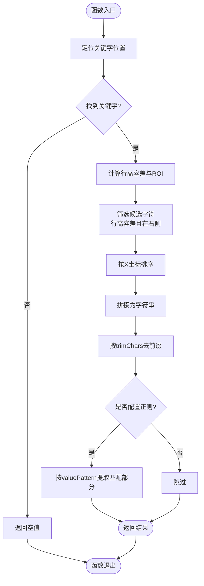
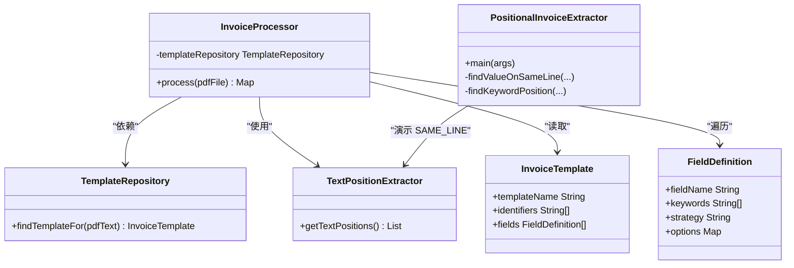

# 提取策略系统

<cite>
**本文引用的文件**
- [InvoiceProcessor.java](file://src/main/java/com/kinghy/invoiceanalysis/service/InvoiceProcessor.java)
- [PositionalInvoiceExtractor.java](file://src/main/java/com/kinghy/invoiceanalysis/service/PositionalInvoiceExtractor.java)
- [TextPositionExtractor.java](file://src/main/java/com/kinghy/invoiceanalysis/service/TextPositionExtractor.java)
- [InvoiceTemplate.java](file://src/main/java/com/kinghy/invoiceanalysis/entity/dto/InvoiceTemplate.java)
- [FieldDefinition.java](file://src/main/java/com/kinghy/invoiceanalysis/entity/dto/FieldDefinition.java)
- [TemplateRepository.java](file://src/main/java/com/kinghy/invoiceanalysis/entity/pojo/TemplateRepository.java)
- [beijing-tongzhou-hospital-template.json](file://src/main/java/com/kinghy/invoiceanalysis/config/templates/beijing-tongzhou-hospital-template.json)
- [v1.md](file://docs/v1.md)
</cite>

## 目录
1. [简介](#简介)
2. [项目结构](#项目结构)
3. [核心组件](#核心组件)
4. [架构总览](#架构总览)
5. [详细组件分析](#详细组件分析)
6. [依赖关系分析](#依赖关系分析)
7. [性能考虑](#性能考虑)
8. [故障排查指南](#故障排查指南)
9. [结论](#结论)
10. [附录](#附录)

## 简介
本文件系统性阐述发票识别系统中的提取策略体系，重点覆盖三种策略：SAME_LINE（同行提取）、BELOW（下方提取）与 AREA（区域提取。文档从架构设计、数据流、算法实现、性能特征、策略选择与配置、扩展指南、最佳实践等方面进行全面说明，并结合模板配置与策略参数给出可操作的实施建议。

## 项目结构
该项目采用“模板驱动 + 策略模式”的架构：通过 JSON 模板定义字段、关键字与提取策略；核心处理器根据模板动态选择策略执行提取；位置提取器负责从 PDF 中抽取带坐标的文本片段，为策略提供精确的空间信息。

图表来源
- [InvoiceProcessor.java](file://src/main/java/com/kinghy/invoiceanalysis/service/InvoiceProcessor.java#L1-L159)
- [PositionalInvoiceExtractor.java](file://src/main/java/com/kinghy/invoiceanalysis/service/PositionalInvoiceExtractor.java#L1-L117)
- [TextPositionExtractor.java](file://src/main/java/com/kinghy/invoiceanalysis/service/TextPositionExtractor.java#L1-L30)
- [InvoiceTemplate.java](file://src/main/java/com/kinghy/invoiceanalysis/entity/dto/InvoiceTemplate.java#L1-L16)
- [FieldDefinition.java](file://src/main/java/com/kinghy/invoiceanalysis/entity/dto/FieldDefinition.java#L1-L14)
- [TemplateRepository.java](file://src/main/java/com/kinghy/invoiceanalysis/entity/pojo/TemplateRepository.java#L1-L41)
- [beijing-tongzhou-hospital-template.json](file://src/main/java/com/kinghy/invoiceanalysis/config/templates/beijing-tongzhou-hospital-template.json#L1-L55)

章节来源
- [InvoiceProcessor.java](file://src/main/java/com/kinghy/invoiceanalysis/service/InvoiceProcessor.java#L1-L159)
- [PositionalInvoiceExtractor.java](file://src/main/java/com/kinghy/invoiceanalysis/service/PositionalInvoiceExtractor.java#L1-L117)
- [TextPositionExtractor.java](file://src/main/java/com/kinghy/invoiceanalysis/service/TextPositionExtractor.java#L1-L30)
- [InvoiceTemplate.java](file://src/main/java/com/kinghy/invoiceanalysis/entity/dto/InvoiceTemplate.java#L1-L16)
- [FieldDefinition.java](file://src/main/java/com/kinghy/invoiceanalysis/entity/dto/FieldDefinition.java#L1-L14)
- [TemplateRepository.java](file://src/main/java/com/kinghy/invoiceanalysis/entity/pojo/TemplateRepository.java#L1-L41)
- [beijing-tongzhou-hospital-template.json](file://src/main/java/com/kinghy/invoiceanalysis/config/templates/beijing-tongzhou-hospital-template.json#L1-L55)

## 核心组件
- 模板与字段定义：通过 JSON 模板声明字段名、关键字集合、策略类型与策略参数，实现“规则即配置”。
- 模板仓库：扫描模板目录，加载 JSON 为对象，并基于标识符匹配适用模板。
- 提取器：提供带位置的文本序列，支持按关键字定位与空间范围筛选。
- 主处理器：读取 PDF 文本与位置信息，匹配模板，遍历字段并调用对应策略提取值。

章节来源
- [InvoiceTemplate.java](file://src/main/java/com/kinghy/invoiceanalysis/entity/dto/InvoiceTemplate.java#L1-L16)
- [FieldDefinition.java](file://src/main/java/com/kinghy/invoiceanalysis/entity/dto/FieldDefinition.java#L1-L14)
- [TemplateRepository.java](file://src/main/java/com/kinghy/invoiceanalysis/entity/pojo/TemplateRepository.java#L1-L41)
- [TextPositionExtractor.java](file://src/main/java/com/kinghy/invoiceanalysis/service/TextPositionExtractor.java#L1-L30)
- [InvoiceProcessor.java](file://src/main/java/com/kinghy/invoiceanalysis/service/InvoiceProcessor.java#L1-L159)

## 架构总览
系统以模板为中心，围绕模板驱动的策略执行展开。主流程包括：加载模板、提取文本与位置、匹配模板、遍历字段并执行策略、输出结果。

图表来源
- [InvoiceProcessor.java](file://src/main/java/com/kinghy/invoiceanalysis/service/InvoiceProcessor.java#L27-L77)
- [PositionalInvoiceExtractor.java](file://src/main/java/com/kinghy/invoiceanalysis/service/PositionalInvoiceExtractor.java#L17-L93)
- [TemplateRepository.java](file://src/main/java/com/kinghy/invoiceanalysis/entity/pojo/TemplateRepository.java#L25-L39)
- [beijing-tongzhou-hospital-template.json](file://src/main/java/com/kinghy/invoiceanalysis/config/templates/beijing-tongzhou-hospital-template.json#L7-L52)

## 详细组件分析

### 同行提取 SAME_LINE
- 工作机制
  - 先定位关键字在页面上的最后字符位置，以此为基准确定行高容差与右侧 ROI 区域。
  - 遍历所有文本位置，筛选出在该行高容差范围内且位于关键字右侧的字符。
  - 对候选字符按 X 坐标升序排序并拼接为字符串，再按配置进行前缀清理与可选的正则过滤。
- 算法实现要点
  - 行高容差：使用关键字字符高度的一半作为上下限，提升对字体差异的鲁棒性。
  - ROI 定义：以关键字结束位置为起点，向右扩展至页面边界或合理上限。
  - 排序与拼接：确保字符顺序与阅读方向一致。
  - 去噪：去除冒号、空格等非数值字符，必要时应用正则进一步清洗。
- 性能特征
  - 时间复杂度：O(N)，N 为页面字符数；排序开销 O(K log K)，K 为候选字符数。
  - 空间复杂度：O(K)。
  - 关键优化点：ROI 缩小、早期剪枝、避免重复字符串拼接。
- 适用场景
  - 关键字与值在同一行，值位于关键字右侧，且无换行或分隔符干扰。
  - 常见于“字段名: 值”或“字段名 值”的布局。
- 模板配置
  - strategy: SAME_LINE
  - options.trimChars: 提取后从开头剔除的字符集
  - options.valuePattern: 可选的正则表达式，仅提取匹配部分
- 示例路径
  - 同行提取实现：[findValueOnSameLine](file://src/main/java/com/kinghy/invoiceanalysis/service/PositionalInvoiceExtractor.java#L54-L93)
  - 关键字定位实现：[findKeywordPosition](file://src/main/java/com/kinghy/invoiceanalysis/service/PositionalInvoiceExtractor.java#L101-L115)
  - 主流程中 SAME_LINE 调用点：[InvoiceProcessor.process](file://src/main/java/com/kinghy/invoiceanalysis/service/InvoiceProcessor.java#L58-L63)
  - 模板配置示例：[beijing-tongzhou-hospital-template.json](file://src/main/java/com/kinghy/invoiceanalysis/config/templates/beijing-tongzhou-hospital-template.json#L8-L32)

图表来源
- [PositionalInvoiceExtractor.java](file://src/main/java/com/kinghy/invoiceanalysis/service/PositionalInvoiceExtractor.java#L54-L93)

章节来源
- [PositionalInvoiceExtractor.java](file://src/main/java/com/kinghy/invoiceanalysis/service/PositionalInvoiceExtractor.java#L54-L93)
- [InvoiceProcessor.java](file://src/main/java/com/kinghy/invoiceanalysis/service/InvoiceProcessor.java#L58-L63)
- [beijing-tongzhou-hospital-template.json](file://src/main/java/com/kinghy/invoiceanalysis/config/templates/beijing-tongzhou-hospital-template.json#L8-L32)

### 下方提取 BELOW
- 工作机制
  - 以关键字为起点，在其下方按行或关键词边界进行扫描。
  - 支持“最多向下几行”限制与“遇到某些关键词即停止”的边界控制，避免误抓取。
  - 通常与 SAME_LINE 类似，先定位关键字，再在下方 ROI 内收集候选字符并排序拼接。
- 算法实现要点
  - 行高容差：同样基于字符高度，保证同一行判断的稳定性。
  - 边界控制：maxLinesBelow 控制向下扫描深度；stopAtKeywords 作为提前终止条件。
  - 与 SAME_LINE 的差异：扫描方向从“右侧”改为“下方”，并引入行计数与关键词检测。
- 性能特征
  - 时间复杂度：O(N)，排序开销 O(K log K)。
  - 空间复杂度：O(K)。
  - 优化建议：限制扫描行数、使用关键词索引快速判定边界。
- 适用场景
  - 关键字与值不在同一行，值位于关键字下方，且存在多行文本或表格形式。
- 模板配置
  - strategy: BELOW
  - options.maxLinesBelow: 向下扫描的最大行数
  - options.stopAtKeywords: 遇到这些关键字时停止
- 示例路径
  - 主流程中 BELOW 占位调用点：[InvoiceProcessor.process](file://src/main/java/com/kinghy/invoiceanalysis/service/InvoiceProcessor.java#L65-L69)
  - 模板配置示例：[beijing-tongzhou-hospital-template.json](file://src/main/java/com/kinghy/invoiceanalysis/config/templates/beijing-tongzhou-hospital-template.json#L33-L41)

章节来源
- [InvoiceProcessor.java](file://src/main/java/com/kinghy/invoiceanalysis/service/InvoiceProcessor.java#L65-L69)
- [beijing-tongzhou-hospital-template.json](file://src/main/java/com/kinghy/invoiceanalysis/config/templates/beijing-tongzhou-hospital-template.json#L33-L41)

### 区域提取 AREA
- 工作机制
  - 通过预设的矩形区域（x_start, y_start, width, height）直接限定提取范围。
  - 适合没有关键字、但值出现在固定位置的场景（如标题、单位名称等）。
- 算法实现要点
  - 区域判定：对每个字符的坐标进行矩形包含判断。
  - 排序与拼接：通常仍需按阅读方向排序后再拼接。
  - 参数校验：确保区域参数有效，避免越界。
- 性能特征
  - 时间复杂度：O(N)，空间复杂度：O(K)。
  - 优化建议：区域尽量靠近目标，减少 N 与 K。
- 适用场景
  - 固定版式、固定位置的文本块，如单位名称、发票号码等。
- 模板配置
  - strategy: AREA
  - options.x_start, options.y_start, options.width, options.height: 矩形区域参数
- 示例路径
  - 主流程中 AREA 占位调用点：[InvoiceProcessor.process](file://src/main/java/com/kinghy/invoiceanalysis/service/InvoiceProcessor.java#L67-L69)
  - 模板配置示例：[beijing-tongzhou-hospital-template.json](file://src/main/java/com/kinghy/invoiceanalysis/config/templates/beijing-tongzhou-hospital-template.json#L42-L52)

章节来源
- [InvoiceProcessor.java](file://src/main/java/com/kinghy/invoiceanalysis/service/InvoiceProcessor.java#L67-L69)
- [beijing-tongzhou-hospital-template.json](file://src/main/java/com/kinghy/invoiceanalysis/config/templates/beijing-tongzhou-hospital-template.json#L42-L52)

### 策略选择与决策逻辑
- 决策依据
  - 字段定义中的 strategy 字段决定使用哪种策略。
  - 主流程中根据 strategy 分支调用相应策略实现。
- 当前实现状态
  - 主流程已预留 SAME_LINE、BELOW、AREA 的分支占位，其中 SAME_LINE 已在演示代码中实现，BELOW 与 AREA 为占位，等待策略类实现。
- 配置方法
  - 在模板 JSON 的 fields 数组中为每个字段设置 strategy 与 options。
  - options 中的 trimChars、valuePattern、maxLinesBelow、stopAtKeywords、x/y/width/height 等参数按策略需求配置。

章节来源
- [InvoiceProcessor.java](file://src/main/java/com/kinghy/invoiceanalysis/service/InvoiceProcessor.java#L55-L74)
- [beijing-tongzhou-hospital-template.json](file://src/main/java/com/kinghy/invoiceanalysis/config/templates/beijing-tongzhou-hospital-template.json#L7-L52)

### 策略扩展指南
- 设计思路
  - 采用策略模式：定义统一接口，为 SAME_LINE、BELOW、AREA 分别实现具体策略类。
  - 主处理器通过 strategy 名称映射到具体策略实例，实现“规则即配置”。
- 实现步骤
  - 定义策略接口与实现类（如 ExtractionStrategy、SameLineStrategy、BelowStrategy、AreaStrategy）。
  - 在主处理器中注入策略映射表，按字段的 strategy 动态选择并执行。
  - 将 options 解析为策略内部参数对象，传递给策略实现。
- 优势
  - 易于新增策略、替换策略、复用通用逻辑。
  - 降低主流程复杂度，提升可维护性。

章节来源
- [v1.md](file://docs/v1.md#L243-L243)

## 依赖关系分析

图表来源
- [InvoiceProcessor.java](file://src/main/java/com/kinghy/invoiceanalysis/service/InvoiceProcessor.java#L1-L159)
- [TemplateRepository.java](file://src/main/java/com/kinghy/invoiceanalysis/entity/pojo/TemplateRepository.java#L1-L41)
- [InvoiceTemplate.java](file://src/main/java/com/kinghy/invoiceanalysis/entity/dto/InvoiceTemplate.java#L1-L16)
- [FieldDefinition.java](file://src/main/java/com/kinghy/invoiceanalysis/entity/dto/FieldDefinition.java#L1-L14)
- [TextPositionExtractor.java](file://src/main/java/com/kinghy/invoiceanalysis/service/TextPositionExtractor.java#L1-L30)
- [PositionalInvoiceExtractor.java](file://src/main/java/com/kinghy/invoiceanalysis/service/PositionalInvoiceExtractor.java#L1-L117)

章节来源
- [InvoiceProcessor.java](file://src/main/java/com/kinghy/invoiceanalysis/service/InvoiceProcessor.java#L1-L159)
- [TemplateRepository.java](file://src/main/java/com/kinghy/invoiceanalysis/entity/pojo/TemplateRepository.java#L1-L41)
- [InvoiceTemplate.java](file://src/main/java/com/kinghy/invoiceanalysis/entity/dto/InvoiceTemplate.java#L1-L16)
- [FieldDefinition.java](file://src/main/java/com/kinghy/invoiceanalysis/entity/dto/FieldDefinition.java#L1-L14)
- [TextPositionExtractor.java](file://src/main/java/com/kinghy/invoiceanalysis/service/TextPositionExtractor.java#L1-L30)
- [PositionalInvoiceExtractor.java](file://src/main/java/com/kinghy/invoiceanalysis/service/PositionalInvoiceExtractor.java#L1-L117)

## 性能考虑
- 时间复杂度
  - SAME_LINE：O(N) + O(K log K)，N 为字符总数，K 为候选字符数。
  - BELOW：与 SAME_LINE 类似，但扫描方向为下方，受 maxLinesBelow 限制。
  - AREA：O(N) + O(K log K)，受区域大小影响。
- 空间复杂度
  - O(K)，主要为候选字符集合。
- 优化建议
  - ROI 缩小：尽可能缩小搜索区域，减少 N 与 K。
  - 行高容差：合理设置容差，避免误判导致的候选过多。
  - 排序优化：优先使用更高效的排序策略或减少排序规模。
  - 正则过滤：在清洗阶段尽早过滤，减少后续处理量。
  - 缓存与复用：对常用模板与关键字位置进行缓存，减少重复计算。

## 故障排查指南
- 关键字未找到
  - 检查模板中 keywords 是否与 PDF 中实际文本一致（大小写、全角半角、多余空格）。
  - 调整 SAME_LINE 的行高容差或检查字体差异。
- 提取为空
  - 确认 ROI 设置是否正确，尤其是关键字结束位置与右侧起点。
  - 检查是否存在关键字本身被误判为候选字符的情况（可通过 X 坐标边界过滤）。
- 结果不准确
  - 使用 options.trimChars 去除前缀干扰。
  - 使用 options.valuePattern 进一步清洗，确保只提取期望内容。
- 版式变化
  - 更新模板 JSON 中的 strategy 与 options，必要时新增模板。
  - 对于 BELOW，适当调整 maxLinesBelow 与 stopAtKeywords。

章节来源
- [PositionalInvoiceExtractor.java](file://src/main/java/com/kinghy/invoiceanalysis/service/PositionalInvoiceExtractor.java#L54-L93)
- [beijing-tongzhou-hospital-template.json](file://src/main/java/com/kinghy/invoiceanalysis/config/templates/beijing-tongzhou-hospital-template.json#L7-L52)

## 结论
本系统通过“模板 + 策略”的方式实现了高度可配置的发票字段提取能力。SAME_LINE 适用于同行右侧提取，BELOW 适用于下方提取，AREA 适用于固定区域提取。当前主流程已预留策略扩展点，建议尽快落地策略模式，将 SAME_LINE 的实现抽象为策略接口，使系统具备更强的可扩展性与可维护性。

## 附录
- 模板配置参考
  - 字段定义：[beijing-tongzhou-hospital-template.json](file://src/main/java/com/kinghy/invoiceanalysis/config/templates/beijing-tongzhou-hospital-template.json#L7-L52)
  - 数据模型：[InvoiceTemplate.java](file://src/main/java/com/kinghy/invoiceanalysis/entity/dto/InvoiceTemplate.java#L1-L16)、[FieldDefinition.java](file://src/main/java/com/kinghy/invoiceanalysis/entity/dto/FieldDefinition.java#L1-L14)
  - 模板加载：[TemplateRepository.java](file://src/main/java/com/kinghy/invoiceanalysis/entity/pojo/TemplateRepository.java#L1-L41)
  - 位置提取：[TextPositionExtractor.java](file://src/main/java/com/kinghy/invoiceanalysis/service/TextPositionExtractor.java#L1-L30)
  - 主流程与策略占位：[InvoiceProcessor.java](file://src/main/java/com/kinghy/invoiceanalysis/service/InvoiceProcessor.java#L55-L74)