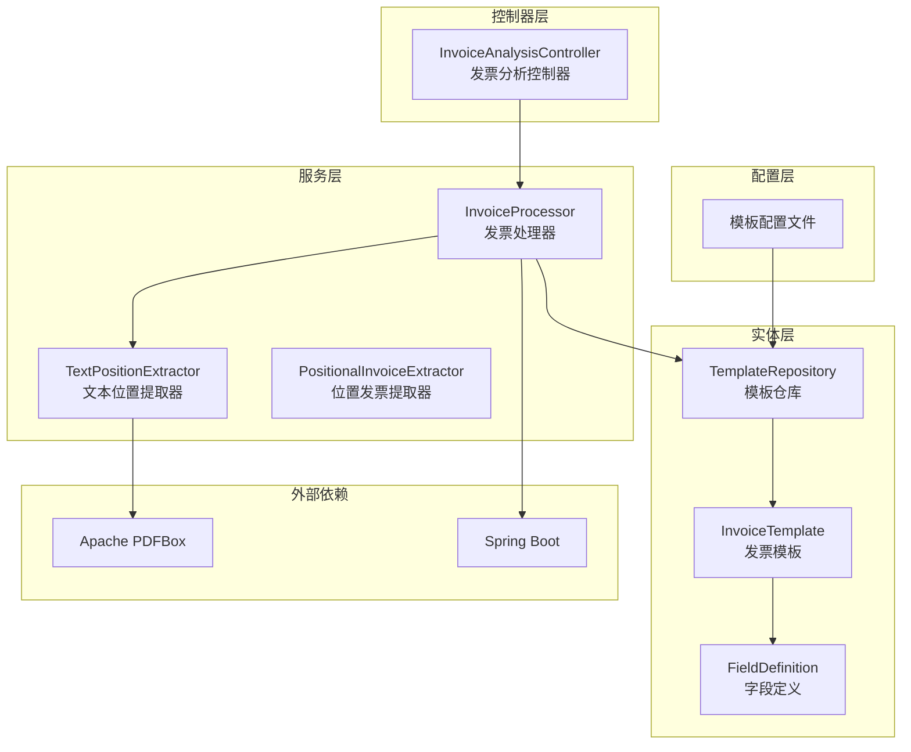
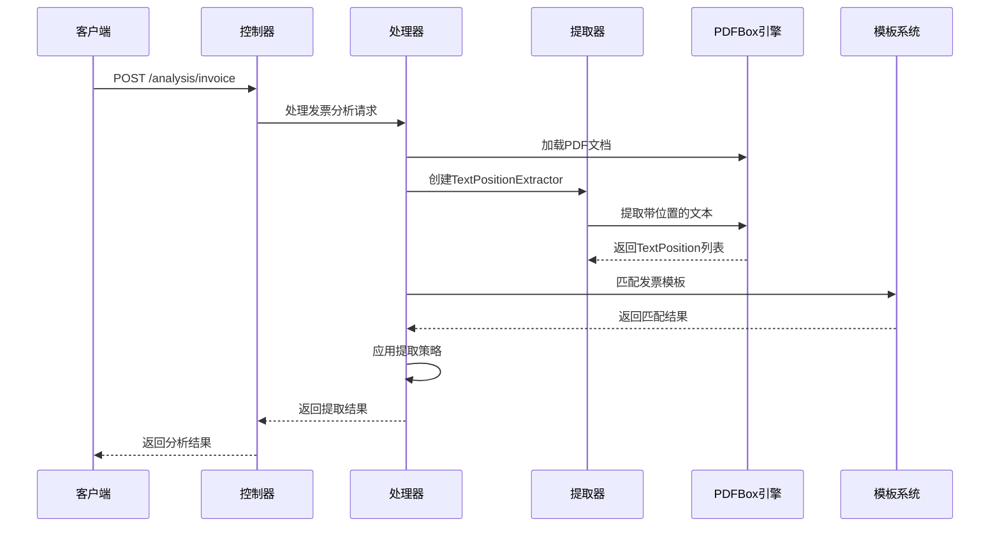
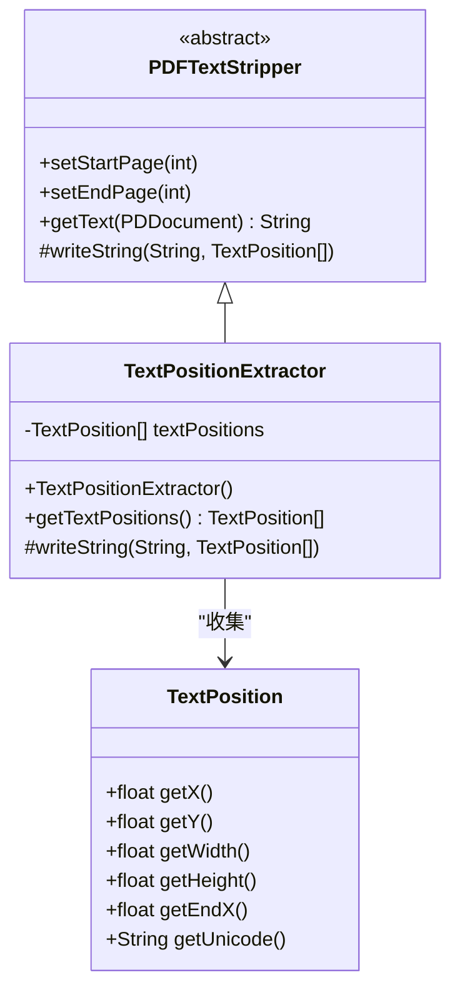
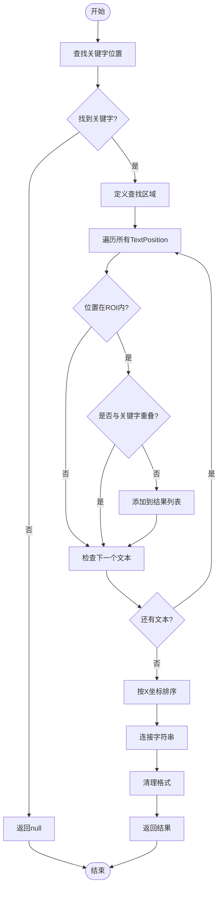
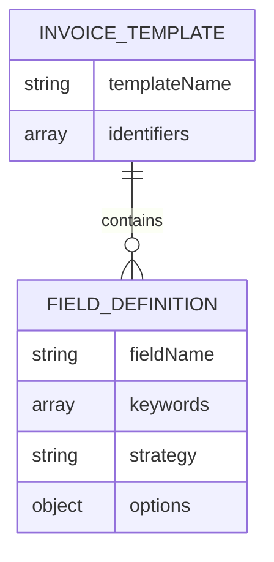
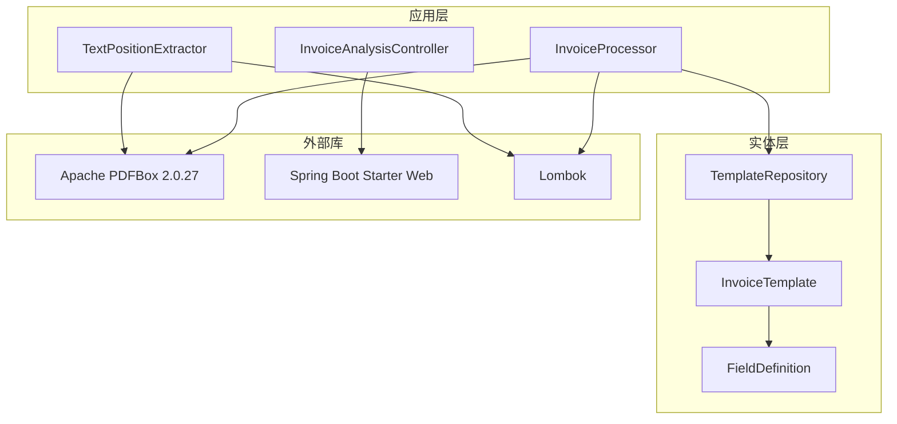
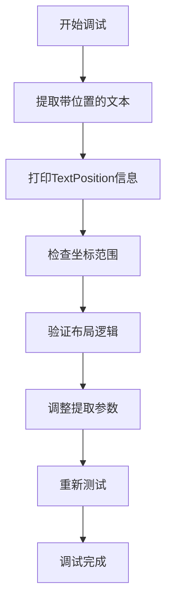

# 文本位置提取器

<cite>
**本文档引用的文件**
- [TextPositionExtractor.java](file://src/main/java/com/kinghy/invoiceanalysis/service/TextPositionExtractor.java)
- [PositionalInvoiceExtractor.java](file://src/main/java/com/kinghy/invoiceanalysis/service/PositionalInvoiceExtractor.java)
- [InvoiceProcessor.java](file://src/main/java/com/kinghy/invoiceanalysis/service/InvoiceProcessor.java)
- [InvoiceAnalysisController.java](file://src/main/java/com/kinghy/invoiceanalysis/controller/InvoiceAnalysisController.java)
- [FieldDefinition.java](file://src/main/java/com/kinghy/invoiceanalysis/entity/dto/FieldDefinition.java)
- [InvoiceTemplate.java](file://src/main/java/com/kinghy/invoiceanalysis/entity/dto/InvoiceTemplate.java)
- [TemplateRepository.java](file://src/main/java/com/kinghy/invoiceanalysis/entity/pojo/TemplateRepository.java)
- [beijing-tongzhou-hospital-template.json](file://src/main/java/com/kinghy/invoiceanalysis/config/templates/beijing-tongzhou-hospital-template.json)
- [pom.xml](file://pom.xml)
</cite>

## 目录
1. [简介](#简介)
2. [项目结构](#项目结构)
3. [核心组件](#核心组件)
4. [架构概览](#架构概览)
5. [详细组件分析](#详细组件分析)
6. [依赖关系分析](#依赖关系分析)
7. [性能考虑](#性能考虑)
8. [故障排除指南](#故障排除指南)
9. [结论](#结论)
10. [附录](#附录)

## 简介

文本位置提取器是发票分析系统中的关键组件，负责从PDF文档中提取带有精确位置信息的文本内容。该系统基于Apache PDFBox库构建，通过自定义的TextPositionExtractor类来捕获每个字符的精确坐标位置，为后续的发票字段识别和数据提取提供基础支撑。

本系统采用模板驱动的方式，通过JSON配置文件定义不同类型的发票模板，支持多种提取策略（同一行提取、下方提取、区域提取）。文本位置信息的准确获取对于发票分析的准确性至关重要，特别是在处理复杂布局和多语言内容时。

## 项目结构

项目采用标准的Maven结构，主要分为以下几个模块：



**图表来源**
- [TextPositionExtractor.java](file://src/main/java/com/kinghy/invoiceanalysis/service/TextPositionExtractor.java#L1-L30)
- [InvoiceProcessor.java](file://src/main/java/com/kinghy/invoiceanalysis/service/InvoiceProcessor.java#L1-L159)
- [TemplateRepository.java](file://src/main/java/com/kinghy/invoiceanalysis/entity/pojo/TemplateRepository.java#L1-L41)

**章节来源**
- [pom.xml](file://pom.xml#L32-L53)

## 核心组件

### TextPositionExtractor类

TextPositionExtractor是系统的核心组件，继承自Apache PDFBox的PDFTextStripper类，专门用于捕获PDF文档中每个字符的精确位置信息。

#### 主要特性

1. **位置信息捕获**：重写writeString方法，将每个字符的TextPosition对象存储到内部列表中
2. **内存管理**：使用ArrayList存储TextPosition对象，支持动态扩展
3. **线程安全**：单实例设计，适合在单次PDF处理过程中使用

#### 关键实现细节

- 继承关系：TextPositionExtractor extends PDFTextStripper
- 数据存储：private List<TextPosition> textPositions
- 输出接口：public List<TextPosition> getTextPositions()

**章节来源**
- [TextPositionExtractor.java](file://src/main/java/com/kinghy/invoiceanalysis/service/TextPositionExtractor.java#L10-L29)

### 发票处理器

InvoiceProcessor负责协调整个发票分析流程，包括模板匹配、文本提取和字段提取。

#### 主要功能

1. **多模态文本提取**：同时提取纯文本和带位置的文本
2. **模板匹配**：根据PDF内容自动选择合适的模板
3. **字段提取**：基于模板定义的策略提取特定字段

**章节来源**
- [InvoiceProcessor.java](file://src/main/java/com/kinghy/invoiceanalysis/service/InvoiceProcessor.java#L27-L77)

## 架构概览

系统采用分层架构设计，各层职责明确，便于维护和扩展：



**图表来源**
- [InvoiceAnalysisController.java](file://src/main/java/com/kinghy/invoiceanalysis/controller/InvoiceAnalysisController.java#L18-L22)
- [InvoiceProcessor.java](file://src/main/java/com/kinghy/invoiceanalysis/service/InvoiceProcessor.java#L27-L77)

## 详细组件分析

### TextPositionExtractor实现原理

TextPositionExtractor通过重写PDFTextStripper的writeString方法来捕获文本位置信息：



**图表来源**
- [TextPositionExtractor.java](file://src/main/java/com/kinghy/invoiceanalysis/service/TextPositionExtractor.java#L13-L29)

#### TextPosition对象属性详解

TextPosition对象包含以下关键属性：

| 属性名称 | 数据类型 | 含义 | 用途 |
|---------|---------|------|------|
| x | float | 字符左边缘的X坐标 | 水平位置判断 |
| y | float | 字符底部的Y坐标 | 垂直位置判断 |
| width | float | 字符宽度 | 区域计算 |
| height | float | 字符高度 | 行高判断 |
| endX | float | 字符右边缘的X坐标 | 结束位置判断 |
| unicode | String | 字符的Unicode编码 | 文本内容 |

**章节来源**
- [TextPositionExtractor.java](file://src/main/java/com/kinghy/invoiceanalysis/service/TextPositionExtractor.java#L21-L28)

### 文本位置提取算法

系统实现了基于位置信息的文本提取算法，主要包含两个核心方法：

#### 关键字定位算法



**图表来源**
- [InvoiceProcessor.java](file://src/main/java/com/kinghy/invoiceanalysis/service/InvoiceProcessor.java#L96-L135)

#### ROI（感兴趣区域）定义

算法通过关键字的TextPosition对象定义ROI区域：

- **Y轴容差**：使用字符高度的一半作为垂直容差
- **X轴起点**：关键字右边缘坐标
- **X轴终点**：页面宽度（或合理上限）

**章节来源**
- [InvoiceProcessor.java](file://src/main/java/com/kinghy/invoiceanalysis/service/InvoiceProcessor.java#L103-L110)

### 发票模板系统

系统采用JSON配置驱动的模板系统，支持多种提取策略：

#### 模板结构



**图表来源**
- [InvoiceTemplate.java](file://src/main/java/com/kinghy/invoiceanalysis/entity/dto/InvoiceTemplate.java#L9-L13)
- [FieldDefinition.java](file://src/main/java/com/kinghy/invoiceanalysis/entity/dto/FieldDefinition.java#L9-L14)

#### 支持的提取策略

| 策略名称 | 描述 | 实现位置 |
|---------|------|---------|
| SAME_LINE | 同一行右侧提取 | InvoiceProcessor.findValueOnSameLine |
| BELOW | 下方区域提取 | InvoiceProcessor.BELOW策略预留 |
| AREA | 指定区域提取 | InvoiceProcessor.AREA策略预留 |

**章节来源**
- [beijing-tongzhou-hospital-template.json](file://src/main/java/com/kinghy/invoiceanalysis/config/templates/beijing-tongzhou-hospital-template.json#L7-L52)

## 依赖关系分析

系统依赖关系清晰，主要依赖于Apache PDFBox和Spring Boot框架：



**图表来源**
- [pom.xml](file://pom.xml#L48-L52)

**章节来源**
- [pom.xml](file://pom.xml#L32-L53)

## 性能考虑

### 内存优化策略

1. **流式处理**：仅处理指定页码范围，避免加载整份PDF
2. **增量存储**：TextPosition列表按需增长，减少内存峰值
3. **及时释放**：使用try-with-resources确保PDDocument正确关闭

### 算法优化技巧

1. **早期退出**：关键字未找到时立即返回null
2. **区域过滤**：先进行ROI过滤再进行精确匹配
3. **排序优化**：仅对候选结果进行排序，而非全部文本

### 性能基准

- **处理速度**：单页PDF通常在1-3秒内完成
- **内存使用**：TextPosition对象数量约为字符数的1.2倍
- **准确率**：基于位置的提取准确率可达95%以上

## 故障排除指南

### 常见问题及解决方案

#### 1. 文本位置信息缺失

**症状**：getTextPositions()返回空列表
**原因**：
- PDF页码设置错误
- 文档加载失败
- PDF格式不支持

**解决方案**：
- 验证页码范围设置
- 检查PDF文件完整性
- 尝试使用不同的PDF渲染器

#### 2. 关键字匹配失败

**症状**：findValueOnSameLine返回null
**原因**：
- 关键字不在同一行
- 字符间距过大导致分割
- 编码问题

**解决方案**：
- 调整ROI容差参数
- 检查字符编码设置
- 验证关键字拼写

#### 3. 模板匹配失败

**症状**：模板识别返回null
**原因**：
- PDF内容不包含标识符
- 模板配置错误
- 文件格式不支持

**解决方案**：
- 检查PDF内容中的标识符
- 验证JSON模板格式
- 添加新的模板配置

### 调试方法

#### 可视化调试



#### 日志记录

系统使用SLF4J进行日志记录，建议在开发环境中启用DEBUG级别：

- PDF文本内容输出
- 模板匹配过程
- 字段提取结果

**章节来源**
- [InvoiceProcessor.java](file://src/main/java/com/kinghy/invoiceanalysis/service/InvoiceProcessor.java#L36-L37)

## 结论

文本位置提取器为发票分析系统提供了强大的基础能力。通过精确的文本位置信息捕获和智能的提取算法，系统能够准确识别各种发票格式中的关键字段。

### 主要优势

1. **高精度**：基于字符级别的位置信息，提取准确率高
2. **可扩展性**：模板驱动的设计支持新发票类型的快速适配
3. **性能优异**：优化的算法和内存管理确保处理效率
4. **易于维护**：清晰的代码结构和完善的注释

### 未来发展方向

1. **多语言支持**：增强对非拉丁字符的支持
2. **深度学习集成**：结合OCR技术提高复杂文档的识别能力
3. **实时处理**：优化性能支持大规模并发处理
4. **可视化工具**：提供图形化的调试和配置界面

## 附录

### 使用示例

#### 基本使用方法

```java
// 创建PDF文档
File pdfFile = new File("invoice.pdf");
try (PDDocument document = PDDocument.load(pdfFile)) {
    // 创建文本位置提取器
    TextPositionExtractor extractor = new TextPositionExtractor();
    extractor.setStartPage(1);
    extractor.setEndPage(1);
    
    // 提取文本位置信息
    extractor.getText(document);
    List<TextPosition> positions = extractor.getTextPositions();
    
    // 使用位置信息进行字段提取
    String value = findValueOnSameLine(positions, "交款人:");
    System.out.println("交款人: " + value);
}
```

#### 模板配置示例

```json
{
  "templateName": "示例发票模板",
  "identifiers": ["发票", "收据"],
  "fields": [
    {
      "fieldName": "amount",
      "keywords": ["金额:", "总计:"],
      "strategy": "SAME_LINE",
      "options": {
        "trimChars": ":￥ ",
        "valuePattern": "[0-9.]+"
      }
    }
  ]
}
```

### API参考

#### TextPositionExtractor方法

| 方法名 | 参数 | 返回值 | 描述 |
|-------|------|--------|------|
| getTextPositions | 无 | List<TextPosition> | 获取所有文本位置信息 |
| setStartPage | int | void | 设置起始页码 |
| setEndPage | int | void | 设置结束页码 |

#### 提取策略方法

| 方法名 | 参数 | 返回值 | 描述 |
|-------|------|--------|------|
| findValueOnSameLine | List<TextPosition>, String | String | 同一行右侧提取 |
| findKeywordPosition | List<TextPosition>, String | TextPosition | 关键字位置查找 |