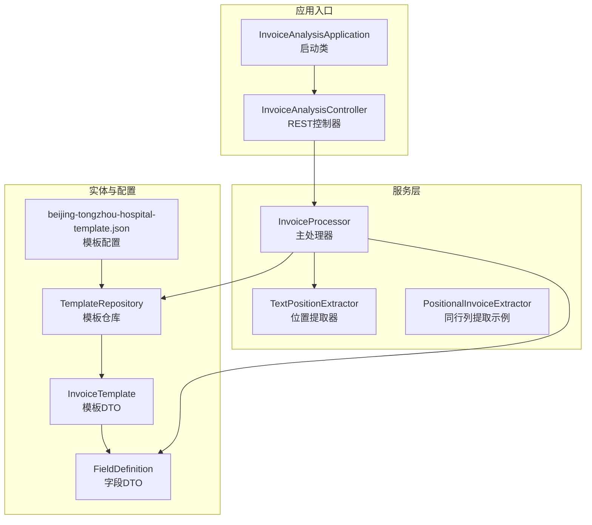
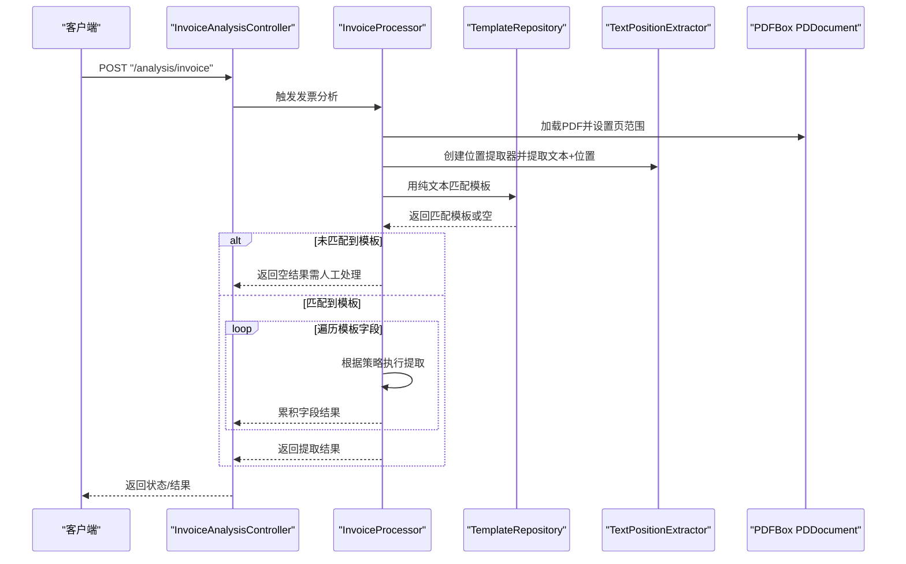
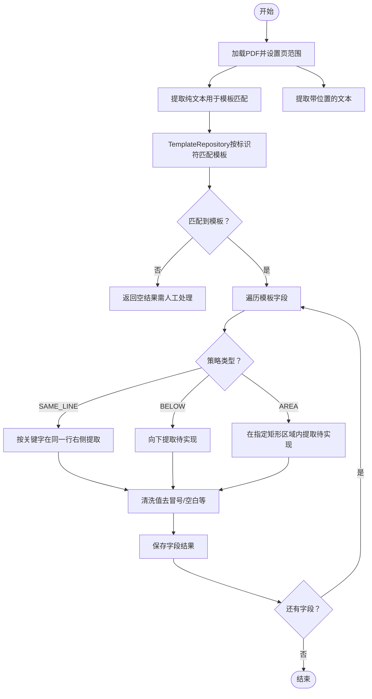
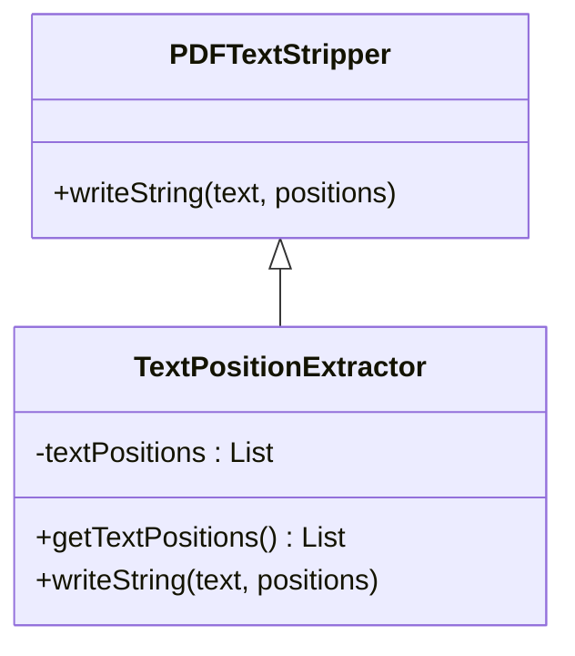
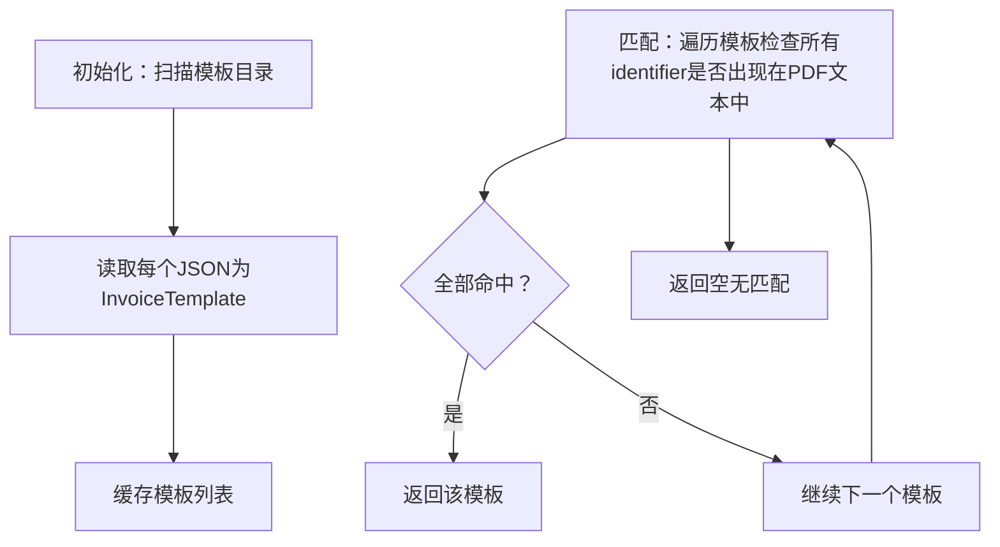
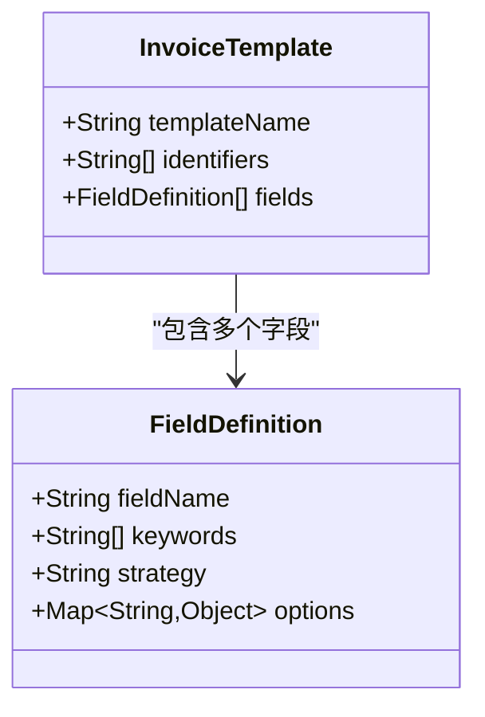
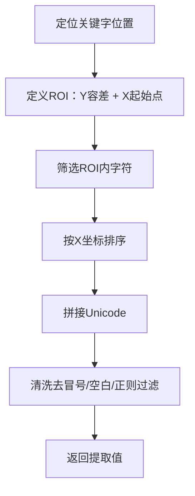
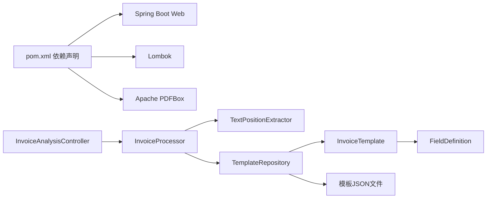

# 核心功能

<cite>
**本文引用的文件**
- [InvoiceAnalysisApplication.java](file://src/main/java/com/kinghy/invoiceanalysis/InvoiceAnalysisApplication.java)
- [InvoiceAnalysisController.java](file://src/main/java/com/kinghy/invoiceanalysis/controller/InvoiceAnalysisController.java)
- [InvoiceProcessor.java](file://src/main/java/com/kinghy/invoiceanalysis/service/InvoiceProcessor.java)
- [PositionalInvoiceExtractor.java](file://src/main/java/com/kinghy/invoiceanalysis/service/PositionalInvoiceExtractor.java)
- [TextPositionExtractor.java](file://src/main/java/com/kinghy/invoiceanalysis/service/TextPositionExtractor.java)
- [FieldDefinition.java](file://src/main/java/com/kinghy/invoiceanalysis/entity/dto/FieldDefinition.java)
- [InvoiceTemplate.java](file://src/main/java/com/kinghy/invoiceanalysis/entity/dto/InvoiceTemplate.java)
- [TemplateRepository.java](file://src/main/java/com/kinghy/invoiceanalysis/entity/pojo/TemplateRepository.java)
- [beijing-tongzhou-hospital-template.json](file://src/main/java/com/kinghy/invoiceanalysis/config/templates/beijing-tongzhou-hospital-template.json)
- [application.properties](file://src/main/resources/application.properties)
- [pom.xml](file://pom.xml)
</cite>

## 目录
1. [简介](#简介)
2. [项目结构](#项目结构)
3. [核心组件](#核心组件)
4. [架构总览](#架构总览)
5. [详细组件分析](#详细组件分析)
6. [依赖关系分析](#依赖关系分析)
7. [性能考虑](#性能考虑)
8. [故障排查指南](#故障排查指南)
9. [结论](#结论)
10. [附录](#附录)

## 简介
本文件面向发票分析系统的核心功能，围绕以下主题展开：发票PDF解析、字段提取、模板匹配与策略执行；三种提取策略（SAME_LINE、BELOW、AREA）的工作机制与适用场景；JSON模板配置的结构与规则；错误处理与异常情况的处理方案；文本位置信息的获取与处理过程；以及最佳实践与性能优化建议。文档同时提供基于源码的可视化图示与路径引用，帮助读者快速定位实现细节。

## 项目结构
系统采用分层架构：控制器负责HTTP入口，服务层负责解析与提取，实体层负责模板与字段的DTO定义，资源层提供模板JSON配置。核心流程是：读取PDF文本与位置信息 → 匹配模板 → 按模板字段与策略提取值 → 返回结果。

图表来源
- [InvoiceAnalysisApplication.java](file://src/main/java/com/kinghy/invoiceanalysis/InvoiceAnalysisApplication.java#L1-L14)
- [InvoiceAnalysisController.java](file://src/main/java/com/kinghy/invoiceanalysis/controller/InvoiceAnalysisController.java#L1-L26)
- [InvoiceProcessor.java](file://src/main/java/com/kinghy/invoiceanalysis/service/InvoiceProcessor.java#L1-L159)
- [TextPositionExtractor.java](file://src/main/java/com/kinghy/invoiceanalysis/service/TextPositionExtractor.java#L1-L30)
- [PositionalInvoiceExtractor.java](file://src/main/java/com/kinghy/invoiceanalysis/service/PositionalInvoiceExtractor.java#L1-L117)
- [TemplateRepository.java](file://src/main/java/com/kinghy/invoiceanalysis/entity/pojo/TemplateRepository.java#L1-L41)
- [InvoiceTemplate.java](file://src/main/java/com/kinghy/invoiceanalysis/entity/dto/InvoiceTemplate.java#L1-L16)
- [FieldDefinition.java](file://src/main/java/com/kinghy/invoiceanalysis/entity/dto/FieldDefinition.java#L1-L14)
- [beijing-tongzhou-hospital-template.json](file://src/main/java/com/kinghy/invoiceanalysis/config/templates/beijing-tongzhou-hospital-template.json#L1-L55)

章节来源
- [InvoiceAnalysisApplication.java](file://src/main/java/com/kinghy/invoiceanalysis/InvoiceAnalysisApplication.java#L1-L14)
- [InvoiceAnalysisController.java](file://src/main/java/com/kinghy/invoiceanalysis/controller/InvoiceAnalysisController.java#L1-L26)
- [pom.xml](file://pom.xml#L1-L86)

## 核心组件
- 发票处理器（InvoiceProcessor）：负责加载PDF、提取文本与位置信息、匹配模板、遍历字段并执行策略提取。
- 文本位置提取器（TextPositionExtractor）：继承PDFTextStripper，收集每个字符的Unicode与其TextPosition，便于后续按位置判断。
- 模板仓库（TemplateRepository）：扫描模板目录，读取JSON为InvoiceTemplate对象，按标识符匹配适用模板。
- 字段定义（FieldDefinition）：描述单个字段的关键词、策略与选项。
- 模板定义（InvoiceTemplate）：描述模板名称、标识符集合与字段列表。
- 控制器（InvoiceAnalysisController）：提供HTTP接口入口，当前为占位实现，未来可接入处理器。

章节来源
- [InvoiceProcessor.java](file://src/main/java/com/kinghy/invoiceanalysis/service/InvoiceProcessor.java#L1-L159)
- [TextPositionExtractor.java](file://src/main/java/com/kinghy/invoiceanalysis/service/TextPositionExtractor.java#L1-L30)
- [TemplateRepository.java](file://src/main/java/com/kinghy/invoiceanalysis/entity/pojo/TemplateRepository.java#L1-L41)
- [FieldDefinition.java](file://src/main/java/com/kinghy/invoiceanalysis/entity/dto/FieldDefinition.java#L1-L14)
- [InvoiceTemplate.java](file://src/main/java/com/kinghy/invoiceanalysis/entity/dto/InvoiceTemplate.java#L1-L16)
- [InvoiceAnalysisController.java](file://src/main/java/com/kinghy/invoiceanalysis/controller/InvoiceAnalysisController.java#L1-L26)

## 架构总览
系统以“模板驱动 + 策略执行”的方式工作：先通过模板识别PDF版式，再按字段策略提取对应值。位置信息由TextPositionExtractor提供，使提取更稳健。

图表来源
- [InvoiceAnalysisController.java](file://src/main/java/com/kinghy/invoiceanalysis/controller/InvoiceAnalysisController.java#L18-L22)
- [InvoiceProcessor.java](file://src/main/java/com/kinghy/invoiceanalysis/service/InvoiceProcessor.java#L27-L77)
- [TemplateRepository.java](file://src/main/java/com/kinghy/invoiceanalysis/entity/pojo/TemplateRepository.java#L25-L39)
- [TextPositionExtractor.java](file://src/main/java/com/kinghy/invoiceanalysis/service/TextPositionExtractor.java#L21-L28)

## 详细组件分析

### 发票处理器（InvoiceProcessor）
职责与流程
- 加载PDF并限制页范围（当前为第1页）。
- 先提取纯文本用于模板匹配，再提取带位置的文本用于策略提取。
- 通过TemplateRepository按模板标识符匹配适用模板。
- 遍历模板字段，根据strategy选择执行策略（当前对SAME_LINE已实现，BELOW/AREA留待扩展）。
- 对提取到的值进行清洗（如去前导冒号与空白）。

关键实现要点
- 使用TextPositionExtractor收集所有字符位置，以便按行与区域提取。
- SAME_LINE策略通过关键字位置定义ROI（感兴趣区域），在该区域内按X坐标排序拼接字符。
- 模板未匹配时返回空结果并记录日志，提示人工介入。

图表来源
- [InvoiceProcessor.java](file://src/main/java/com/kinghy/invoiceanalysis/service/InvoiceProcessor.java#L27-L77)
- [InvoiceProcessor.java](file://src/main/java/com/kinghy/invoiceanalysis/service/InvoiceProcessor.java#L96-L135)

章节来源
- [InvoiceProcessor.java](file://src/main/java/com/kinghy/invoiceanalysis/service/InvoiceProcessor.java#L1-L159)

### 文本位置提取器（TextPositionExtractor）
职责与流程
- 继承PDFTextStripper，覆写writeString，在每次输出字符时收集对应的TextPosition列表。
- 提供getTextPositions获取全部字符位置，供策略算法使用。

图表来源
- [TextPositionExtractor.java](file://src/main/java/com/kinghy/invoiceanalysis/service/TextPositionExtractor.java#L13-L29)

章节来源
- [TextPositionExtractor.java](file://src/main/java/com/kinghy/invoiceanalysis/service/TextPositionExtractor.java#L1-L30)

### 模板仓库（TemplateRepository）
职责与流程
- 扫描模板目录，读取所有JSON文件为InvoiceTemplate对象。
- 通过模板的identifiers集合判断是否包含于PDF纯文本，从而确定匹配模板。

图表来源
- [TemplateRepository.java](file://src/main/java/com/kinghy/invoiceanalysis/entity/pojo/TemplateRepository.java#L15-L39)

章节来源
- [TemplateRepository.java](file://src/main/java/com/kinghy/invoiceanalysis/entity/pojo/TemplateRepository.java#L1-L41)

### 字段与模板数据模型
- InvoiceTemplate：包含模板名称、标识符列表、字段列表。
- FieldDefinition：包含字段名、关键词列表、策略、选项。

图表来源
- [InvoiceTemplate.java](file://src/main/java/com/kinghy/invoiceanalysis/entity/dto/InvoiceTemplate.java#L9-L13)
- [FieldDefinition.java](file://src/main/java/com/kinghy/invoiceanalysis/entity/dto/FieldDefinition.java#L9-L14)

章节来源
- [InvoiceTemplate.java](file://src/main/java/com/kinghy/invoiceanalysis/entity/dto/InvoiceTemplate.java#L1-L16)
- [FieldDefinition.java](file://src/main/java/com/kinghy/invoiceanalysis/entity/dto/FieldDefinition.java#L1-L14)

### JSON模板配置（示例：北京市医疗门诊收费票）
- 模板名称：用于日志与调试。
- 标识符：用于快速匹配模板。
- 字段列表：每个字段包含字段名、关键词、策略与选项。
  - SAME_LINE：在同一行右侧提取，常用于冒号分隔的键值对。
  - BELOW：在关键字下方若干行内提取，适合多行值或跨行信息。
  - AREA：在指定矩形区域内提取，适合固定版式区域。

章节来源
- [beijing-tongzhou-hospital-template.json](file://src/main/java/com/kinghy/invoiceanalysis/config/templates/beijing-tongzhou-hospital-template.json#L1-L55)

### 三种提取策略详解

- SAME_LINE（同一行）
  - 工作机制：定位关键字的最后字符位置，定义ROI（Y方向容差+X起始点为关键字右侧），在ROI内按X坐标升序拼接字符，再进行清洗。
  - 适用场景：冒号分隔的键值对（如“交款人: 张三”、“票据号码: 123456789”）。
  - 优势：简单高效，对版式变化不敏感。
  - 注意：需确保关键字唯一且在同一行，避免误匹配。

- BELOW（下方）
  - 工作机制：在关键字下方指定行数范围内查找值，可设置停止关键字以避免越界。
  - 适用场景：跨行或多行值（如业务流水号、摘要等）。
  - 注意：需合理设置最大行数与停止关键字，防止误抓取。

- AREA（区域）
  - 工作机制：在给定矩形区域内提取字符，通常用于固定版式的标题、单位名称等。
  - 适用场景：固定区域内的文本块。
  - 注意：需根据不同分辨率与缩放比例调整坐标与尺寸。

章节来源
- [InvoiceProcessor.java](file://src/main/java/com/kinghy/invoiceanalysis/service/InvoiceProcessor.java#L58-L69)
- [beijing-tongzhou-hospital-template.json](file://src/main/java/com/kinghy/invoiceanalysis/config/templates/beijing-tongzhou-hospital-template.json#L36-L51)

### 文本位置信息的获取与处理
- 获取：通过TextPositionExtractor覆写writeString，将每个字符的Unicode与其TextPosition列表合并收集。
- 处理：在SAME_LINE策略中，利用关键字的Y坐标与高度计算Y容差，X坐标从关键字右侧开始，限定ROI后按X排序拼接。
- 清洗：去除前导冒号与空白，必要时按正则过滤数值。

图表来源
- [TextPositionExtractor.java](file://src/main/java/com/kinghy/invoiceanalysis/service/TextPositionExtractor.java#L21-L28)
- [InvoiceProcessor.java](file://src/main/java/com/kinghy/invoiceanalysis/service/InvoiceProcessor.java#L96-L135)

章节来源
- [TextPositionExtractor.java](file://src/main/java/com/kinghy/invoiceanalysis/service/TextPositionExtractor.java#L1-L30)
- [InvoiceProcessor.java](file://src/main/java/com/kinghy/invoiceanalysis/service/InvoiceProcessor.java#L96-L135)

### 使用示例与场景
- 示例一：SAME_LINE
  - 场景：从“交款人: 张三”中提取张三。
  - 步骤：定位“交款人”，定义ROI，按X排序拼接，清洗冒号与空格。
  - 参考路径：[InvoiceProcessor.java](file://src/main/java/com/kinghy/invoiceanalysis/service/InvoiceProcessor.java#L58-L63)

- 示例二：BELOW
  - 场景：在关键字下方最多两行提取业务流水号。
  - 步骤：定位关键字，向下扫描至最大行数或遇到停止关键字。
  - 参考路径：[beijing-tongzhou-hospital-template.json](file://src/main/java/com/kinghy/invoiceanalysis/config/templates/beijing-tongzhou-hospital-template.json#L36-L41)

- 示例三：AREA
  - 场景：在固定矩形区域内提取收款单位名称。
  - 步骤：设定x/y/宽/高，筛选区域内字符并拼接。
  - 参考路径：[beijing-tongzhou-hospital-template.json](file://src/main/java/com/kinghy/invoiceanalysis/config/templates/beijing-tongzhou-hospital-template.json#L46-L51)

章节来源
- [InvoiceProcessor.java](file://src/main/java/com/kinghy/invoiceanalysis/service/InvoiceProcessor.java#L58-L69)
- [beijing-tongzhou-hospital-template.json](file://src/main/java/com/kinghy/invoiceanalysis/config/templates/beijing-tongzhou-hospital-template.json#L36-L51)

## 依赖关系分析
- 外部依赖：Spring Boot Web、Lombok、PDFBox。
- 内部模块：控制器、处理器、提取器、模板仓库、DTO与JSON配置。
- 耦合度：处理器依赖提取器与模板仓库；模板仓库依赖Jackson将JSON映射为DTO；控制器目前为空实现，未来可注入处理器。

图表来源
- [pom.xml](file://pom.xml#L32-L53)
- [InvoiceAnalysisController.java](file://src/main/java/com/kinghy/invoiceanalysis/controller/InvoiceAnalysisController.java#L1-L26)
- [InvoiceProcessor.java](file://src/main/java/com/kinghy/invoiceanalysis/service/InvoiceProcessor.java#L1-L159)
- [TemplateRepository.java](file://src/main/java/com/kinghy/invoiceanalysis/entity/pojo/TemplateRepository.java#L1-L41)
- [InvoiceTemplate.java](file://src/main/java/com/kinghy/invoiceanalysis/entity/dto/InvoiceTemplate.java#L1-L16)
- [FieldDefinition.java](file://src/main/java/com/kinghy/invoiceanalysis/entity/dto/FieldDefinition.java#L1-L14)

章节来源
- [pom.xml](file://pom.xml#L1-L86)

## 性能考虑
- 页范围控制：当前仅处理第1页，减少解析开销；可根据发票复杂度扩展页范围。
- ROI裁剪：SAME_LINE策略通过ROI缩小搜索空间，提升效率。
- 排序与拼接：按X坐标排序后拼接，时间复杂度近似O(n log n)，n为ROI内字符数。
- 模板预加载：TemplateRepository一次性读取模板目录，避免重复IO。
- 正则清洗：尽量使用简单正则或字符集过滤，避免回溯开销。
- 扩展策略：BELOW/AREA策略可引入缓存与索引，提高跨行/区域检索效率。

[本节为通用性能建议，无需特定文件引用]

## 故障排查指南
常见问题与处理
- 模板未匹配
  - 现象：返回空结果并记录“未找到适用模板”。
  - 处理：检查PDF文本中是否存在模板标识符；确认模板JSON的identifiers是否覆盖关键文本。
  - 参考路径：[InvoiceProcessor.java](file://src/main/java/com/kinghy/invoiceanalysis/service/InvoiceProcessor.java#L47-L51)、[TemplateRepository.java](file://src/main/java/com/kinghy/invoiceanalysis/entity/pojo/TemplateRepository.java#L25-L39)

- 关键字未定位
  - 现象：SAME_LINE策略返回null。
  - 处理：确认关键字是否存在于PDF文本；检查关键字顺序与大小写；适当放宽或收紧Y容差。
  - 参考路径：[InvoiceProcessor.java](file://src/main/java/com/kinghy/invoiceanalysis/service/InvoiceProcessor.java#L96-L135)

- ROI内无字符
  - 现象：SAME_LINE策略返回null。
  - 处理：检查关键字位置与X起始点；增大ROI或调整容差；确认字符未被裁剪。
  - 参考路径：[InvoiceProcessor.java](file://src/main/java/com/kinghy/invoiceanalysis/service/InvoiceProcessor.java#L103-L120)

- PDF加载失败
  - 现象：抛出IO异常。
  - 处理：检查文件路径与权限；确认PDF格式有效；捕获异常并记录日志。
  - 参考路径：[InvoiceProcessor.java](file://src/main/java/com/kinghy/invoiceanalysis/service/InvoiceProcessor.java#L30-L37)

- 控制器接口未生效
  - 现象：POST /analysis/invoice返回占位结果。
  - 处理：实现控制器逻辑并注入处理器；确保Spring Boot自动装配正常。
  - 参考路径：[InvoiceAnalysisController.java](file://src/main/java/com/kinghy/invoiceanalysis/controller/InvoiceAnalysisController.java#L18-L22)

章节来源
- [InvoiceProcessor.java](file://src/main/java/com/kinghy/invoiceanalysis/service/InvoiceProcessor.java#L30-L77)
- [TemplateRepository.java](file://src/main/java/com/kinghy/invoiceanalysis/entity/pojo/TemplateRepository.java#L25-L39)
- [InvoiceAnalysisController.java](file://src/main/java/com/kinghy/invoiceanalysis/controller/InvoiceAnalysisController.java#L18-L22)

## 结论
本系统通过“模板驱动 + 策略执行”的方式，将发票解析从编码固化转变为配置化管理。TextPositionExtractor提供了稳健的位置信息基础，结合SAME_LINE策略可高效提取常见键值对；BELOW与AREA策略预留了对多行与固定区域的扩展能力。配合模板仓库的标识符匹配与JSON配置，系统具备良好的可维护性与可扩展性。建议在生产环境中进一步完善策略实现、异常处理与性能优化，并通过日志与监控保障稳定性。

[本节为总结性内容，无需特定文件引用]

## 附录

### JSON模板配置规则速览
- templateName：模板名称，用于日志与调试。
- identifiers：模板标识符数组，用于快速匹配。
- fields：字段数组，每项包含：
  - fieldName：字段名（作为结果键）。
  - keywords：关键词列表（支持多种变体）。
  - strategy：提取策略（SAME_LINE/BELOW/AREA）。
  - options：策略选项（如trimChars、valuePattern、maxLinesBelow、stopAtKeywords、x/y/width/height等）。

章节来源
- [beijing-tongzhou-hospital-template.json](file://src/main/java/com/kinghy/invoiceanalysis/config/templates/beijing-tongzhou-hospital-template.json#L1-L55)
- [FieldDefinition.java](file://src/main/java/com/kinghy/invoiceanalysis/entity/dto/FieldDefinition.java#L9-L14)
- [InvoiceTemplate.java](file://src/main/java/com/kinghy/invoiceanalysis/entity/dto/InvoiceTemplate.java#L9-L13)