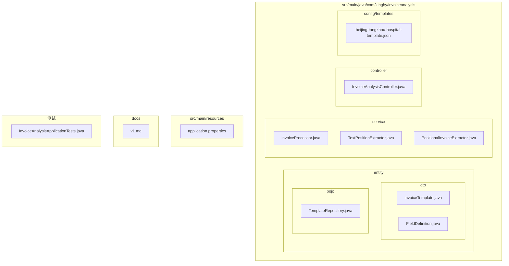
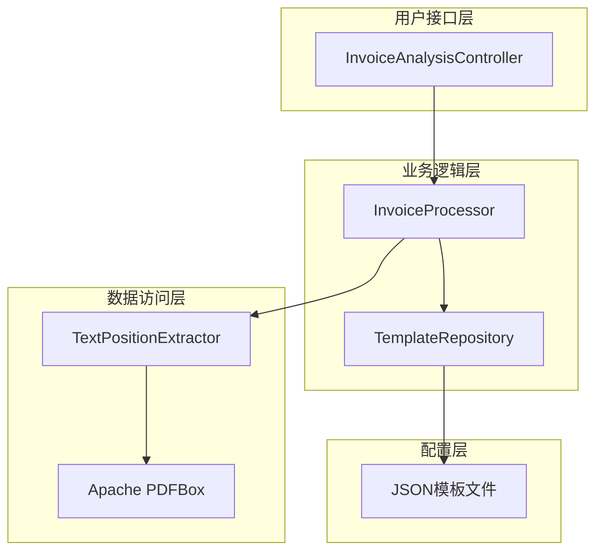
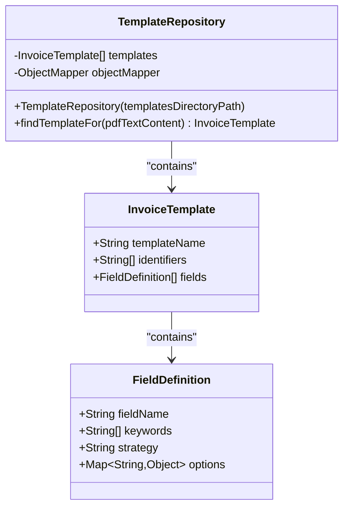
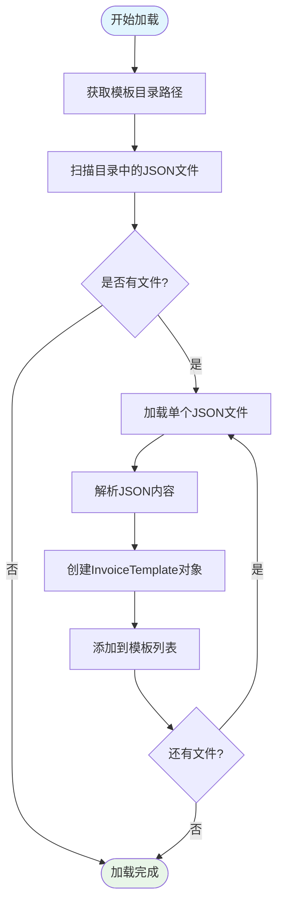
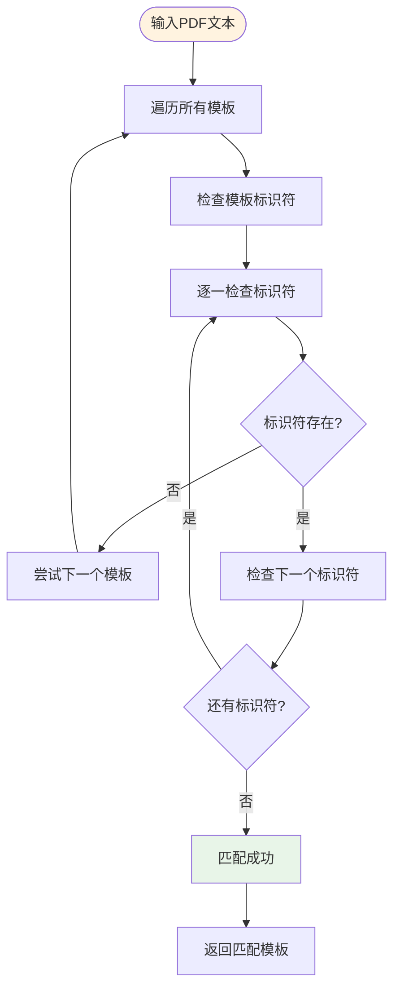
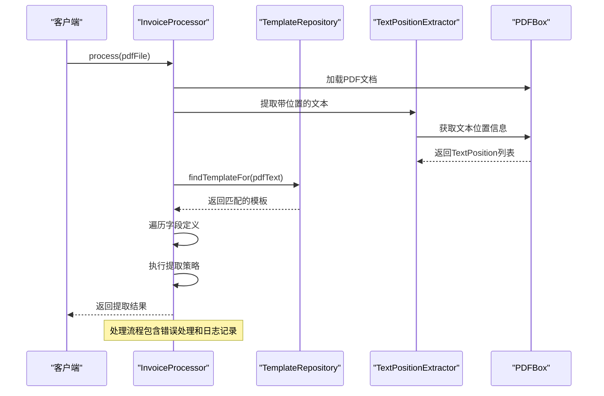
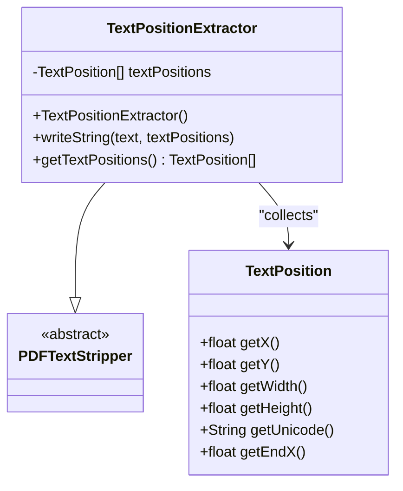
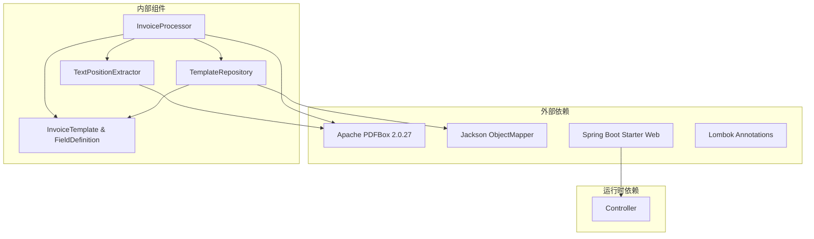

# 模板管理系统

<cite>
**本文档引用的文件**
- [TemplateRepository.java](file://src/main/java/com/kinghy/invoiceanalysis/entity/pojo/TemplateRepository.java)
- [InvoiceTemplate.java](file://src/main/java/com/kinghy/invoiceanalysis/entity/dto/InvoiceTemplate.java)
- [FieldDefinition.java](file://src/main/java/com/kinghy/invoiceanalysis/entity/dto/FieldDefinition.java)
- [beijing-tongzhou-hospital-template.json](file://src/main/java/com/kinghy/invoiceanalysis/config/templates/beijing-tongzhou-hospital-template.json)
- [InvoiceProcessor.java](file://src/main/java/com/kinghy/invoiceanalysis/service/InvoiceProcessor.java)
- [TextPositionExtractor.java](file://src/main/java/com/kinghy/invoiceanalysis/service/TextPositionExtractor.java)
- [PositionalInvoiceExtractor.java](file://src/main/java/com/kinghy/invoiceanalysis/service/PositionalInvoiceExtractor.java)
- [InvoiceAnalysisController.java](file://src/main/java/com/kinghy/invoiceanalysis/controller/InvoiceAnalysisController.java)
- [application.properties](file://src/main/resources/application.properties)
- [pom.xml](file://pom.xml)
- [v1.md](file://docs/v1.md)
</cite>

## 目录
1. [简介](#简介)
2. [项目结构](#项目结构)
3. [核心组件](#核心组件)
4. [架构概览](#架构概览)
5. [详细组件分析](#详细组件分析)
6. [依赖关系分析](#依赖关系分析)
7. [性能考虑](#性能考虑)
8. [故障排除指南](#故障排除指南)
9. [结论](#结论)
10. [附录](#附录)

## 简介

模板管理系统是一个基于JSON配置的发票分析引擎，旨在通过可配置的模板机制实现对不同版式发票的自动化识别和数据提取。该系统采用"规则配置与引擎分离"的设计理念，通过JSON模板文件定义提取规则，Java代码作为通用的提取引擎执行解析任务。

系统的核心优势在于：
- **高度可配置**：通过JSON模板文件实现版式变更，无需修改代码
- **模块化设计**：模板仓库、处理器、提取器各司其职
- **扩展性强**：支持多种提取策略和自定义字段定义
- **易于维护**：业务人员可直接修改模板配置

## 项目结构

项目采用标准的Maven多模块结构，主要包含以下目录：



**图表来源**
- [TemplateRepository.java](file://src/main/java/com/kinghy/invoiceanalysis/entity/pojo/TemplateRepository.java#L1-L41)
- [InvoiceTemplate.java](file://src/main/java/com/kinghy/invoiceanalysis/entity/dto/InvoiceTemplate.java#L1-L16)
- [FieldDefinition.java](file://src/main/java/com/kinghy/invoiceanalysis/entity/dto/FieldDefinition.java#L1-L14)

**章节来源**
- [pom.xml](file://pom.xml#L1-L86)
- [application.properties](file://src/main/resources/application.properties#L1-L2)

## 核心组件

### 数据模型设计

系统采用简洁而强大的数据模型设计，通过三个核心类实现完整的模板管理功能：

#### InvoiceTemplate 数据模型
- **模板名称**：用于标识和记录的可读名称
- **标识符集合**：用于模板匹配的关键字符串列表
- **字段定义列表**：具体的提取字段配置

#### FieldDefinition 数据模型
- **字段名称**：系统内部使用的字段标识符
- **关键字列表**：用于定位字段值的关键字数组
- **提取策略**：指定字段值提取方式的策略类型
- **选项配置**：策略相关的配置参数

**章节来源**
- [InvoiceTemplate.java](file://src/main/java/com/kinghy/invoiceanalysis/entity/dto/InvoiceTemplate.java#L8-L13)
- [FieldDefinition.java](file://src/main/java/com/kinghy/invoiceanalysis/entity/dto/FieldDefinition.java#L8-L14)

## 架构概览

系统采用分层架构设计，各组件职责明确，耦合度低：



**图表来源**
- [InvoiceAnalysisController.java](file://src/main/java/com/kinghy/invoiceanalysis/controller/InvoiceAnalysisController.java#L14-L26)
- [InvoiceProcessor.java](file://src/main/java/com/kinghy/invoiceanalysis/service/InvoiceProcessor.java#L17-L25)
- [TemplateRepository.java](file://src/main/java/com/kinghy/invoiceanalysis/entity/pojo/TemplateRepository.java#L11-L23)

## 详细组件分析

### TemplateRepository 类分析

TemplateRepository 是模板管理系统的核心组件，负责模板的加载、管理和匹配。

#### 主要职责
1. **模板加载**：从指定目录加载所有JSON格式的模板文件
2. **模板匹配**：根据PDF文本内容匹配最合适的模板
3. **模板存储**：维护内存中的模板集合

#### 实现原理



**图表来源**
- [TemplateRepository.java](file://src/main/java/com/kinghy/invoiceanalysis/entity/pojo/TemplateRepository.java#L11-L40)
- [InvoiceTemplate.java](file://src/main/java/com/kinghy/invoiceanalysis/entity/dto/InvoiceTemplate.java#L8-L13)
- [FieldDefinition.java](file://src/main/java/com/kinghy/invoiceanalysis/entity/dto/FieldDefinition.java#L8-L14)

#### 模板加载机制

模板加载过程采用递归扫描的方式，具体流程如下：



**图表来源**
- [TemplateRepository.java](file://src/main/java/com/kinghy/invoiceanalysis/entity/pojo/TemplateRepository.java#L15-L23)

#### 模板匹配算法

模板匹配采用"AND"逻辑的精确匹配策略：



**图表来源**
- [TemplateRepository.java](file://src/main/java/com/kinghy/invoiceanalysis/entity/pojo/TemplateRepository.java#L25-L39)

#### 缓存策略

当前实现采用内存缓存策略：
- **缓存位置**：内存中的ArrayList集合
- **缓存内容**：已加载的InvoiceTemplate对象
- **缓存特点**：进程级别缓存，重启丢失

**章节来源**
- [TemplateRepository.java](file://src/main/java/com/kinghy/invoiceanalysis/entity/pojo/TemplateRepository.java#L11-L40)

### InvoiceProcessor 类分析

InvoiceProcessor 是系统的核心处理引擎，负责协调各个组件完成完整的发票分析流程。

#### 处理流程



**图表来源**
- [InvoiceProcessor.java](file://src/main/java/com/kinghy/invoiceanalysis/service/InvoiceProcessor.java#L27-L77)

#### 文本位置提取机制

系统采用自定义的PDFTextStripper实现，专门用于提取带有位置信息的文本：



**图表来源**
- [TextPositionExtractor.java](file://src/main/java/com/kinghy/invoiceanalysis/service/TextPositionExtractor.java#L13-L29)

**章节来源**
- [InvoiceProcessor.java](file://src/main/java/com/kinghy/invoiceanalysis/service/InvoiceProcessor.java#L17-L77)
- [TextPositionExtractor.java](file://src/main/java/com/kinghy/invoiceanalysis/service/TextPositionExtractor.java#L10-L29)

### JSON模板配置详解

#### 模板文件结构

以北京市通州区医院模板为例，展示完整的JSON配置结构：

```mermaid
graph TB
subgraph "模板根对象"
T1[templateName: "模板名称"]
T2[identifiers: 数组]
T3[fields: 字段定义数组]
end
subgraph "标识符数组"
I1["包含在PDF中的关键字符串"]
I2["用于模板匹配的唯一标识"]
end
subgraph "字段定义"
F1[fieldName: "字段标识符"]
F2[keywords: "关键字列表"]
F3[strategy: "提取策略"]
F4[options: "配置选项"]
end
T2 --> I1
T2 --> I2
T3 --> F1
T3 --> F2
T3 --> F3
T3 --> F4
```

**图表来源**
- [beijing-tongzhou-hospital-template.json](file://src/main/java/com/kinghy/invoiceanalysis/config/templates/beijing-tongzhou-hospital-template.json#L1-L55)

#### 字段提取策略

系统支持三种核心提取策略：

1. **SAME_LINE（同行提取）**
   - 适用场景：关键字与值在同一行
   - 实现方式：基于文本位置信息的区域查找
   - 典型配置：`"strategy": "SAME_LINE"`

2. **BELOW（下方提取）**
   - 适用场景：值位于关键字下方指定行数内
   - 实现方式：基于行间距和关键字位置的范围查找
   - 典型配置：`"strategy": "BELOW"`

3. **AREA（区域提取）**
   - 适用场景：无关键字但位置固定的值
   - 实现方式：基于绝对坐标的矩形区域查找
   - 典型配置：`"strategy": "AREA"`

**章节来源**
- [beijing-tongzhou-hospital-template.json](file://src/main/java/com/kinghy/invoiceanalysis/config/templates/beijing-tongzhou-hospital-template.json#L1-L55)

## 依赖关系分析

系统采用松耦合的设计，主要依赖关系如下：



**图表来源**
- [pom.xml](file://pom.xml#L32-L54)
- [InvoiceProcessor.java](file://src/main/java/com/kinghy/invoiceanalysis/service/InvoiceProcessor.java#L3-L13)

**章节来源**
- [pom.xml](file://pom.xml#L1-L86)

## 性能考虑

### 内存使用优化

1. **模板缓存**：内存中缓存已加载的模板对象
2. **文本位置缓存**：PDF文本位置信息的高效存储
3. **对象复用**：避免重复创建相同的对象实例

### 处理效率优化

1. **早期退出**：模板匹配过程中发现不匹配立即停止
2. **增量处理**：仅处理PDF的第一页以提高速度
3. **批量操作**：一次性提取所有文本位置信息

### 可扩展性建议

1. **模板预编译**：将JSON模板转换为编译后的对象
2. **并发处理**：支持多线程处理多个PDF文件
3. **智能缓存**：实现LRU缓存策略管理模板

## 故障排除指南

### 常见问题及解决方案

#### 模板加载失败
**问题症状**：系统无法加载JSON模板文件
**可能原因**：
- 模板文件路径错误
- JSON格式不正确
- 文件权限问题

**解决步骤**：
1. 验证模板文件路径是否正确
2. 使用JSON验证工具检查语法
3. 检查文件读取权限

#### 模板匹配失败
**问题症状**：找不到合适的模板进行匹配
**可能原因**：
- 标识符设置不当
- PDF文本提取不准确
- 模板配置错误

**解决步骤**：
1. 检查模板的identifiers配置
2. 验证PDF文本提取的准确性
3. 调整关键字的匹配策略

#### 字段提取异常
**问题症状**：某些字段无法正确提取
**可能原因**：
- 提取策略选择不当
- 关键字配置错误
- 文本位置信息异常

**解决步骤**：
1. 重新评估字段的提取策略
2. 调整关键字列表和顺序
3. 检查文本位置提取的准确性

**章节来源**
- [InvoiceProcessor.java](file://src/main/java/com/kinghy/invoiceanalysis/service/InvoiceProcessor.java#L47-L51)

## 结论

模板管理系统通过精心设计的架构实现了高度可配置的发票分析功能。系统的核心价值在于：

1. **配置驱动**：通过JSON模板实现业务逻辑与技术实现的分离
2. **易于维护**：业务人员可直接修改模板配置，无需编程知识
3. **扩展性强**：支持多种提取策略和自定义字段定义
4. **性能优良**：采用内存缓存和优化的匹配算法

未来可以进一步增强的功能包括：
- 实现模板版本管理机制
- 添加模板继承和扩展功能
- 支持模板热加载和动态更新
- 增强错误处理和日志记录能力

## 附录

### 开发指南

#### 新模板开发流程
1. 分析PDF发票的版式特征
2. 确定唯一的标识符集合
3. 识别需要提取的关键字段
4. 选择合适的提取策略
5. 测试和验证模板效果

#### 调试技巧
- 使用日志输出关键处理步骤
- 验证文本位置提取的准确性
- 逐步测试每个字段的提取效果
- 监控内存使用情况

#### 最佳实践
- 模板命名要有明确的业务含义
- 标识符应该具有唯一性和稳定性
- 字段提取策略要与版式特征相匹配
- 定期备份和版本控制模板文件

**章节来源**
- [v1.md](file://docs/v1.md#L1-L297)