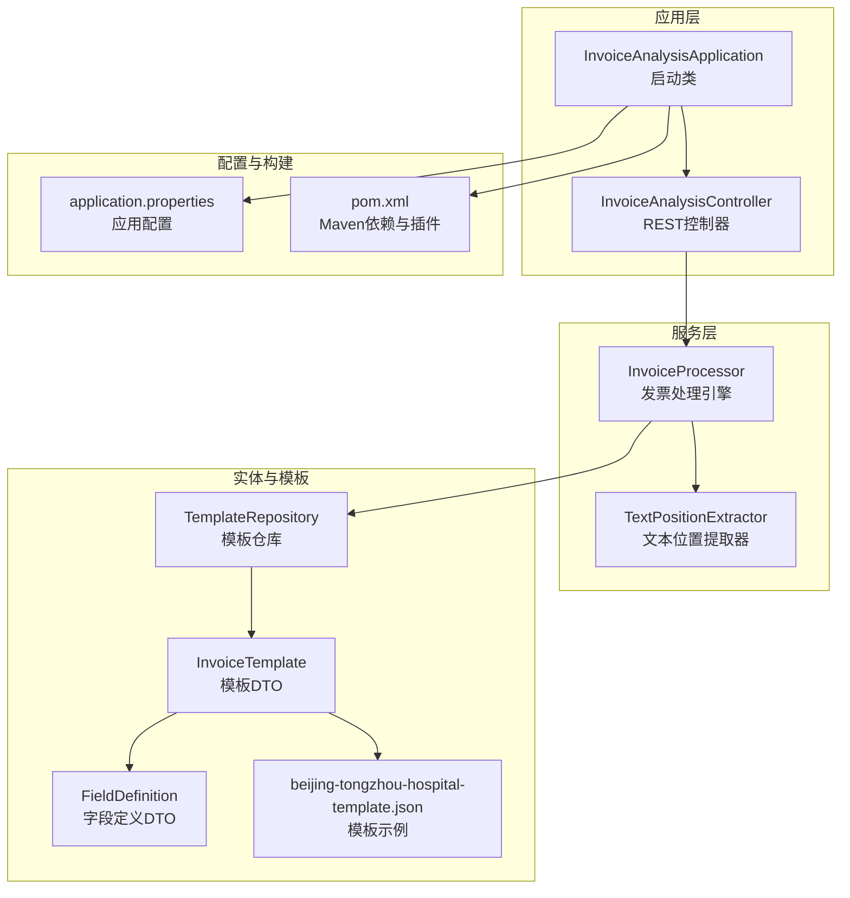
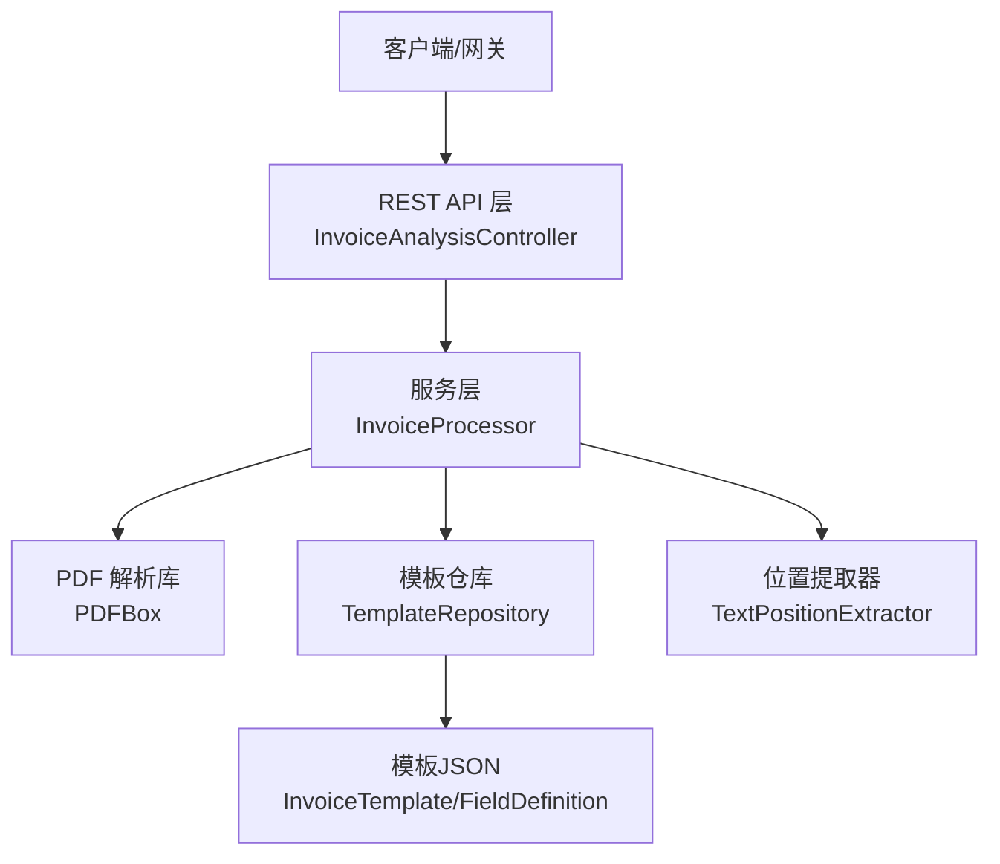
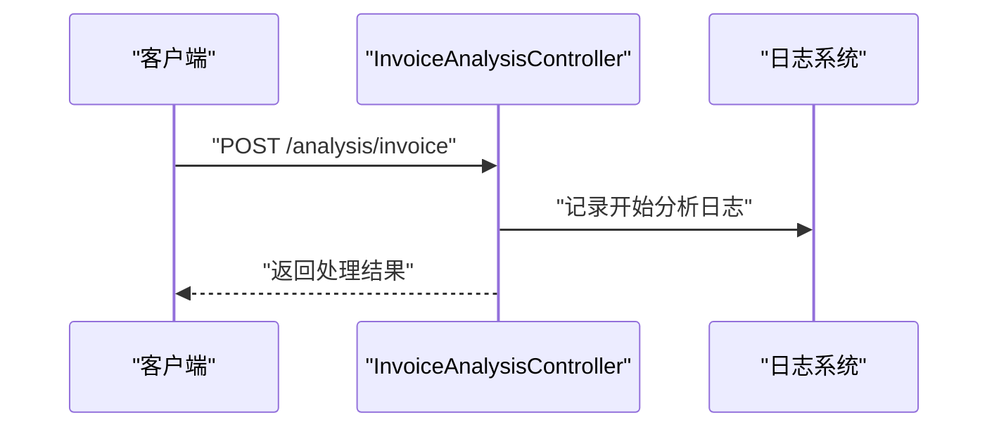
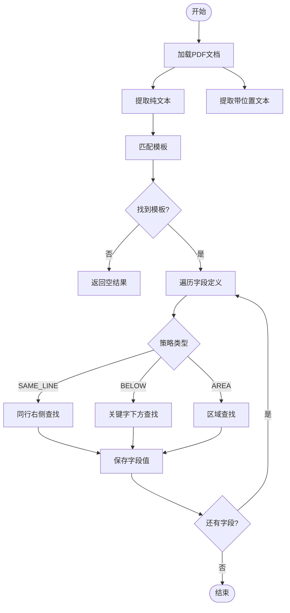
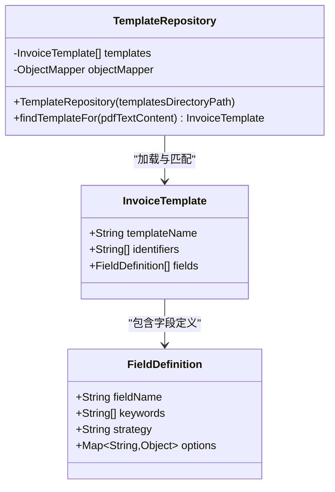
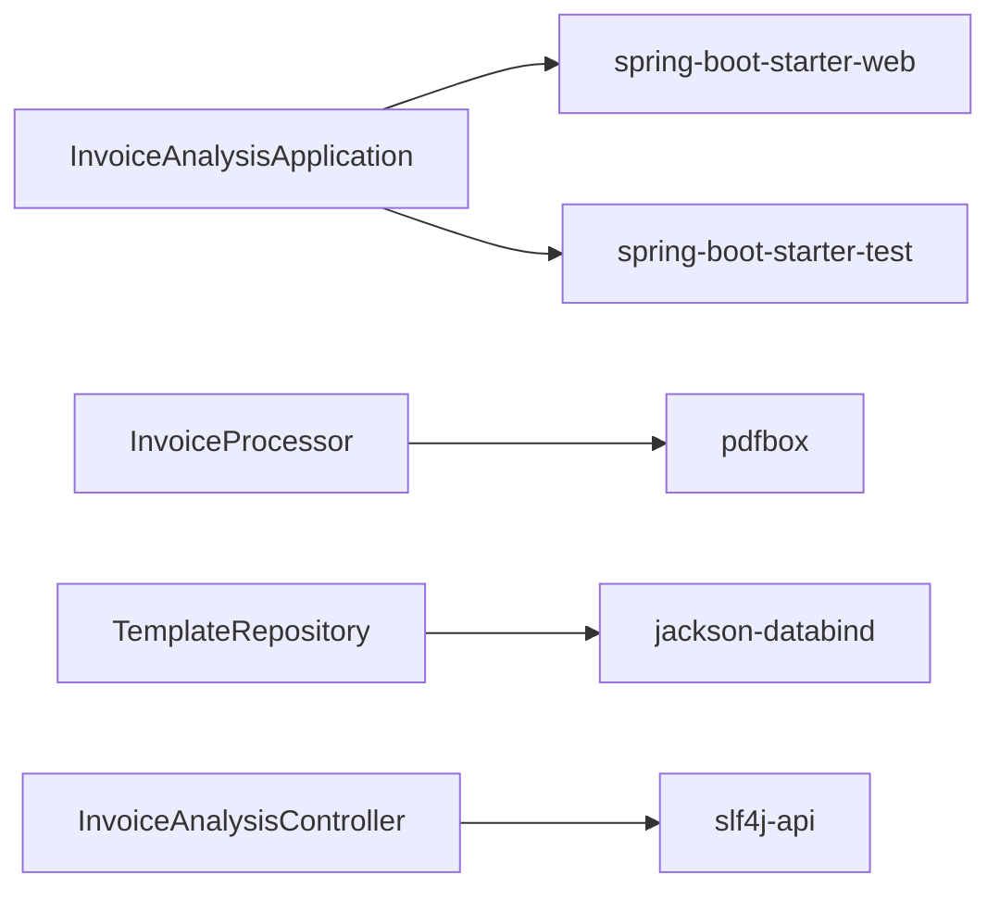

# 部署运维

<cite>
**本文引用的文件**
- [pom.xml](file://pom.xml)
- [application.properties](file://src/main/resources/application.properties)
- [InvoiceAnalysisApplication.java](file://src/main/java/com/kinghy/invoiceanalysis/InvoiceAnalysisApplication.java)
- [InvoiceAnalysisController.java](file://src/main/java/com/kinghy/invoiceanalysis/controller/InvoiceAnalysisController.java)
- [InvoiceProcessor.java](file://src/main/java/com/kinghy/invoiceanalysis/service/InvoiceProcessor.java)
- [TextPositionExtractor.java](file://src/main/java/com/kinghy/invoiceanalysis/service/TextPositionExtractor.java)
- [TemplateRepository.java](file://src/main/java/com/kinghy/invoiceanalysis/entity/pojo/TemplateRepository.java)
- [InvoiceTemplate.java](file://src/main/java/com/kinghy/invoiceanalysis/entity/dto/InvoiceTemplate.java)
- [FieldDefinition.java](file://src/main/java/com/kinghy/invoiceanalysis/entity/dto/FieldDefinition.java)
- [beijing-tongzhou-hospital-template.json](file://src/main/java/com/kinghy/invoiceanalysis/config/templates/beijing-tongzhou-hospital-template.json)
- [InvoiceAnalysisApplicationTests.java](file://src/test/java/com/kinghy/invoiceanalysis/InvoiceAnalysisApplicationTests.java)
- [v1.md](file://docs/v1.md)
</cite>

## 目录
1. [简介](#简介)
2. [项目结构](#项目结构)
3. [核心组件](#核心组件)
4. [架构总览](#架构总览)
5. [详细组件分析](#详细组件分析)
6. [依赖关系分析](#依赖关系分析)
7. [性能考虑](#性能考虑)
8. [故障排查指南](#故障排查指南)
9. [结论](#结论)
10. [附录](#附录)

## 简介
本文件面向生产环境的发票分析系统部署与运维，结合当前代码库与设计文档，给出容器化、Kubernetes与传统服务器三种部署方案，涵盖性能监控与日志管理、扩展性与负载均衡、故障排查与应急响应、备份恢复与灾备、安全与访问控制、运维自动化与CI/CD以及性能调优与容量规划建议。系统以Spring Boot为基础，采用PDFBox解析PDF，模板化配置驱动字段抽取，具备良好的可扩展性与可维护性。

## 项目结构
该工程采用标准Spring Boot Maven工程结构，核心模块如下：
- 启动入口与配置：应用启动类、Spring配置
- 控制器层：HTTP接口暴露
- 服务层：PDF解析与字段抽取
- 实体与数据传输对象：模板与字段定义
- 配置模板：JSON模板目录
- 测试：Spring Boot上下文测试

图表来源
- [InvoiceAnalysisApplication.java](file://src/main/java/com/kinghy/invoiceanalysis/InvoiceAnalysisApplication.java#L1-L14)
- [InvoiceAnalysisController.java](file://src/main/java/com/kinghy/invoiceanalysis/controller/InvoiceAnalysisController.java#L1-L26)
- [InvoiceProcessor.java](file://src/main/java/com/kinghy/invoiceanalysis/service/InvoiceProcessor.java#L1-L159)
- [TextPositionExtractor.java](file://src/main/java/com/kinghy/invoiceanalysis/service/TextPositionExtractor.java#L1-L30)
- [TemplateRepository.java](file://src/main/java/com/kinghy/invoiceanalysis/entity/pojo/TemplateRepository.java#L1-L41)
- [InvoiceTemplate.java](file://src/main/java/com/kinghy/invoiceanalysis/entity/dto/InvoiceTemplate.java#L1-L16)
- [FieldDefinition.java](file://src/main/java/com/kinghy/invoiceanalysis/entity/dto/FieldDefinition.java#L1-L14)
- [beijing-tongzhou-hospital-template.json](file://src/main/java/com/kinghy/invoiceanalysis/config/templates/beijing-tongzhou-hospital-template.json#L1-L55)
- [application.properties](file://src/main/resources/application.properties#L1-L2)
- [pom.xml](file://pom.xml#L1-L86)

章节来源
- [InvoiceAnalysisApplication.java](file://src/main/java/com/kinghy/invoiceanalysis/InvoiceAnalysisApplication.java#L1-L14)
- [InvoiceAnalysisController.java](file://src/main/java/com/kinghy/invoiceanalysis/controller/InvoiceAnalysisController.java#L1-L26)
- [InvoiceProcessor.java](file://src/main/java/com/kinghy/invoiceanalysis/service/InvoiceProcessor.java#L1-L159)
- [TextPositionExtractor.java](file://src/main/java/com/kinghy/invoiceanalysis/service/TextPositionExtractor.java#L1-L30)
- [TemplateRepository.java](file://src/main/java/com/kinghy/invoiceanalysis/entity/pojo/TemplateRepository.java#L1-L41)
- [InvoiceTemplate.java](file://src/main/java/com/kinghy/invoiceanalysis/entity/dto/InvoiceTemplate.java#L1-L16)
- [FieldDefinition.java](file://src/main/java/com/kinghy/invoiceanalysis/entity/dto/FieldDefinition.java#L1-L14)
- [beijing-tongzhou-hospital-template.json](file://src/main/java/com/kinghy/invoiceanalysis/config/templates/beijing-tongzhou-hospital-template.json#L1-L55)
- [application.properties](file://src/main/resources/application.properties#L1-L2)
- [pom.xml](file://pom.xml#L1-L86)

## 核心组件
- 应用启动类：负责Spring Boot应用初始化与启动。
- REST控制器：提供发票分析接口，记录请求日志。
- 发票处理引擎：基于PDFBox解析PDF，结合模板与策略抽取字段。
- 文本位置提取器：继承PDFTextStripper，收集文本位置信息以支持位置相关策略。
- 模板仓库：扫描模板目录，加载JSON模板，按标识符匹配适用模板。
- DTO模型：模板与字段定义的数据结构，支撑配置驱动的抽取逻辑。
- 模板示例：JSON模板定义字段抽取策略与关键字。

章节来源
- [InvoiceAnalysisApplication.java](file://src/main/java/com/kinghy/invoiceanalysis/InvoiceAnalysisApplication.java#L1-L14)
- [InvoiceAnalysisController.java](file://src/main/java/com/kinghy/invoiceanalysis/controller/InvoiceAnalysisController.java#L1-L26)
- [InvoiceProcessor.java](file://src/main/java/com/kinghy/invoiceanalysis/service/InvoiceProcessor.java#L1-L159)
- [TextPositionExtractor.java](file://src/main/java/com/kinghy/invoiceanalysis/service/TextPositionExtractor.java#L1-L30)
- [TemplateRepository.java](file://src/main/java/com/kinghy/invoiceanalysis/entity/pojo/TemplateRepository.java#L1-L41)
- [InvoiceTemplate.java](file://src/main/java/com/kinghy/invoiceanalysis/entity/dto/InvoiceTemplate.java#L1-L16)
- [FieldDefinition.java](file://src/main/java/com/kinghy/invoiceanalysis/entity/dto/FieldDefinition.java#L1-L14)
- [beijing-tongzhou-hospital-template.json](file://src/main/java/com/kinghy/invoiceanalysis/config/templates/beijing-tongzhou-hospital-template.json#L1-L55)

## 架构总览
系统采用三层架构：Web层（REST）、服务层（解析与抽取）、数据层（模板配置）。模板与代码解耦，通过JSON配置驱动抽取策略，便于快速适配新发票版式。

图表来源
- [InvoiceAnalysisController.java](file://src/main/java/com/kinghy/invoiceanalysis/controller/InvoiceAnalysisController.java#L1-L26)
- [InvoiceProcessor.java](file://src/main/java/com/kinghy/invoiceanalysis/service/InvoiceProcessor.java#L1-L159)
- [TextPositionExtractor.java](file://src/main/java/com/kinghy/invoiceanalysis/service/TextPositionExtractor.java#L1-L30)
- [TemplateRepository.java](file://src/main/java/com/kinghy/invoiceanalysis/entity/pojo/TemplateRepository.java#L1-L41)
- [InvoiceTemplate.java](file://src/main/java/com/kinghy/invoiceanalysis/entity/dto/InvoiceTemplate.java#L1-L16)
- [FieldDefinition.java](file://src/main/java/com/kinghy/invoiceanalysis/entity/dto/FieldDefinition.java#L1-L14)

## 详细组件分析

### REST API 接口
- 路径：/analysis/invoice
- 方法：POST
- 功能：触发发票分析流程，记录请求日志，返回处理结果状态。
- 日志：使用SLF4J记录请求开始与处理状态。

图表来源
- [InvoiceAnalysisController.java](file://src/main/java/com/kinghy/invoiceanalysis/controller/InvoiceAnalysisController.java#L1-L26)

章节来源
- [InvoiceAnalysisController.java](file://src/main/java/com/kinghy/invoiceanalysis/controller/InvoiceAnalysisController.java#L1-L26)

### 发票处理引擎
- 输入：PDF文件
- 处理流程：
  1) 加载PDF文档
  2) 提取纯文本与带位置文本
  3) 匹配模板（依据模板标识符）
  4) 遍历字段定义，按策略抽取值
- 输出：字段名到值的映射
- 关键点：支持 SAME_LINE、BELOW、AREA 等策略；通过模板JSON配置字段抽取规则。

图表来源
- [InvoiceProcessor.java](file://src/main/java/com/kinghy/invoiceanalysis/service/InvoiceProcessor.java#L1-L159)

章节来源
- [InvoiceProcessor.java](file://src/main/java/com/kinghy/invoiceanalysis/service/InvoiceProcessor.java#L1-L159)

### 模板仓库与JSON配置
- 模板仓库：扫描模板目录，加载JSON为模板对象，按标识符匹配适用模板。
- JSON模板结构：模板名、标识符集合、字段定义数组（字段名、关键字、策略、选项）。
- 示例模板：北京市通州区中医医院模板，包含 SAME_LINE、BELOW、AREA 等策略示例。

图表来源
- [TemplateRepository.java](file://src/main/java/com/kinghy/invoiceanalysis/entity/pojo/TemplateRepository.java#L1-L41)
- [InvoiceTemplate.java](file://src/main/java/com/kinghy/invoiceanalysis/entity/dto/InvoiceTemplate.java#L1-L16)
- [FieldDefinition.java](file://src/main/java/com/kinghy/invoiceanalysis/entity/dto/FieldDefinition.java#L1-L14)

章节来源
- [TemplateRepository.java](file://src/main/java/com/kinghy/invoiceanalysis/entity/pojo/TemplateRepository.java#L1-L41)
- [InvoiceTemplate.java](file://src/main/java/com/kinghy/invoiceanalysis/entity/dto/InvoiceTemplate.java#L1-L16)
- [FieldDefinition.java](file://src/main/java/com/kinghy/invoiceanalysis/entity/dto/FieldDefinition.java#L1-L14)
- [beijing-tongzhou-hospital-template.json](file://src/main/java/com/kinghy/invoiceanalysis/config/templates/beijing-tongzhou-hospital-template.json#L1-L55)

### 文本位置提取器
- 继承PDFTextStripper，覆盖writeString回调，收集每个字符的TextPosition，便于位置相关策略（如 SAME_LINE）实现。

章节来源
- [TextPositionExtractor.java](file://src/main/java/com/kinghy/invoiceanalysis/service/TextPositionExtractor.java#L1-L30)

## 依赖关系分析
- Spring Boot Web Starter：提供Web容器与REST能力。
- PDFBox：PDF解析与文本位置提取。
- Lombok：简化实体类与日志注解。
- Jackson：模板JSON序列化与反序列化。

图表来源
- [pom.xml](file://pom.xml#L32-L54)
- [InvoiceAnalysisApplication.java](file://src/main/java/com/kinghy/invoiceanalysis/InvoiceAnalysisApplication.java#L1-L14)
- [InvoiceProcessor.java](file://src/main/java/com/kinghy/invoiceanalysis/service/InvoiceProcessor.java#L1-L159)
- [TemplateRepository.java](file://src/main/java/com/kinghy/invoiceanalysis/entity/pojo/TemplateRepository.java#L1-L41)
- [InvoiceAnalysisController.java](file://src/main/java/com/kinghy/invoiceanalysis/controller/InvoiceAnalysisController.java#L1-L26)

章节来源
- [pom.xml](file://pom.xml#L32-L54)

## 性能考虑
- PDF解析成本：单页解析与位置提取为O(N)级别，N为页面字符数；模板匹配为O(T×I)，T为模板数量，I为标识符数量。
- 内存占用：PDF文档加载与TextPosition列表增长，建议限制并发与单次处理文件大小。
- 线程与连接：默认单实例处理；多实例可通过水平扩展与负载均衡分担。
- 缓存策略：模板JSON加载可缓存至内存，避免重复IO；模板匹配结果可按内容摘要缓存。
- I/O优化：模板目录与PDF输入路径建议使用高性能存储；批量处理时合并IO。
- JVM参数：建议设置合适的堆大小与GC策略，结合监控指标调整。
- 并发与限流：对外接口增加限流与熔断，防止突发流量导致资源耗尽。

## 故障排查指南
- 接口无响应或超时
  - 检查应用日志与错误栈，确认PDF解析异常或模板匹配失败。
  - 核对模板目录权限与JSON格式有效性。
- 字段提取为空
  - 确认PDF文本中存在模板标识符；核对关键字与策略配置。
  - 对于 SAME_LINE，检查关键字位置与ROI区域；对于 BELOW/AREA，检查选项配置。
- 模板未生效
  - 确认模板JSON已加载；检查模板名与标识符是否唯一且准确。
- 并发问题
  - 观察CPU与内存使用率；必要时扩容实例或优化策略实现。
- 日志与监控
  - 确保日志输出到标准输出/文件；接入集中式日志系统；设置关键指标告警。

章节来源
- [InvoiceAnalysisController.java](file://src/main/java/com/kinghy/invoiceanalysis/controller/InvoiceAnalysisController.java#L1-L26)
- [InvoiceProcessor.java](file://src/main/java/com/kinghy/invoiceanalysis/service/InvoiceProcessor.java#L1-L159)
- [TemplateRepository.java](file://src/main/java/com/kinghy/invoiceanalysis/entity/pojo/TemplateRepository.java#L1-L41)

## 结论
本系统以模板驱动的抽取引擎为核心，具备良好的可扩展性与可维护性。通过合理部署与运维策略，可在生产环境中稳定运行并快速适配新发票版式。建议优先采用容器化与Kubernetes编排，结合完善的监控与日志体系，确保高可用与可观测性。

## 附录

### 生产环境部署方案

- Docker容器化部署
  - 基础镜像：官方JRE镜像或Alpine+OpenJDK
  - 构建产物：将应用打包为可执行JAR，置于镜像内
  - 配置挂载：将模板目录映射为卷，便于热更新
  - 端口与健康检查：暴露应用端口，配置健康检查
  - 安全：非root用户运行，最小权限原则
  - 参考路径
    - [pom.xml](file://pom.xml#L56-L83)
    - [application.properties](file://src/main/resources/application.properties#L1-L2)

- Kubernetes集群部署
  - Deployment：副本数、滚动升级策略、资源限制
  - Service：ClusterIP/LoadBalancer暴露服务
  - ConfigMap：模板JSON配置（或挂载卷）
  - PersistentVolume：模板目录持久化
  - HPA：基于CPU/自定义指标自动扩缩
  - 参考路径
    - [InvoiceProcessor.java](file://src/main/java/com/kinghy/invoiceanalysis/service/InvoiceProcessor.java#L1-L159)
    - [TemplateRepository.java](file://src/main/java/com/kinghy/invoiceanalysis/entity/pojo/TemplateRepository.java#L1-L41)

- 传统服务器部署
  - JDK安装：建议使用与构建一致的JDK版本
  - 应用部署：将JAR与模板目录放置于统一路径
  - 启动方式：systemd或nohup方式守护进程
  - 环境变量：JAVA_OPTS、日志路径、模板路径
  - 参考路径
    - [InvoiceAnalysisApplication.java](file://src/main/java/com/kinghy/invoiceanalysis/InvoiceAnalysisApplication.java#L1-L14)

### 性能监控与日志管理最佳实践
- 指标采集：CPU、内存、GC、请求QPS、P95/P99延迟、错误率
- 日志：结构化日志，区分INFO/WARN/ERROR；接入ELK/EFK或云日志平台
- 告警：阈值告警与趋势告警结合；分级处理
- 参考路径
  - [InvoiceAnalysisController.java](file://src/main/java/com/kinghy/invoiceanalysis/controller/InvoiceAnalysisController.java#L1-L26)

### 扩展性设计与负载均衡策略
- 水平扩展：多实例部署，共享模板目录或集中式配置
- 负载均衡：Nginx/Ingress/Tengine，健康检查与会话亲和
- 异步处理：队列化请求，降低峰值压力
- 参考路径
  - [InvoiceAnalysisController.java](file://src/main/java/com/kinghy/invoiceanalysis/controller/InvoiceAnalysisController.java#L1-L26)

### 故障排查与应急响应流程
- 快速定位：查看应用日志与错误栈，确认PDF解析与模板匹配
- 降级策略：禁用复杂策略、回退到简单模板、临时关闭新模板
- 应急回滚：版本化发布与灰度发布，回滚至上一稳定版本
- 参考路径
  - [InvoiceProcessor.java](file://src/main/java/com/kinghy/invoiceanalysis/service/InvoiceProcessor.java#L1-L159)

### 备份恢复与灾难恢复方案
- 数据备份：模板JSON定期备份；数据库（如有）增量与全量备份
- 配置备份：模板目录快照；版本控制模板变更
- 灾难恢复：跨机房/跨地域部署；自动切换与数据同步
- 参考路径
  - [TemplateRepository.java](file://src/main/java/com/kinghy/invoiceanalysis/entity/pojo/TemplateRepository.java#L1-L41)

### 安全配置与访问控制策略
- 网络隔离：仅开放必要端口；内网访问
- 认证授权：网关层鉴权，接口级权限控制
- 文件安全：模板目录权限最小化；禁止上传可执行文件
- 参考路径
  - [InvoiceAnalysisController.java](file://src/main/java/com/kinghy/invoiceanalysis/controller/InvoiceAnalysisController.java#L1-L26)

### 运维自动化与CI/CD流水线
- 构建：Maven打包生成JAR；跳过注解处理器插件（当前注释掉）
- 测试：单元测试与集成测试
- 打包：Docker镜像构建；Kubernetes清单生成
- 发布：GitOps或流水线自动化；灰度发布
- 参考路径
  - [pom.xml](file://pom.xml#L56-L83)
  - [InvoiceAnalysisApplicationTests.java](file://src/test/java/com/kinghy/invoiceanalysis/InvoiceAnalysisApplicationTests.java#L1-L14)

### 性能调优与容量规划建议
- JVM调优：合理设置堆大小、GC策略；结合监控指标迭代
- 并发与限流：对外接口限流与熔断；内部线程池大小
- 存储与I/O：模板目录与PDF输入路径使用高性能存储
- 容量规划：基于历史峰值与增长趋势，预留20%-30%冗余
- 参考路径
  - [InvoiceProcessor.java](file://src/main/java/com/kinghy/invoiceanalysis/service/InvoiceProcessor.java#L1-L159)