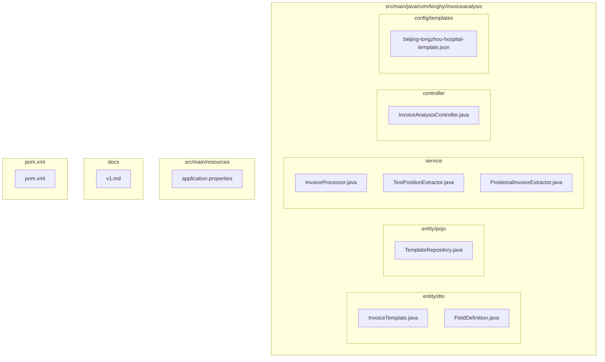
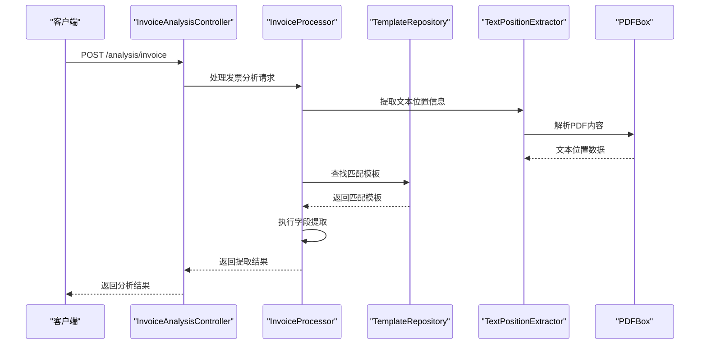
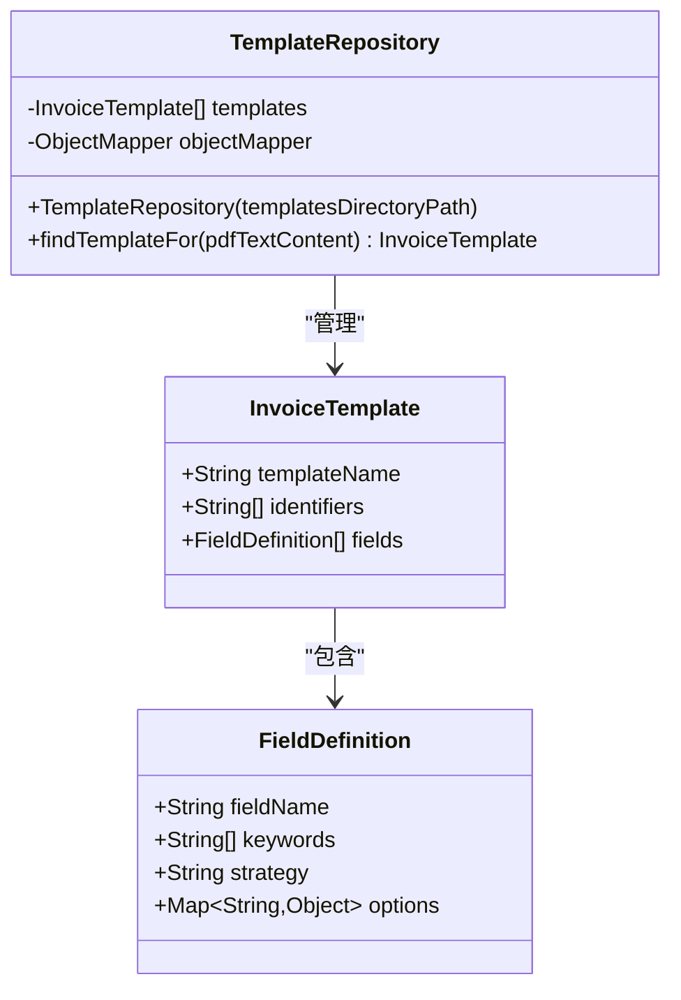
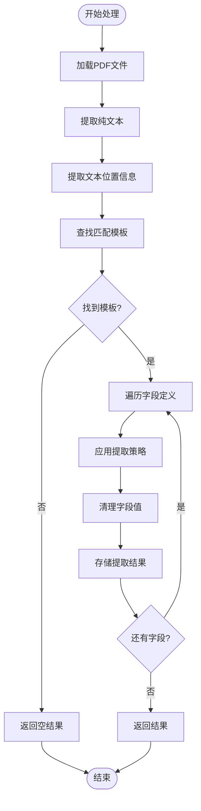
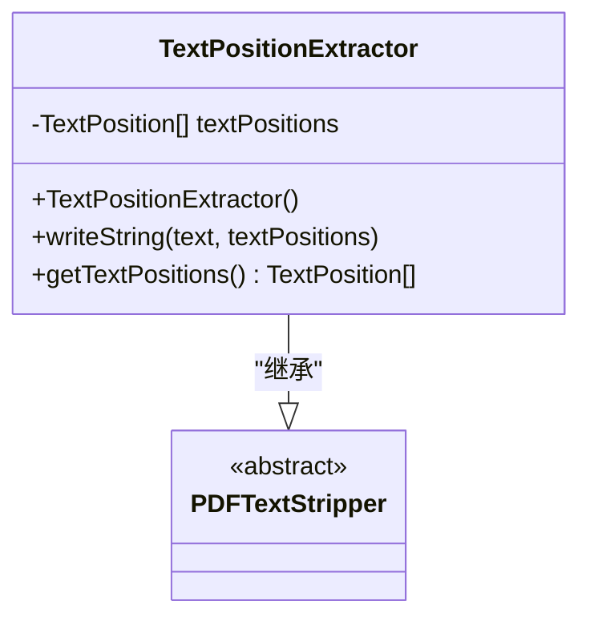
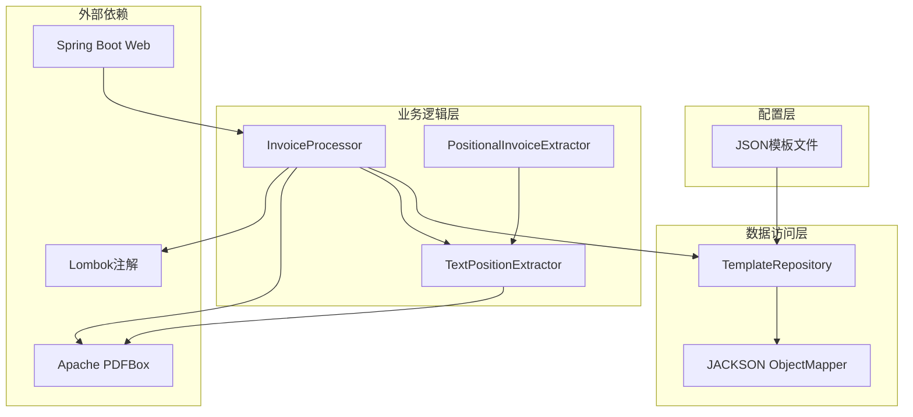

# 配置管理

<cite>
**本文档引用的文件**
- [InvoiceTemplate.java](file://src/main/java/com/kinghy/invoiceanalysis/entity/dto/InvoiceTemplate.java)
- [FieldDefinition.java](file://src/main/java/com/kinghy/invoiceanalysis/entity/dto/FieldDefinition.java)
- [TemplateRepository.java](file://src/main/java/com/kinghy/invoiceanalysis/entity/pojo/TemplateRepository.java)
- [InvoiceProcessor.java](file://src/main/java/com/kinghy/invoiceanalysis/service/InvoiceProcessor.java)
- [TextPositionExtractor.java](file://src/main/java/com/kinghy/invoiceanalysis/service/TextPositionExtractor.java)
- [PositionalInvoiceExtractor.java](file://src/main/java/com/kinghy/invoiceanalysis/service/PositionalInvoiceExtractor.java)
- [beijing-tongzhou-hospital-template.json](file://src/main/java/com/kinghy/invoiceanalysis/config/templates/beijing-tongzhou-hospital-template.json)
- [application.properties](file://src/main/resources/application.properties)
- [pom.xml](file://pom.xml)
- [v1.md](file://docs/v1.md)
</cite>

## 目录
1. [简介](#简介)
2. [项目结构](#项目结构)
3. [核心组件](#核心组件)
4. [架构概览](#架构概览)
5. [详细组件分析](#详细组件分析)
6. [依赖关系分析](#依赖关系分析)
7. [性能考虑](#性能考虑)
8. [故障排除指南](#故障排除指南)
9. [结论](#结论)

## 简介

发票分析系统采用JSON模板驱动的配置管理方式，实现了提取规则与引擎代码的完全分离。该系统通过配置文件定义发票版式的识别规则和字段提取策略，使得业务人员可以在不修改代码的情况下快速适配新的发票类型。

系统的核心设计理念是将"规则"（发票版式、关键字、提取方式）与"引擎"（PDF解析和数据提取代码）完全解耦，通过JSON配置文件实现高度可配置和易于维护的发票解析系统。

## 项目结构

项目采用标准的Maven结构，主要分为以下模块：

**图表来源**
- [InvoiceTemplate.java](file://src/main/java/com/kinghy/invoiceanalysis/entity/dto/InvoiceTemplate.java#L1-L16)
- [TemplateRepository.java](file://src/main/java/com/kinghy/invoiceanalysis/entity/pojo/TemplateRepository.java#L1-L41)
- [InvoiceProcessor.java](file://src/main/java/com/kinghy/invoiceanalysis/service/InvoiceProcessor.java#L1-L159)

**章节来源**
- [pom.xml](file://pom.xml#L1-L86)
- [application.properties](file://src/main/resources/application.properties#L1-L2)

## 核心组件

### 数据模型定义

系统的核心数据模型由两个主要DTO类组成：

#### InvoiceTemplate 数据模型
- **templateName**: 模板的可读名称，用于标识发票类型
- **identifiers**: 关键识别符列表，用于自动识别发票版式
- **fields**: 字段定义列表，包含所有待提取字段的配置

#### FieldDefinition 数据模型
- **fieldName**: 系统内部使用的字段标识符
- **keywords**: 关键字列表，用于定位字段值
- **strategy**: 提取策略类型
- **options**: 策略配置选项

**章节来源**
- [InvoiceTemplate.java](file://src/main/java/com/kinghy/invoiceanalysis/entity/dto/InvoiceTemplate.java#L8-L13)
- [FieldDefinition.java](file://src/main/java/com/kinghy/invoiceanalysis/entity/dto/FieldDefinition.java#L8-L14)

## 架构概览

系统采用分层架构设计，实现了配置驱动的发票解析流程：

**图表来源**
- [InvoiceProcessor.java](file://src/main/java/com/kinghy/invoiceanalysis/service/InvoiceProcessor.java#L27-L77)
- [TemplateRepository.java](file://src/main/java/com/kinghy/invoiceanalysis/entity/pojo/TemplateRepository.java#L25-L39)

## 详细组件分析

### 模板仓库 (TemplateRepository)

TemplateRepository负责管理所有JSON模板文件，实现模板的加载和查找功能：

**图表来源**
- [TemplateRepository.java](file://src/main/java/com/kinghy/invoiceanalysis/entity/pojo/TemplateRepository.java#L11-L40)
- [InvoiceTemplate.java](file://src/main/java/com/kinghy/invoiceanalysis/entity/dto/InvoiceTemplate.java#L9-L13)
- [FieldDefinition.java](file://src/main/java/com/kinghy/invoiceanalysis/entity/dto/FieldDefinition.java#L9-L14)

#### 模板加载机制

模板仓库通过以下步骤实现模板加载：

1. **目录扫描**: 遍历指定目录下的所有JSON文件
2. **JSON解析**: 使用Jackson库将JSON文件转换为Java对象
3. **内存缓存**: 将解析后的模板存储在内存列表中
4. **模板查找**: 基于PDF文本内容的识别符匹配模板

**章节来源**
- [TemplateRepository.java](file://src/main/java/com/kinghy/invoiceanalysis/entity/pojo/TemplateRepository.java#L15-L23)

### 发票处理器 (InvoiceProcessor)

InvoiceProcessor是系统的核心处理引擎，负责协调整个发票解析流程：

**图表来源**
- [InvoiceProcessor.java](file://src/main/java/com/kinghy/invoiceanalysis/service/InvoiceProcessor.java#L27-L77)

#### 提取策略实现

系统支持三种核心提取策略：

1. **SAME_LINE**: 在关键字同一行向右查找
2. **BELOW**: 在关键字下方指定范围内查找  
3. **AREA**: 在指定的矩形区域内查找

**章节来源**
- [InvoiceProcessor.java](file://src/main/java/com/kinghy/invoiceanalysis/service/InvoiceProcessor.java#L55-L74)

### 文本位置提取器 (TextPositionExtractor)

TextPositionExtractor继承自PDFBox的PDFTextStripper，专门用于提取带有位置信息的文本：

**图表来源**
- [TextPositionExtractor.java](file://src/main/java/com/kinghy/invoiceanalysis/service/TextPositionExtractor.java#L13-L29)

**章节来源**
- [TextPositionExtractor.java](file://src/main/java/com/kinghy/invoiceanalysis/service/TextPositionExtractor.java#L10-L29)

## 依赖关系分析

系统采用松耦合的设计，各组件之间的依赖关系清晰明确：

**图表来源**
- [pom.xml](file://pom.xml#L32-L53)
- [InvoiceProcessor.java](file://src/main/java/com/kinghy/invoiceanalysis/service/InvoiceProcessor.java#L1-L159)

**章节来源**
- [pom.xml](file://pom.xml#L29-L53)

## 性能考虑

### 内存优化策略

1. **模板缓存**: TemplateRepository将所有模板加载到内存中，避免重复I/O操作
2. **流式处理**: PDF文本提取使用流式处理，减少内存占用
3. **延迟加载**: 只在需要时才解析JSON模板文件

### 处理效率优化

1. **早期退出**: 模板匹配过程中一旦发现不匹配立即停止
2. **位置索引**: 利用TextPosition的坐标信息进行快速定位
3. **策略选择**: 根据字段特征选择最优的提取策略

## 故障排除指南

### 常见问题及解决方案

#### 模板加载失败
- **症状**: 启动时无法加载JSON模板文件
- **原因**: JSON格式错误或文件路径不正确
- **解决**: 检查JSON文件语法，确认文件路径正确

#### 模板匹配失败
- **症状**: PDF文件无法匹配到合适的模板
- **原因**: identifiers配置不准确或PDF内容不包含识别符
- **解决**: 增加更精确的识别符，或调整现有识别符

#### 字段提取错误
- **症状**: 字段值提取不正确或为空
- **原因**: 关键字配置错误或提取策略不当
- **解决**: 调整keywords列表，选择合适的strategy和options

### 调试方法

1. **日志输出**: 系统提供了详细的日志输出，便于跟踪处理过程
2. **单元测试**: 可以针对特定模板编写测试用例
3. **手动验证**: 使用PositionalInvoiceExtractor进行手动验证

**章节来源**
- [InvoiceProcessor.java](file://src/main/java/com/kinghy/invoiceanalysis/service/InvoiceProcessor.java#L47-L51)

## 结论

发票分析系统的配置管理方案成功实现了规则与代码的完全分离，通过JSON模板文件定义所有提取规则。这种设计具有以下优势：

1. **高度可配置**: 业务人员可以独立维护模板，无需编程知识
2. **易于扩展**: 支持新增发票类型和字段提取策略
3. **维护简便**: 模板文件的增删改查操作简单直观
4. **性能稳定**: 采用内存缓存和流式处理，保证处理效率

系统目前实现了基础的模板加载和字段提取功能，后续可以进一步完善策略模式的实现，增加更多的提取策略和验证机制，以支持更复杂的发票类型和更高的准确性要求。