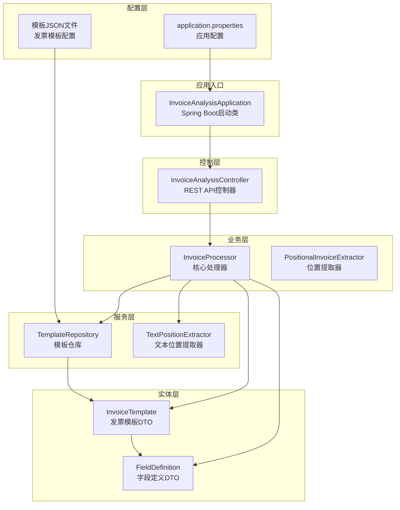
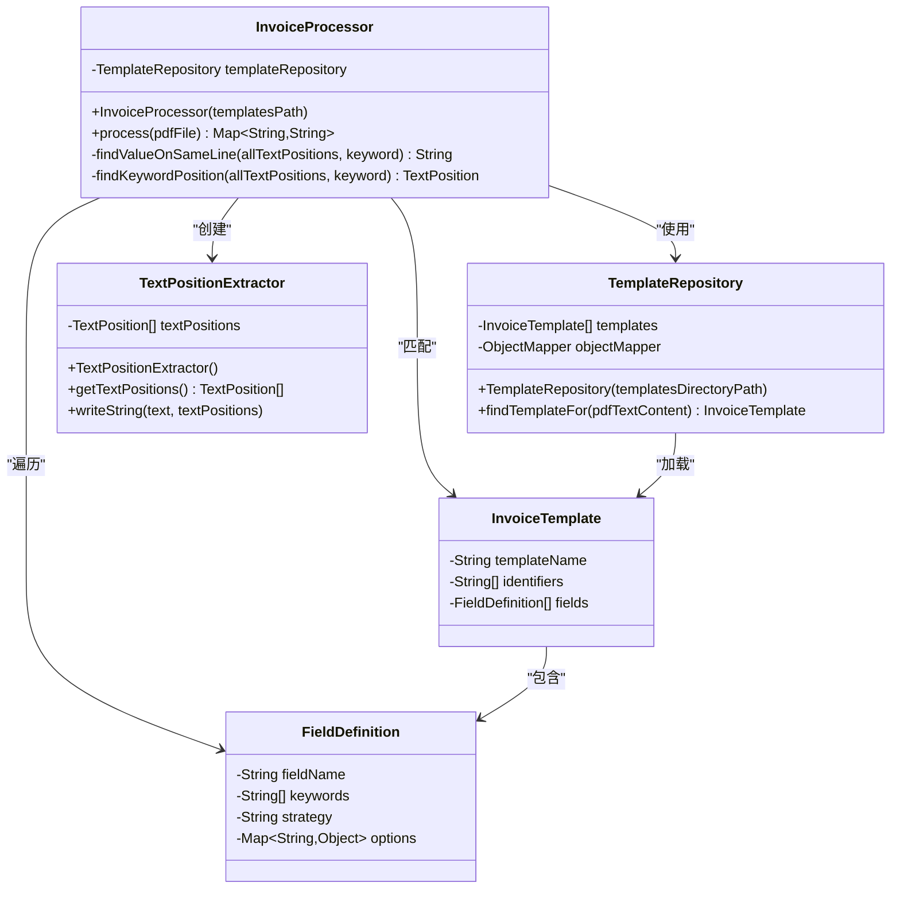
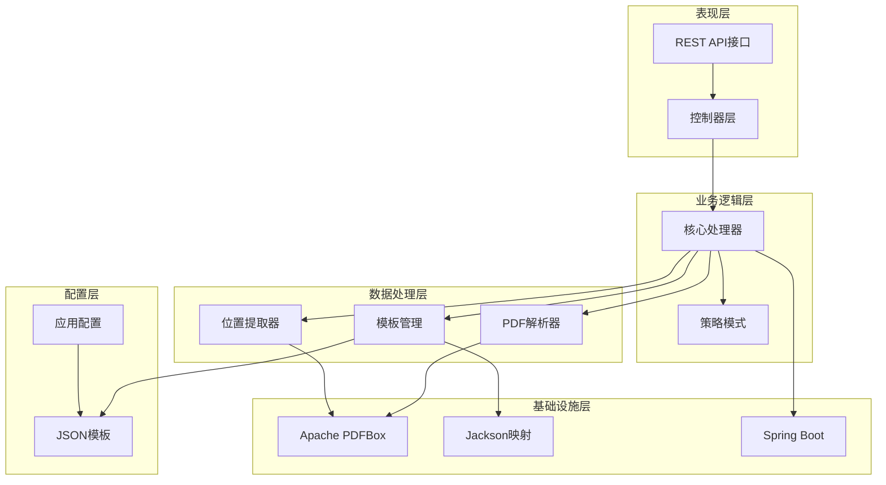
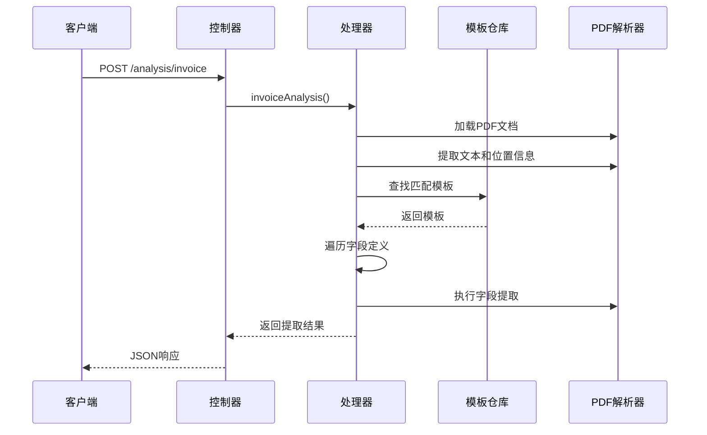
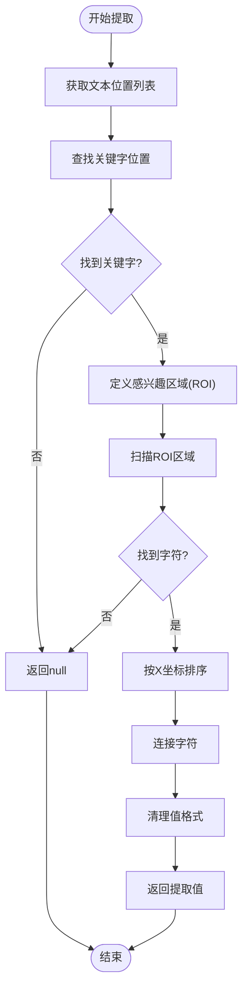
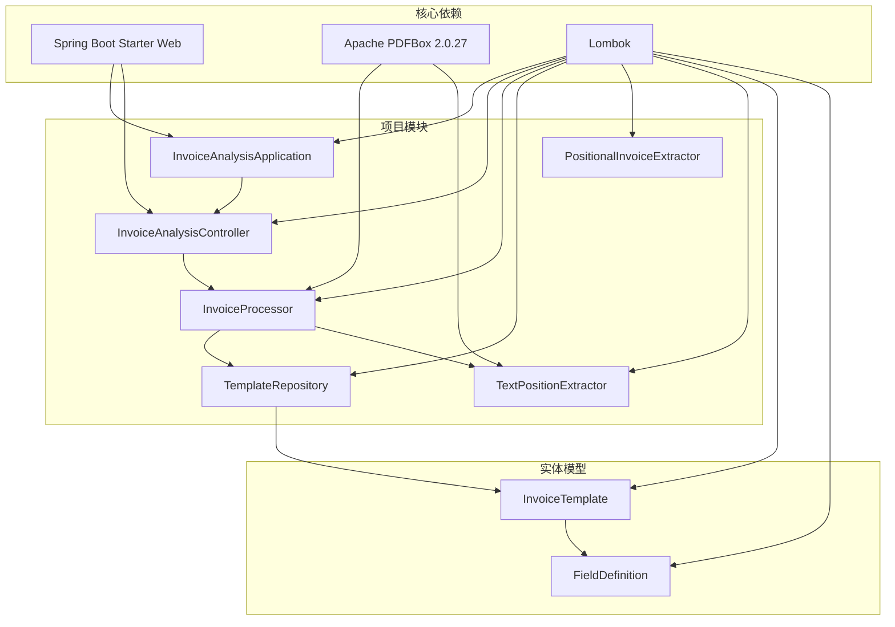

# 项目概述

<cite>
**本文档引用的文件**
- [InvoiceAnalysisApplication.java](file://src/main/java/com/kinghy/invoiceanalysis/InvoiceAnalysisApplication.java)
- [InvoiceAnalysisController.java](file://src/main/java/com/kinghy/invoiceanalysis/controller/InvoiceAnalysisController.java)
- [InvoiceProcessor.java](file://src/main/java/com/kinghy/invoiceanalysis/service/InvoiceProcessor.java)
- [PositionalInvoiceExtractor.java](file://src/main/java/com/kinghy/invoiceanalysis/service/PositionalInvoiceExtractor.java)
- [TextPositionExtractor.java](file://src/main/java/com/kinghy/invoiceanalysis/service/TextPositionExtractor.java)
- [FieldDefinition.java](file://src/main/java/com/kinghy/invoiceanalysis/entity/dto/FieldDefinition.java)
- [InvoiceTemplate.java](file://src/main/java/com/kinghy/invoiceanalysis/entity/dto/InvoiceTemplate.java)
- [TemplateRepository.java](file://src/main/java/com/kinghy/invoiceanalysis/entity/pojo/TemplateRepository.java)
- [application.properties](file://src/main/resources/application.properties)
- [pom.xml](file://pom.xml)
- [beijing-tongzhou-hospital-template.json](file://src/main/java/com/kinghy/invoiceanalysis/config/templates/beijing-tongzhou-hospital-template.json)
- [v1.md](file://docs/v1.md)
</cite>

## 目录
1. [简介](#简介)
2. [项目结构](#项目结构)
3. [核心组件](#核心组件)
4. [架构概览](#架构概览)
5. [详细组件分析](#详细组件分析)
6. [依赖关系分析](#依赖关系分析)
7. [性能考虑](#性能考虑)
8. [故障排除指南](#故障排除指南)
9. [结论](#结论)
10. [附录](#附录)

## 简介

发票分析系统是一个基于Java开发的智能发票自动识别和数据提取平台。该系统采用JSON配置驱动的设计理念，通过Apache PDFBox库实现PDF文档解析，结合模板匹配机制实现发票字段的自动化提取。系统的核心目标是将发票解析从传统的编码实现转变为可配置的模板驱动模式，从而大幅提高系统的可维护性和适应性。

### 主要特性

- **模板驱动架构**：通过JSON配置文件定义发票解析规则，支持多种发票类型和版式
- **多策略提取**：支持同行提取、下方提取、区域提取等多种字段提取策略
- **可扩展设计**：采用策略模式和工厂模式，便于添加新的提取策略
- **高可配置性**：业务人员可通过修改JSON文件调整提取规则，无需编程知识
- **生产就绪**：具备日志记录、错误处理和性能监控能力

### 技术优势

- **低耦合高内聚**：业务逻辑与技术实现分离，便于维护和扩展
- **配置即代码**：通过JSON配置实现规则管理，降低维护成本
- **跨平台兼容**：基于Java开发，支持Windows、Linux、macOS等操作系统
- **开源生态**：利用Apache PDFBox等成熟开源组件，确保稳定性

## 项目结构

项目采用标准的Maven多模块结构，遵循Spring Boot约定优于配置的原则。整体架构分为表现层、业务层、数据访问层和配置层四个主要部分。

**图表来源**
- [InvoiceAnalysisApplication.java](file://src/main/java/com/kinghy/invoiceanalysis/InvoiceAnalysisApplication.java#L1-L14)
- [InvoiceAnalysisController.java](file://src/main/java/com/kinghy/invoiceanalysis/controller/InvoiceAnalysisController.java#L1-L26)
- [InvoiceProcessor.java](file://src/main/java/com/kinghy/invoiceanalysis/service/InvoiceProcessor.java#L1-L159)

**章节来源**
- [pom.xml](file://pom.xml#L1-L86)
- [application.properties](file://src/main/resources/application.properties#L1-L2)

## 核心组件

### 发票处理器 (InvoiceProcessor)

发票处理器是系统的核心组件，负责协调整个发票分析流程。它集成了PDF文档解析、模板匹配和字段提取功能，实现了从PDF到结构化数据的完整转换。

**图表来源**
- [InvoiceProcessor.java](file://src/main/java/com/kinghy/invoiceanalysis/service/InvoiceProcessor.java#L17-L159)
- [TemplateRepository.java](file://src/main/java/com/kinghy/invoiceanalysis/entity/pojo/TemplateRepository.java#L11-L41)
- [TextPositionExtractor.java](file://src/main/java/com/kinghy/invoiceanalysis/service/TextPositionExtractor.java#L13-L30)
- [InvoiceTemplate.java](file://src/main/java/com/kinghy/invoiceanalysis/entity/dto/InvoiceTemplate.java#L9-L16)
- [FieldDefinition.java](file://src/main/java/com/kinghy/invoiceanalysis/entity/dto/FieldDefinition.java#L9-L14)

### 模板仓库 (TemplateRepository)

模板仓库负责管理所有发票模板，通过JSON文件实现模板的动态加载和管理。系统支持多个模板文件，每个模板定义了特定发票类型的解析规则。

**章节来源**
- [TemplateRepository.java](file://src/main/java/com/kinghy/invoiceanalysis/entity/pojo/TemplateRepository.java#L11-L41)
- [InvoiceTemplate.java](file://src/main/java/com/kinghy/invoiceanalysis/entity/dto/InvoiceTemplate.java#L9-L16)

### 文本位置提取器 (TextPositionExtractor)

文本位置提取器继承自Apache PDFBox的PDFTextStripper类，专门用于提取PDF文档中每个字符的精确位置信息。这对于实现基于位置的字段提取至关重要。

**章节来源**
- [TextPositionExtractor.java](file://src/main/java/com/kinghy/invoiceanalysis/service/TextPositionExtractor.java#L13-L30)

## 架构概览

系统采用分层架构设计，将业务逻辑、数据处理和配置管理清晰分离。整体架构体现了高内聚、低耦合的设计原则。

**图表来源**
- [InvoiceAnalysisApplication.java](file://src/main/java/com/kinghy/invoiceanalysis/InvoiceAnalysisApplication.java#L6-L11)
- [InvoiceAnalysisController.java](file://src/main/java/com/kinghy/invoiceanalysis/controller/InvoiceAnalysisController.java#L14-L26)
- [InvoiceProcessor.java](file://src/main/java/com/kinghy/invoiceanalysis/service/InvoiceProcessor.java#L15-L25)

## 详细组件分析

### 发票自动分析工作原理

系统通过以下步骤实现发票的自动分析和字段提取：

#### 步骤1：PDF文档解析
系统使用Apache PDFBox库提取PDF文档的文本内容和字符位置信息。通过TextPositionExtractor类，系统能够获取每个字符的精确坐标，为后续的基于位置的提取奠定基础。

#### 步骤2：模板匹配
系统扫描PDF文本内容，寻找预定义的标识符（identifiers）。当找到所有标识符时，系统选择对应的模板进行处理。这种机制确保了不同发票类型的准确识别。

#### 步骤3：字段提取
根据模板定义的策略，系统执行相应的字段提取操作：
- **同行提取**：在关键字同一行的右侧查找对应值
- **下方提取**：在关键字下方指定范围内查找值
- **区域提取**：在预定义的矩形区域内提取信息

**图表来源**
- [InvoiceAnalysisController.java](file://src/main/java/com/kinghy/invoiceanalysis/controller/InvoiceAnalysisController.java#L18-L22)
- [InvoiceProcessor.java](file://src/main/java/com/kinghy/invoiceanalysis/service/InvoiceProcessor.java#L27-L77)
- [TemplateRepository.java](file://src/main/java/com/kinghy/invoiceanalysis/entity/pojo/TemplateRepository.java#L25-L39)

### 字段提取算法

系统实现了基于位置的智能字段提取算法，能够处理复杂的发票布局。

**图表来源**
- [InvoiceProcessor.java](file://src/main/java/com/kinghy/invoiceanalysis/service/InvoiceProcessor.java#L96-L135)
- [PositionalInvoiceExtractor.java](file://src/main/java/com/kinghy/invoiceanalysis/service/PositionalInvoiceExtractor.java#L54-L93)

**章节来源**
- [InvoiceProcessor.java](file://src/main/java/com/kinghy/invoiceanalysis/service/InvoiceProcessor.java#L96-L159)
- [PositionalInvoiceExtractor.java](file://src/main/java/com/kinghy/invoiceanalysis/service/PositionalInvoiceExtractor.java#L54-L117)

### 模板配置系统

系统通过JSON文件实现模板的灵活配置，每个模板定义了特定发票类型的解析规则。

**章节来源**
- [beijing-tongzhou-hospital-template.json](file://src/main/java/com/kinghy/invoiceanalysis/config/templates/beijing-tongzhou-hospital-template.json#L1-L55)
- [v1.md](file://docs/v1.md#L18-L94)

## 依赖关系分析

系统依赖关系清晰明确，主要依赖包括Spring Boot Web、Apache PDFBox和Lombok等核心组件。

**图表来源**
- [pom.xml](file://pom.xml#L32-L54)
- [InvoiceAnalysisApplication.java](file://src/main/java/com/kinghy/invoiceanalysis/InvoiceAnalysisApplication.java#L3-L4)
- [InvoiceProcessor.java](file://src/main/java/com/kinghy/invoiceanalysis/service/InvoiceProcessor.java#L7-L13)

**章节来源**
- [pom.xml](file://pom.xml#L29-L54)

## 性能考虑

系统在设计时充分考虑了性能优化，采用了多种策略来提升处理效率：

### 内存管理
- 使用try-with-resources语句确保PDF文档资源的及时释放
- 限制单页处理以减少内存占用
- 采用流式处理避免大文件内存溢出

### 算法优化
- 关键字查找采用滑动窗口算法，时间复杂度为O(n*m)
- ROI区域过滤减少不必要的字符扫描
- 排序前的预过滤提升排序效率

### 可扩展性
- 策略模式支持动态加载新的提取策略
- 模板缓存机制避免重复解析
- 异步处理支持批量文件处理

## 故障排除指南

### 常见问题及解决方案

#### 模板匹配失败
**问题**：系统无法找到合适的发票模板
**原因**：PDF文本内容不包含模板标识符
**解决方案**：
1. 检查PDF文档是否为正确的发票类型
2. 验证模板JSON文件中的标识符设置
3. 调整标识符的匹配策略

#### 字段提取不准确
**问题**：某些字段提取结果为空或错误
**原因**：关键字位置变化或提取策略不当
**解决方案**：
1. 更新模板中的关键字列表
2. 调整提取策略参数
3. 手动验证ROI区域设置

#### 性能问题
**问题**：处理大量文件时性能下降
**解决方案**：
1. 优化模板数量和复杂度
2. 调整并发处理策略
3. 增加系统内存配置

**章节来源**
- [InvoiceProcessor.java](file://src/main/java/com/kinghy/invoiceanalysis/service/InvoiceProcessor.java#L47-L51)
- [TemplateRepository.java](file://src/main/java/com/kinghy/invoiceanalysis/entity/pojo/TemplateRepository.java#L25-L39)

## 结论

发票分析系统通过创新的模板驱动架构，成功地将复杂的发票解析任务转化为可配置的模板管理过程。系统不仅具备强大的技术能力，更重要的是提供了极高的可维护性和扩展性。

### 主要成就
- **架构创新**：首次在发票解析领域引入模板驱动设计理念
- **技术先进**：采用最新的PDF处理技术和策略模式
- **实用性强**：业务人员可直接参与规则配置，无需编程知识
- **扩展性好**：支持无限量模板和自定义策略扩展

### 未来发展方向
- 实现模板的热更新机制
- 添加机器学习辅助的智能模板匹配
- 支持更多发票类型和国际标准
- 提供Web界面进行模板可视化编辑

## 附录

### 快速开始指南

#### 环境要求
- Java 8或更高版本
- Maven 3.6+
- 至少4GB内存

#### 安装步骤
1. 克隆项目到本地
2. 在IDE中导入Maven项目
3. 配置PDF文件路径
4. 运行InvoiceAnalysisApplication

#### 基本使用方法
1. 准备发票PDF文件
2. 在config/templates目录下创建JSON模板
3. 运行InvoiceProcessor.main()方法
4. 查看控制台输出的提取结果

#### 开发者指南
- 新增字段提取策略：实现ExtractionStrategy接口
- 添加新发票类型：创建对应的JSON模板文件
- 自定义模板加载：修改TemplateRepository类
- 扩展API接口：在Controller中添加新的REST端点

**章节来源**
- [InvoiceAnalysisApplication.java](file://src/main/java/com/kinghy/invoiceanalysis/InvoiceAnalysisApplication.java#L9-L11)
- [InvoiceProcessor.java](file://src/main/java/com/kinghy/invoiceanalysis/service/InvoiceProcessor.java#L79-L85)